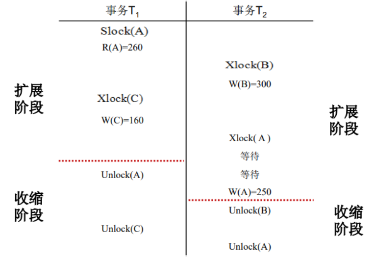
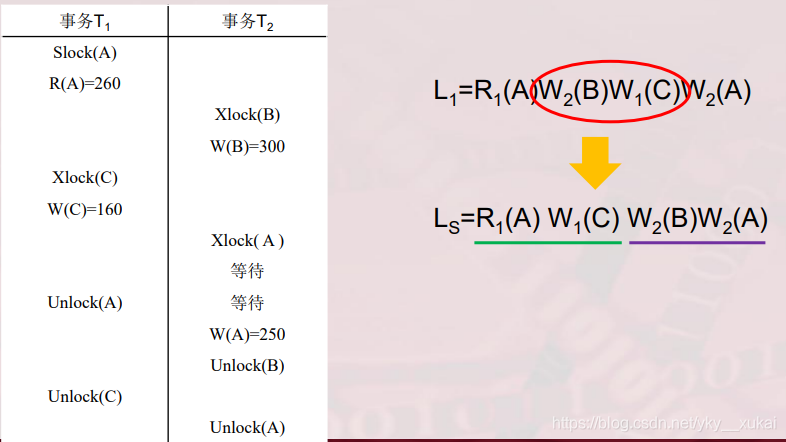
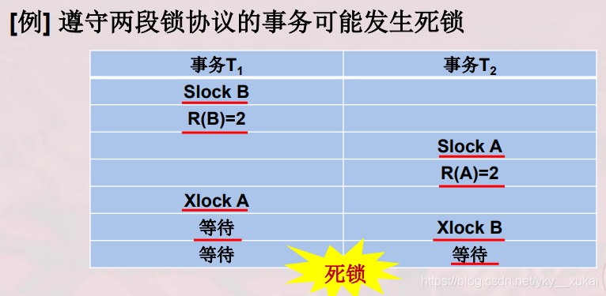

# 死锁：可串行调度、两段锁协议、一次封锁法

[toc]

## 可串行调度

多个事务的并发执行是正确的，当且仅当其结果与按某一次序串行执行这些事务时的结果相同。

可串行化（Serializability）是并发事务正确调度的准则，一个给定的并发调度，当且仅当它是可串行化的才是正确的。DBMS为了保证事务并发调度的正确性，普遍使用两段锁协议来保证并发调度的可串行化：

### 两段锁协议

-   事务对任何数据进行读写操作前首先需要获取该数据相应的锁；
-   事务开始释放锁以后就不能再申请其他的锁；

可以证明，若并发的所有事务均遵守两段锁协议，则对这些事务的任何并发调度策略都是可串行化的：

#### 一次封锁法

-   在遵循两段锁协议的基础上，一次封锁法要求每个事务必须一次性获得所有需要使用的数据的锁

注意两段锁协议和防止死锁的一次封锁法的异同之处。一次封锁法要求每个事务必须一次将所有要使用的数据全部加锁，否则就不能继续执行，因此一次封锁法遵守两段锁协议；但是两段锁协议并不要求事务必须一次将所有要使用的数据全部加锁，因此遵守两段锁协议的事务可能发生死锁。

