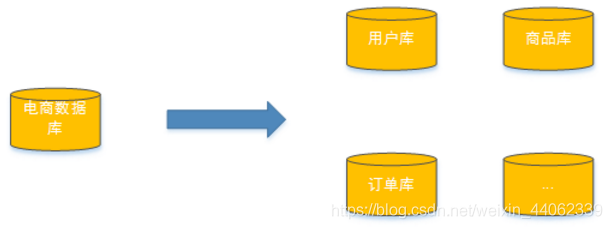

# MySQL - 分库分表

什么是分库分表？分库分表的目的是什么？

分库分表的结果是什么？分库分表会引入什么问题？这些问题该如何解决？

[toc]

随着公司业务快速发展，数据库中的数据量猛增，访问性能也开始变慢了，优化迫在眉睫。分析一下问题出现在哪儿： 关系型数据库本身比较容易成为系统瓶颈，单机存储容量、连接数、处理能力都有限。当单表的数据量达到1000W或100G以后，由于查询维度较多，即使添加从库、优化索引，做很多操作时性能仍下降严重。

方案1：

通过提高服务器硬件性能来提高数据库数据处理能力，比如增加存储容量、CPU等。这种方案成本很高，而且如果瓶颈如果来自MySQL本身，那么系统的提升效果也是有限的。

方案2：

将数据分散到不同的数据库，通过控制单一数据库的数据量来保证数据库的性能，从而保证系统整体性能。如下图：将电商数据库拆分为若干独立的数据库，并且对于大表也拆分为若干小表，通过这种数据库拆分的方法来解决数据库的性能问题。

<mark>分库分表是解决由于数据量多大而导致数据库性能降低问题的一种解决方案。将大库拆成小库，将大表拆成小表，使得单一数据库、单一数据表的数据量变小，从而达到提升数据性能的目的。</mark>

分库分表包括分库和分表两个部分，在生产中通常包括：垂直分库、水平分库、垂直分表、水平分表四种方式。

## 垂直切分

### 垂直分表

### 垂直分库

## 水平切分

### 水平分表

### 水平分库
