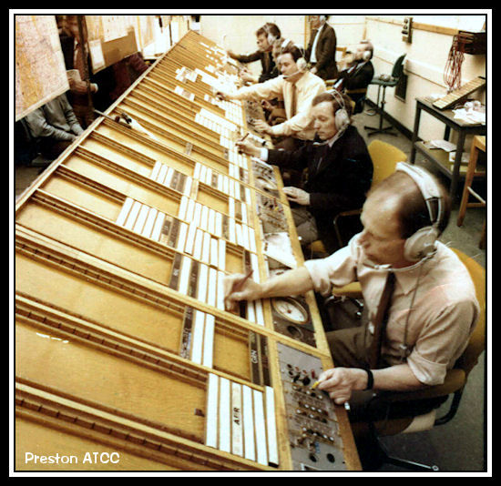
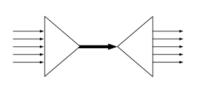

# I/O 多路复用

内容整理自知乎：[IO 多路复用是什么意思？ - 罗志宇的回答](https://www.zhihu.com/question/32163005/answer/55772739)

假设你是一个机场的空管，你需要管理到你机场的所有航线，包括进港、出港，有些航班需要移到停机坪等待，有些航班需要到登机口接乘客。

你会怎么做？最简单的做法：<u>招一大批空管人员，然后每个人盯一架飞机，从进港，接客，排位，出港，航线监控，直至交接给下一个空港，全程监控</u>。

那么问题来了：

-   很快你就发现空管塔里面聚集起来一大票的空管员，交通稍微繁忙一点，新的空管员就已经挤不进来了
-   空管员之间需要协调，屋子里面就1, 2个人的时候还好，几十号人以后 ，基本上就成菜市场了
-   空管员经常需要更新一些公用的东西，比如起飞显示屏，比如下一个小时后的出港排期，最后你会很惊奇的发现，每个人的时间最后都花在了抢这些资源上

现实上我们的空管同时管几十架飞机稀松平常的事情， 他们怎么做的呢？他们用这个东西：

这个东西叫 [flight progress](https://www.zhihu.com/search?q=flight+progress&search_source=Entity&hybrid_search_source=Entity&hybrid_search_extra={"sourceType"%3A"answer"%2C"sourceId"%3A55772739}) strip.  每一个块代表一个航班，不同的槽代表不同的状态，然后一个空管员可以管理一组这样的块（一组航班），而他的工作，就是在航班信息有新的更新的时候，把对应的块放到不同的槽子里面。

>   Note：这个东西现在还没有淘汰，只是变成电子的了而已

是不是觉得一下子效率高了很多，一个空管塔里可以调度的航线可以是前一种方法的几倍到几十倍。

---

如果你把每一个航线当成一个 I/O 流（Socket）, 空管当成你的服务端 Sock 管理代码的话。

-   第一种方案就是最传统的多线程并发模型——每进来一个新的 I/O 流就分配一个新的线程进行管理
-   第二种方案就是 `I/O 多路复用`——单个线程，通过记录跟踪每个 I/O 流（Socket）的状态，来同时管理多个 I/O 流

其实 “I/O多路复用” 这个坑爹翻译可能是这个概念在中文里面如此难理解的原因。所谓的I/O多路复用在英文中其实叫 I/O multiplexing。如果你搜索 multiplexing 啥意思，基本上都会出这个图：

于是大部分人都直接联想到“一根网线，多个 socket 复用” 这个概念，其实不管你用多进程还是 I/O 多路复用，网线都只有一根好伐。**多个Sock复用一根网线这个功能是在内核＋驱动层实现的**。

**重要的事情再说一遍： I/O multiplexing 这里面的 multiplexing 指的其实是在单个线程通过记录跟踪每一个Sock(I/O流)的状态(对应空管塔里面的 Fight progress strip 槽)来同时管理多个 I/O 流**. 发明它的原因，是尽量多的提高服务器的吞吐能力。

是不是听起来好拗口，看个图就懂了：

在同一个线程里面， 通过拨开关的方式，来同时传输多个I/O流， (学过EE的人现在可以站出来义正严辞说这个叫“[时分复用](https://www.zhihu.com/search?q=时分复用&search_source=Entity&hybrid_search_source=Entity&hybrid_search_extra={"sourceType"%3A"answer"%2C"sourceId"%3A55772739})”了）

