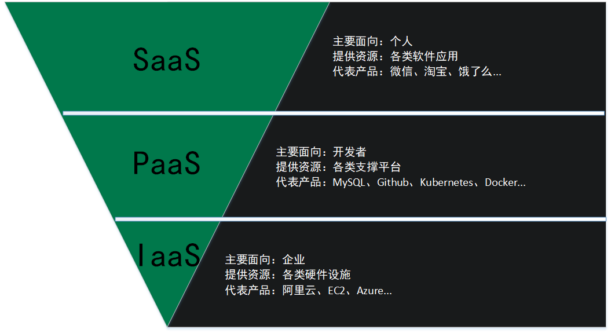
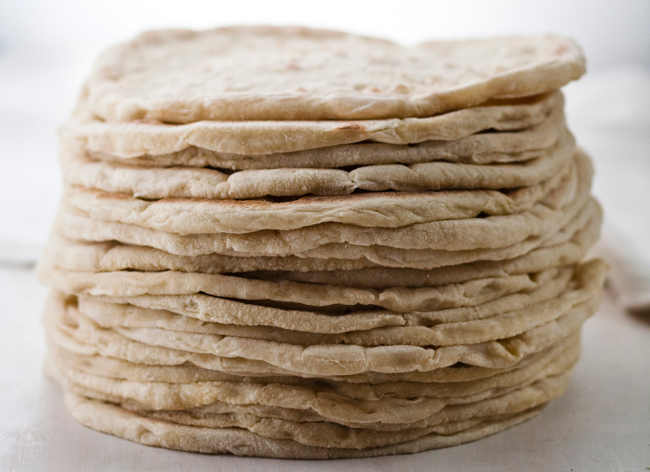
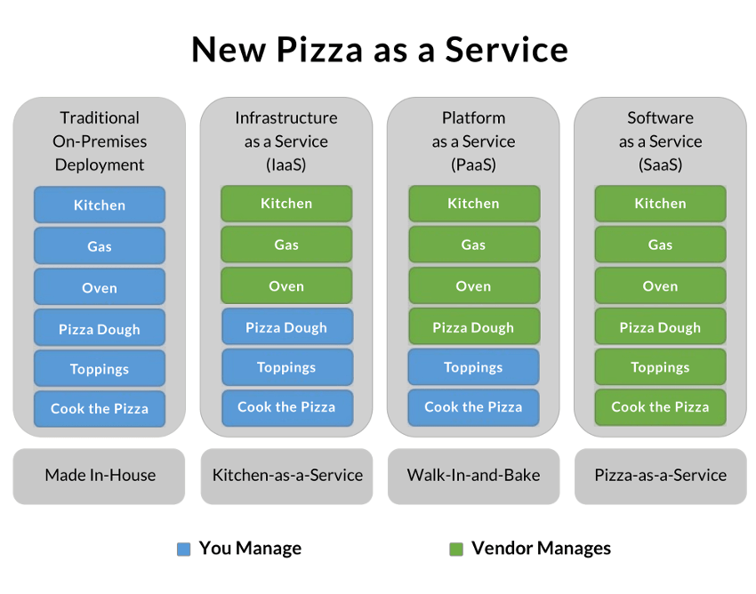
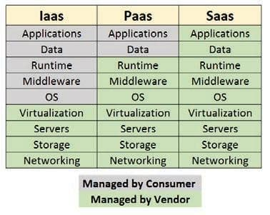

# IaaS、PaaS、SaaS

参考文章：

1.  [理解云计算三种服务模式——IaaS、PaaS和SaaS](https://blog.csdn.net/qq_34386891/article/details/79621599)

2.  [IaaS，PaaS，SaaS 的区别](https://www.ruanyifeng.com/blog/2017/07/iaas-paas-saas.html)

---

业界普遍将云计算按照**服务的提供方式**划分为三个大类：

-   **SaaS（Software as a Service，软件即服务）**
-   **PaaS（Platform as a Service，平台即服务）**
-   **IaaS（Infrastructure as a Service，基础架构即服务）**

其中，SaaS基于PaaS实现，PaaS基于IaaS实现，三者分别面对不同的需求：

## 披萨

它们有什么区别呢？IBM 的软件架构师 Albert Barron 曾经使用披萨作为比喻，[解释](https://www.linkedin.com/pulse/20140730172610-9679881-pizza-as-a-service)这个问题。David Ng 进一步[引申](https://m.oursky.com/saas-paas-and-iaas-explained-in-one-graphic-d56c3e6f4606)，让它变得更准确易懂。请设想你是一个餐饮业者，打算做披萨生意。

你可以从头到尾，自己生产披萨，但是这样比较麻烦，需要准备的东西多，因此你决定外包一部分工作，采用他人的服务。你有三个方案：

1.  IaaS

    由他人提供厨房、炉子、煤气，你使用这些基础设施，来烤你的披萨。

    

2.  PaaS

    除了基础设施，他人还提供披萨饼皮。

    

    你只要把自己的配料洒在饼皮上，让他帮你烤出来就行了。也就是说，你要做的就是设计披萨的味道（海鲜披萨或者鸡肉披萨），他人提供平台服务，让你把自己的设计实现。

    

3.  SaaS

    他人直接做好了披萨，不用你的介入，到手的就是一个成品。你要做的就是把它卖出去，最多再包装一下，印上你自己的 Logo。

    

上面的三种方案，可以总结成下面这张图：

从左到右，自己承担的工作量越来越少：IaaS > PaaS > SaaS

对应软件开发，则是下面这张图：

## SaaS

软件的开发、部署、管理都由第三方负责，不需要关心底层技术，拿来即用。普通用户接触到的互联网服务大多属于SaaS。

## PaaS

提供软件部署平台（runtime），抽象掉了硬件和操作系统细节，可以无缝地扩展（scaling）。开发者只需要关注自己的业务逻辑，不需要关注底层

## IaaS

**云服务的最底层，主要提供一些基础资源。**它与 PaaS 的区别是，用户需要自己控制底层，实现基础设施的使用逻辑。

微软的 Azure 云服务有一张图，解释这三种模式的差异：

上图中，绿色的部分是云服务商决定的，紫色的部分是用户决定的。可以看到，SaaS 模式下用户没有任何自主权，只能使用给定的应用程序；PaaS  模式下可以自己安装应用程序，但是不能定制操作系统；IaaS 模式下则是云服务商提供（虚拟的）硬件，从操作系统开始都可以自己选择和定制。

