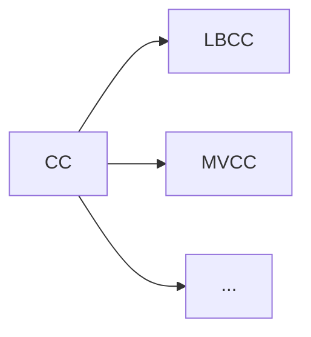

# MVCC

[toc]

## 是什么？

LBCC，全称 Lock-Base Concurrency Control，即基于锁的并发控制；MVCC，全称 Multi-Version Concurrency Control，即多版本并发控制。<mark>MVCC和LBCC是实现并发控制的两种方案</mark>。

## 特殊点？

在数据库中，并发控制是指在多个用户/进程/线程同时对数据库进行操作时，即保证事务的一致性和隔离性，同时又最大程度地并发。

当多个用户/进程/线程同时对数据库进行操作时，会出现3种冲突场景：

-   读-读：没有任何问题
-   读-写：事务隔离问题，例如：脏读、幻读、不可重复读
-   写-写：更新丢失问题，例如：第一类更新丢失（回滚丢失）、第二类更新丢失（覆盖丢失|二次更新丢失）

通常数据库会采用LBCC来解决冲突，但是这种方式的开销比较大，并且存在死锁的风险。相较于传统的 LBCC，<mark>MVCC 的主要特点是“读不加锁”</mark>，这种特性对于“读多写少”的应用场景能够极大提高系统的并发度。

MVCC是一种用来<mark>解决“读-写”冲突</mark>的无锁并发控制方案。在并发读写数据库时，可以做到在读操作时不用阻塞写操作，写操作也不用阻塞读操作，提高了数据库并发读写的性能同时还可以解决脏读、幻读、不可重复读等事务隔离问题，但不能解决更新丢失问题，即<mark>无法解决“写-写”冲突</mark>。

## 总结

总之，MVCC就是由于大牛们不满意只让数据库采用悲观锁这样性能不佳的形式去解决读-写冲突问题，而提出的解决方案。因为有了MVCC，所以在数据库中我们可以形成两个组合：

-   **MVCC + 悲观锁**：MVCC解决“读-写”冲突，悲观锁解决“写-写”冲突
-   **MVCC + 乐观锁**：MVCC解决“读-写”冲突，乐观锁解决“写-写”冲突

