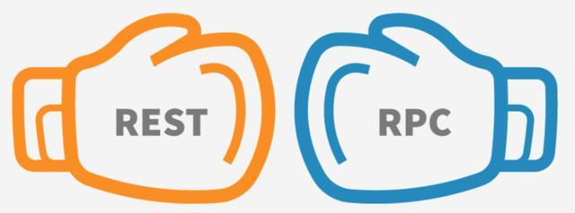
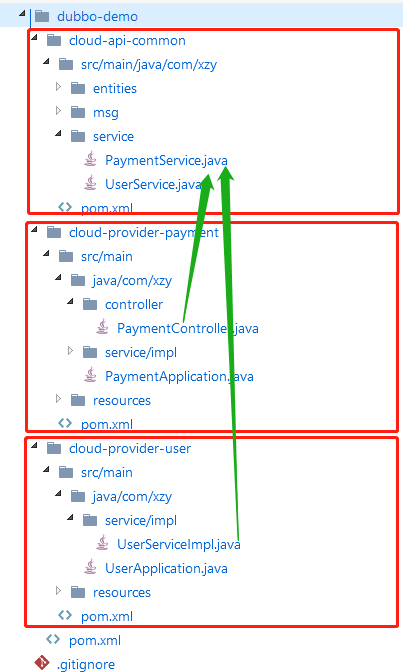

# RPC 与 REST

参考文章：https://zhuanlan.zhihu.com/p/426303359



[toc]

## 一、RPC

RPC（Remote Procedure Call，RPC），即远程过程调用，最近几年频繁被各种论坛，文章，课程提及，乍一看还以为是什么牛逼的新技术，其实在计算机科学中已经存在超过四十年时间，是个不折不扣的“老古董”。

==RPC出现的最初目的，就是为了让计算机能够像调用本地方法一样去调用远程方法。==

我们先来看一下计算机是如何调用本地方法的：

```java
// Caller    :  调用者，代码里的main()
// Callee    :  被调用者，代码里的println()
// Call Site :  调用点，即发生方法调用的指令流位置
// Parameter :  参数，由Caller传递给Callee的数据，即“hello world”
// Retval    :  返回值，由Callee传递给Caller的数据，如果方法能够正常结束，它是void，如果方法异常完成，它是对应的异常

public static void main(String[] args) {    
    System.out.println("hello world");
}
```


在完全不考虑编译器优化的前提下，程序运行至调用 println() 方法输出 hello world 这行时，计算机（物理机或者虚拟机）要完成以下几项工作：

1.  **传递方法参数**： 将字符串 hello world 的引用地址入栈
2.  **确定方法版本**： 根据 println() 方法的签名，确定其执行版本。这其实并不是一个简单的过程，无论是编译时静态解析，还是运行时动态分派，都必须根据某些语言规范中明确定义的原则，找到明确的 Callee，“明确”是指唯一的一个 Callee，或者有严格优先级的多个 Callee，譬如不同的重载版本
3.  **执行被调方法**： 从栈中弹出 Parameter 的值或引用，并以此为输入，执行 Callee 内部的逻辑。这里我们只关心方法是如何调用的，而不关心方法内部具体是如何执行的
4.  **返回执行结果**： 将 Callee 的执行结果入栈，并将程序的指令流恢复到 Call Site 的下一条指令，继续向下执行


我们再来考虑如果println()方法不在当前进程的内存地址空间中会发生什么问题。不难想到，这样会至少面临两个直接的障碍：

1.  首先，第一步和第四步所做的传递参数、传回结果都依赖于==栈内存==，如果 Caller 与 Callee 分属不同的进程，就不会拥有相同的栈内存，此时将参数在 Caller 进程的内存中压栈，对于 Callee 进程的执行毫无意义
2.  其次，第二步的方法版本选择依赖于==语言规则==，如果 Caller 与 Callee 不是同一种语言实现的程序，方法版本选择就将是一项模糊的不可知行为


我们暂时忽略第二个问题，假设 Caller 和 Callee 是使用同一种语言实现的。那么两个进程之间该如何交换数据呢？这就是“进程间通信”（Inter-Process Communication，IPC）要解决的问题。

### 跨进程通信的解决方案

#### 1、管道（Pipe）/具名管道（Named Pipe）

管道类似于两个进程间的桥梁，可通过管道在==进程间传递少量的字符流或字节流==。普通管道只用于有亲缘关系的进程（由一个进程启动的另外一个进程）间的通信，具名管道摆脱了普通管道没有名字的限制，除具有管道的所有功能外，它还允许无亲缘关系的进程间的通信。

管道典型的应用就是 Linux 命令行中的 “|” 操作符， 譬如：`ps -ef | grep java`， ps 与 grep 都有独立的进程，以上命令就是通过管道操作符 “|” 将 ps 命令的标准输出连接到 grep 命令的标准输入上。

#### 2、信号（Signal）

信号用于==通知目标进程有某种事件发生==。除了进程间通信外，进程还可以给进程自身发送信号。信号的典型应用是 kill 命令， 譬如：`kill -9 pid`，命令表示由 Shell 进程向指定 PID 的进程发送 SIGKILL 信号。

#### 3、信号量（Semaphore）

信号量用于在==两个进程之间同步协作手段==，它相当于操作系统提供的一个特殊变量，程序可以在上面进行 wait() 和 notify() 操作。

#### 4、消息队列（Message Queue）

以上三种方式只适合传递少量消息，POSIX 标准中定义了可用于进程间数据量较多的通信的消息队列。进程可以向队列添加消息，被赋予读权限的进程还可以从队列消费消息。<u>消息队列克服了信号承载信息量少、管道只能用于无格式字节流以及缓冲区大小受限等缺点，但实时性相对受限。</u>

#### 5、共享内存（Shared Memory）

允许多个进程访问同一块公共内存空间，这是==效率最高的进程间通信形式==。原本每个进程的内存地址空间都是相互隔离的，但操作系统提供了让进程主动创建、映射、分离、控制某一块内存的程序接口。<u>当一块内存被多进程共享时，各个进程往往会与其他通信机制，譬如与信号量结合使用，来达到进程间同步及互斥的协调操作。</u>

#### 6、本地套接字接口（IPC Socket）

<u>消息队列与共享内存只适合单机多进程间的通信，套接字接口则是更普适的进程间通信机制，可用于不同机器之间的进程通信。</u>套接字（Socket）起初是由UNIX系统的BSD分支开发出来的，现在已经移植到所有主流的操作系统上。出于效率考虑，当仅限于本机进程间通信时，套接字接口是被优化过的，不会经过网络协议栈，不需要打包拆包、计算校验和、维护序号和应答等操作，只是简单地将应用层数据从一个进程复制到另一个进程，这种进程间通信方式即本地套接字接口（UNIX Domain Socket），又叫作 IPC Socket。

### RPC 要解决的三个问题

#### 1、如何表示数据？

这里的数据包括传递给方法的参数和方法执行之后的返回值。也就是说一个进程把参数传给另一个进程，或者从另一个进程获取返回值，数据格式怎么表示的问题。你可能会觉得很奇怪，比如用 Java 语言写的程序，传递 String，int 等类型不就行了吗？对于进程内的方法调用，使用同一种语言的数据类型，比如双方的程序都用 Java 语言写的，这样调用自然没有问题。但是，如果调用方是用 Java 语言写的，被调用方是 C 语言写的，他们的数据类型定义的都不一样，该如何兼容呢？

就算双方都用同一种语言写的，比如 C 语言，但是在不同的硬件指令集、不同的操作系统下，同样的数据类型也完全可能有不一样的表现细节，譬如数据宽度、字节序列的差异等等。

那该怎么办呢？

说来也简单，就是<u>先把双方要交流的数据先转化成大家都认识的中间格式，然后再将中间格式数据转化成自己所用语言的数据类型</u>，听起来是不是很熟悉？没错，这就是==序列化与反序列化==。我以前学 Java 的时候，学到序列化与反序列化就很纳闷？参数为什么要序列化呢？直接传不就行了吗？原来是要考虑不同语言、硬件、操作系统的情况。

每种RPC协议都有对应的序列化协议，例如：

-   ONC RPC的外部数据表示（External Data Representation，XDR）
-   CORBA的通用数据表示（Common Data Representation，CDR）
-   Java RMI的Java对象序列化流协议（Java Object Serialization Stream Protocol）
-   gRPC的Protocol Buffers
-   Web Service的XML序列化
-   众多轻量级RPC支持的JSON序列化

看到 Web Service 的 XML 序列化特别有感触，以前在用 Web Service 的时候，我很奇怪为什么要用 xml 费这么大劲去描述一个个字段，一个个参数，原来是为了让不同的语言都能识别。

#### 2、如何传递数据？

两个程序之间如何传递数据，也就是互相操作，交互数据，除了序列化与反序列化之外还需要考虑：异常、超时、安全、认证、授权、事务等等，都可能产生双方需要交换信息的需求。在计算机科学中，专门有一个名词 “Wire Protocol” 来表示这种两个 Endpoint 之间交换这类数据的行为，常见的 Wire Protocol 如下：

-   Java RMI的Java远程消息交换协议（Java Remote Message Protocol，JRMP，也支持RMI-IIOP）
-   CORBA的互联网ORB间协议（Internet Inter ORB Protocol，IIOP，是GIOP协议在IP协议上的实现版本）
-   DDS的实时发布订阅协议（Real Time Publish Subscribe Protocol，RTPS）
-   Web Service的简单对象访问协议（Simple Object Access Protocol，SOAP）
-   如果要求足够简单，双方都是HTTP Endpoint，直接使用HTTP 协议也是可以的（如JSON-RPC）

除了传递数据，RPC 还有更吸引人的地方，它真正强大的地方是它的治理功能，比如连接管理、健康检测、负载均衡、优雅启停机、异常重试、业务分组以及熔断限流等等。

#### 3、如何表示方法？

确定表示方法在本地方法调用中并不是太大的问题，编译器或者解释器会根据语言规范，将调用的方法签名转换为进程空间中子过程入口位置的指针。<u>不过一旦要考虑不同语言，事情又立刻麻烦起来，每种语言的方法签名都可能有差别，所以“如何表示同一个方法”“如何找到对应的方法”还是需要一个统一的跨语言的标准才行。</u>

这个标准可以非常简单，譬如直接给程序的每个方法都规定一个唯一的、在任何机器上都绝不重复的编号，调用时压根不管它是什么方法、签名是如何定义的，直接传这个编号就能找到对应的方法。这种听起既粗鲁又寒碜的办法，还真的就是DCE/RPC当初准备的解决方案。虽然最终DCE还是弄出了一套与语言无关的接口描述语言（Interface Description Language，IDL），成为此后许多 RPC 参考或依赖的基础（如CORBA的OMG  IDL），但那个唯一的绝不重复的编码方案UUID（Universally Unique  Identifier）也被保留且广为流传开来，并被广泛应用于程序开发的方方面面。

类似地，用于表示方法的协议还有：

-   Android的Android接口定义语言（Android Interface Definition Language，AIDL）
-   CORBA的OMG接口定义语言（OMG Interface Definition Language，OMG IDL）
-   Web Service的Web服务描述语言（Web Service Description Language，WSDL）
-   JSON-RPC的JSON Web服务协议（JSON Web Service Protocol，JSON-WSP）


### 小总结

以上RPC中的三个基本问题，全部都可以在本地方法调用过程中找到对应的解决方案。RPC 的设计始于本地方法调用，尽管早已不再追求实现与本地方法调用完全一致的目的，但其设计思路仍然带有本地方法调用的深刻烙印，抓住两者间的联系来类比，对我们更深刻地理解 RPC 的本质会很有帮助。

为了解决上面的三个问题，每个 RPC 的产品解决问题的角度不同，有的着重于简单性，有的希望能支持更多的语言达到普适性，有的看中高性能。现在，已经相继出现过RMI（Sun/Oracle）、Thrift（Facebook/Apache）、Dubbo（阿里巴巴/Apache）、gRPC（Google）、Motan1/2（新浪）、Finagle（Twitter）、brpc（百度/Apache）、.NET Remoting（微软）、Arvo（Hadoop）、JSON-RPC  2.0（公开规范，JSON-RPC工作组）等难以穷举的协议和框架。这些 RPC 功能、特点不尽相同，有的是某种语言私有，有的支持跨越多种语言，有的运行在应用层 HTTP 协议之上，有的直接运行于传输层TCP/UDP协议之上，但并不存在哪一款是“最完美的RPC”。

今时今日，任何一款具有生命力的 RPC 框架，都不再去追求大而全的“完美”，而是以某个具有针对性的特点作为主要的发展方向。同时这也导致了我们的选择困难症，更是催生出了一大堆网络文章和课程，来讲解各RPC的优缺点，什么时候能有一个RPC的王者出来统一天下呢？

## 二、REST

REST 源于 Roy Thomas Fielding 在2000年发表的博士论文“Architectural Styles and the  Design of Network-based Software  Architectures”，此文的确是 REST 的源头。REST（Representational State  Transfer，表征状态转移），这个名字听起来很晦涩，什么叫“表征”、什么东西的“状态”、从哪“转移”到哪？

我们要理解 REST 就要先理解什么是 HTTP，再配合一些实际例子来对两者进行类比，以更清楚地了解 REST，你会发现 ==REST 实际上是 “HTT”（Hypertext Transfer）的进一步抽象，两者的关系就如同接口与实现类的关系一般。==

### “表征状态转移”到底啥意思？

#### 超文本（或超媒体）

“超文本（或超媒体）” 是一种 “能够对操作进行判断和响应的文本（或声音、图像等）”，这个概念在20世纪60年代提出时应该还属于科幻的范畴，但是今天大众已经完全接受了它，互联网中一段文字可以点击、可以触发脚本执行、可以调用服务端已毫不稀奇。下面我们继续尝试从“超文本”或者“超媒体”的含义来理解什么是“表征”以及REST中的其他关键概念，这里使用一个具体事例将其描述如下：

#### 资源（Resource）

譬如你现在正在阅读一篇名为《REST设计风格》的文章，这篇文章的内容本身（你可以将其理解为蕴含的信息、数据）称之为“资源”。<u>无论你是通过阅读购买的图书、浏览器上的网页还是打印出来的文稿，无论是在电脑屏幕上阅读还是在手机上阅读，尽管呈现的样子各不相同，但其中的信息是不变的，你所阅读的仍是同一份“资源”</u>。

#### 表征（Representation）

当你通过浏览器阅读此文章时，浏览器会向服务端发出 “我需要这个资源的HTML格式” 的请求，服务端向浏览器返回的这个HTML 就被称为“表征”，你也可以通过其他方式拿到本文的 PDF、Markdown、RSS 等其他形式的版本，它们同样是一个资源的多种表征。<u>可见“表征”是指信息与用户交互时的表示形式</u>，这与我们软件分层架构中常说的“表示层”（Presentation Layer）的语义其实是一致的。

#### 状态（State）

当你读完了这篇文章，想看后面是什么内容时，你向服务端发出“给我下一篇文章”的请求。但是“下一篇”是个相对概念，必须依赖“当前你正在阅读的文章是哪一篇”才能正确回应，<u>这类在特定语境中才能产生的上下文信息被称为“状态”</u>。我们所说的有状态（Stateful）抑或是无状态（Stateless），都是只相对于服务端来说的，服务端要完成“取下一篇”的请求，要么自己记住用户的状态，如这个用户现在阅读的是哪一篇文章，这称为有状态；要么由客户端来记住状态，在请求的时候明确告诉服务端，如我正在阅读某某文章，现在要读它的下一篇，这称为无状态。也就是说，由服务端来记录用户的状态就叫有状态；由客户端记录状态，并把它传到服务端的叫做无状态。

#### 转移（Transfer）

无论状态是由服务端还是由客户端来提供，“取下一篇文章”这个行为逻辑只能由服务端来提供，因为只有服务端拥有该资源及其表征形式。<u>服务端通过某种方式，把 “用户当前阅读的文章” 转变成 “下一篇文章”，这就被称为“表征状态转移”。</u>


### 小总结

REST 的一条核心原则是“统一接口（Uniform  Interface）”，<font color = red> REST希望开发者面向资源编程，希望软件系统设计的重点放在抽象系统该有哪些资源，而不是抽象系统该有哪些行为（服务）上。</font>这条原则你可以类比计算机中对文件管理的操作来理解，管理文件可能会涉及创建、修改、删除、移动等操作，这些操作数量是可数的，而且对所有文件都是固定、统一的。如果面向资源来设计系统，同样会具有类似的操作特征，由于 REST 并没有设计新的协议，所以这些操作都借用了 HTTP 协议中固有的操作命令来完成。

统一接口也是 REST 最容易陷入争论的地方，基于网络的软件系统，到底是面向资源合适，还是面向服务更合适，这个问题恐怕在很长时间里都不会有定论，也许永远都没有。但是，已经有一个基本清晰的结论是：面向资源编程的抽象程度通常更高。抽象程度高带来的坏处是距离人类的思维方式往往会更远，而好处是通用程度往往会更好。

用这样的语言去诠释REST，还是有些抽象，下面以一个例子来说明：譬如，对于几乎每个系统都有的登录和注销功能，如果你理解成登录对应于login()服务，注销对应于logout()服务这样两个独立服务，这是“符合人类思维”的；如果你理解成登录是PUT Session，注销是DELETE  Session，这样你只需要设计一种“Session资源”即可满足需求，甚至以后对Session的其他需求，如查询登录用户的信息，就是GET  Session而已，其他操作如修改用户信息等也都可以被这同一套设计囊括在内，这便是“抽象程度更高”带来的好处。

如果想要在架构设计中合理恰当地利用统一接口，建议系统应能做到每次请求中都包含资源的ID，所有操作均通过资源ID来进行；建议每个资源都应该是自描述的消息；建议通过超文本来驱动应用状态的转移。

<u>REST绑定于HTTP协议</u>。<u>面向资源编程不是必须构筑在HTTP之上，但REST是，这是缺点，也是优点</u>。因为HTTP本来就是面向资源设计的网络协议，纯粹只用HTTP（而不是SOAP over HTTP那样再构筑协议）带来的好处是无须考虑RPC中的Wire  Protocol问题，REST将复用HTTP协议中已经定义的概念和相关基础支持来解决问题。HTTP协议已经有效运作了三十年，其相关的技术基础设施已是千锤百炼，无比成熟。而坏处自然是，当你想去考虑那些HTTP不提供的特性时，便会彻底束手无策。

HTTP协议中已经提前约定好了一套“统一接口”，它包括GET、HEAD、POST、PUT、DELETE、TRACE、OPTIONS七种基本操作，任何一个支持HTTP协议的服务器都会遵守这套规定，对特定的URI采取这些操作，服务器就会触发相应的表征状态转移。

REST接口很容易理解，举个具体例子，假设一个商城用户中心的接口设计：用户资源会拥有多个不同的下级的资源，譬如若干条短消息资源、一份用户资料资源、一辆购物车资源，购物车中又会有自己的下级资源，譬如多本图书资源。你很容易在程序接口中构造出这些资源的集合关系与层次关系，而且这些关系是符合人们长期在单机或网络环境中管理数据的经验的。相信你不需要专门阅读接口说明书，就能轻易推断出获取用户icyfenix的购物车中的第2本书的REST接口应该表示为： GET /users/icyfenix/cart/2。

再来举几个列子：

-   GET /books：列出所有书籍
-   POST /books：新建一本书
-   GET /books/ID：获取某个指定书籍的信息
-   PUT /books/ID：更新某本书籍的信息（提供该书籍的全部信息）
-   PATCH /books/ID：更新某本指定书籍的信息（提供该书籍的部分信息）
-   DELETE /books/ID：删除某本书


## 对比

很多人会拿 REST 与 RPC 相比较，其实，REST 无论是在思想上、在概念上，还是在使用范围上，与 RPC 都不尽相同，充其量只能算是有一些相似，应用会有一部分重合之处，但本质上并不是同一类型的东西。

==RPC 和 REST 在思想上差异的核心是抽象的目标不一样，即面向过程的编程思想与面向资源的编程思想两者之间的区别。==

REST 与 RPC 在概念上的不同是指 REST 并不是一种远程服务调用协议，甚至可以把定语也去掉，它就不是一种协议。协议都带有一定的规范性和强制性，最起码也有一个规约文档，譬如 JSON-RPC，哪怕再简单，也有《JSON-RPC规范》来规定协议的格式细节、异常、响应码等信息，但是 REST 并没有定义这些内容，尽管有一些指导原则，但实际上并不受任何强制的约束。常有人批评某个系统接口“设计得不够RESTful”，其实这句话本身就有些争议，REST 只能说是风格而不是规范、协议，并且能完全符合 REST 所有指导原则的系统也是不多见的。

REST 的基本思想是面向资源来抽象问题，它与此前流行的编程思想——面向过程的编程在抽象主体上有本质的差别。在 REST 提出以前，人们设计分布式系统服务的唯一方案就只有 RPC，RPC 是将本地的方法调用思路迁移到远程方法调用上，开发者是围绕“远程方法”去设计两个系统间交互的，譬如CORBA、RMI、DCOM，等等。这样做的坏处不仅使“如何在异构系统间表示一个方法”“如何获得接口能够提供的方法清单”成为需要专门协议去解决的问题（RPC的三大基本问题之一），而且对于服务使用者来说，由于服务的每个方法都是完全独立的，他们必须逐个学习才能正确地使用这些方法。Google在“Google API Design Guide”中曾经写下这样一段话。

“以前，人们面向方法去设计RPC API，譬如CORBA和DCOM，随着时间推移，接口与方法越来越多却又各不相同，开发人员必须了解每一个方法才能正确使用它们，这样既耗时又容易出错。”

<u>也就是说 RPC 客户端必须先知道服务器端的方法才能调用它们。</u>

我们在调用 Web Service 接口之前要通过服务器提供的 WSDL 文件来生成客户端，客户端通过 WSDL 文件知道了服务器的方法和参数。

>   我们来看看某个 Dubbo 工程的代码。
>
>   
>
>   
>
>   服务端：
>
>   ```java
>   @Service
>   public class UserServiceImpl implements UserService {
>       /**
>        * 根据主键查询用户信息
>        *
>        * @param id 用户ID
>        * @return 用户信息
>        */
>       @Override
>       public Optional<UserEntity> findByPrimaryKey(Long id) {
>           UserEntity userEntity = new UserEntity(1001L, "张三", 23, "m", "15268897788", "浙江省杭州市西湖区");
>           return Optional.of(userEntity);
>       }
>   }
>   ```
>
>   客户端：
>
>   ```java
>   @RestController
>   @RequestMapping(path = "/payment")
>   public class PaymentController {
>       @Reference //从注册中心获取服务
>       private UserService userService;
>   
>       /**
>        * 获取用户信息
>        *
>        * @param userId 用户ID
>        * @return 用户信息
>        */
>       @GetMapping("/userInfo")
>       public MessageBox<UserEntity> findUserInfo(@RequestParam Long userId) {
>           return MessageBox.ok(userService.findByPrimaryKey(userId));
>       }
>   }
>   ```
>
>   客户端必须先知道服务端有 findByPrimaryKey() 方法，才能去调用它。

REST是根据资源操作的，如果REST的设计满足第 3 级成熟度：Hypermedia  Controls（超文本驱动），服务器会返回下一个操作的超链接。除了第一个请求是由你在浏览器地址栏输入的信息所驱动的之外，其他的请求都应该能够自己描述清楚后续可能发生的状态转移，由超文本自身来驱动。

我们来看一下书中的例子：

```http
HTTP/1.1 200 OK

{
    schedules：[
        {
            id: 1234, start:"14:00", end: "14:50", doctor: "mjones",
            links: [
                {rel: "comfirm schedule", href: "/schedules/1234"}
            ]
        },
        {
            id: 5678, start:"16:00", end: "16:50", doctor: "mjones",
            links: [
                {rel: "comfirm schedule", href: "/schedules/5678"}
            ]
        }
   ],
   links: [
       {rel: "doctor info", href: "/doctors/mjones/info"}
   ]
}
```

就算服务器端没有返回下一操作的链接，客户端知道资源后甚至可以猜出下一个操作的URL。

## 总结

RPC是以一种调用本地方法的思路来调用远程方法，通过各种RPC框架隐藏调用远程方法的细节，让用户以为调用的就是本地方法。RPC隐藏了底层网络通信的复杂度，让我们更专注于业务逻辑的开发。

REST通过HTTP实现，把用户的需求抽象成对资源的操作，用户必须通过HTTP协议的GET、HEAD、POST、PUT、DELETE、TRACE、OPTIONS七种基本操作去和服务器交互。

RPC通常是服务器和服务器之间的通信，比如和中间件的通信，MQ、分布式缓存、分布式数据库等等。

而REST通常是面向客户端的（一般是浏览器），他们的使用场景也是不一样的。