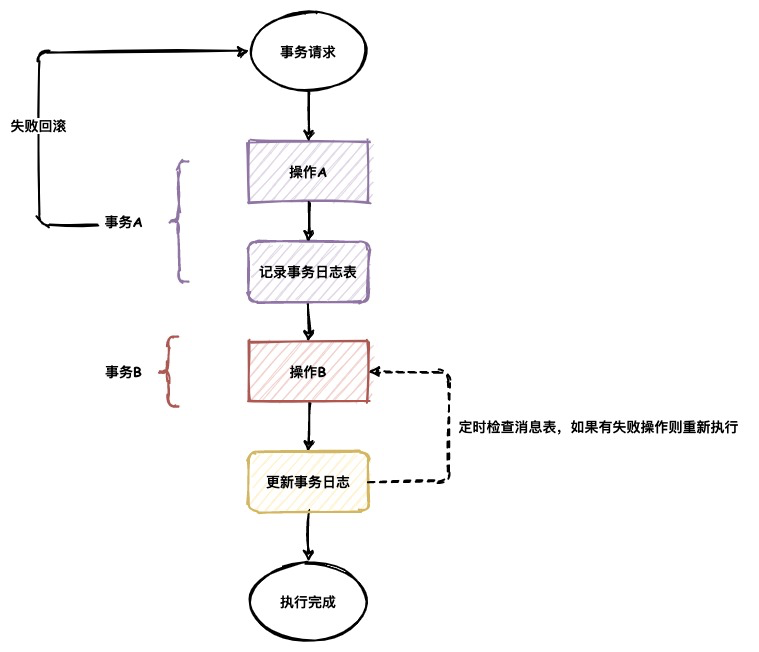

# 常用的分布式事务解决方案

原文：[《分库分表下事务问题的一些解决思路》](https://www.morcat.cn/archives/dbtransacation)

[toc]

## 2PC（Two-Phase Commit）

2PC 即为两阶段提交，是一种在多节点间实现事务原子提交的算法，用来确保所有节点要么全部提交，要么全部中止。我们可以有多种方案来实现该算法，如基于XA协议的实现，阿里也提供了 Seata 中间件支持 2PC 算法。

根据图示可以发现我们引入了一个新组件叫做「协调者」(也称事务管理者)，他的作用是协调所有参与者的提交与回滚操作。

2PC 既然叫做两阶段提交，那必然是分成了两个阶段：

-   ==准备阶段==： 协调者会在准备阶段给所有参与者都发送准备命令。如果参与者发现准备命令无法执行或者执行失败时，可以返回失败，如果执行完成则保存事务日志并返回成功。针对于数据库的操作，准备阶段会记录 redolog 以及 undolog 为后续的提交做准备。需要注意的是在准备阶段时，数据实际是没有被真正保存的。
-   ==提交阶段==： 协调者在提交阶段会根据准备阶段各个参与者的返回结果，判断是执行事务还是回滚事务并向所有参与者发起提交命令。其中只有当准备阶段的所有节点都返回成功，协调者才会发送执行事务的命令。如果有一个参与者返回失败，那么协调者就会向所有参与者发送回滚事务的请求，即分布式事务执行失败。

优点：

-   保证了事务是强一致性的
-   实现相对简单

缺点：

-   同步阻塞问题。如果其中一个参与者响应超时，其他所有参与者都需要等待
-   增加死锁风险。由于每个参与者都可能长时间锁定资源，因此死锁的风险将大大增加
-   单点故障问题。如果协调者出现问题，其他所有参与者将无法判断应该提交还是回滚

## TCC（Try-Confirm-Canel）

TCC 分别指的是三个步骤，Try - Confirm - Cancel。与 2PC 类似，它在逻辑也会分成准备和提交两个阶段。但是最大的不同在于 TCC <u>需要业务服务自己去实现准备、执行、回滚的代码，因此可以做到非常灵活。</u>

-   ==Try==：对资源的预留和锁定
-   ==Confirm==：确认操作，是对事务的真正执行
-   ==Cancel==：撤销操作，把预留阶段的资源撤销

从图中其实我们能发现 TCC 与 2PC 的操作基本是一致的，只是 2PC 针对于数据库操作，TCC 可以让服务方自己去实现相应操作。

优点：

-   实现很灵活，几乎能够满足任何分布式事务的场景

缺点：

-   与业务代码耦合度高，开发复杂度大大提升
-   confirm，cannel 操作需要考虑幂等性
-   其实实现思想还是依据 2PC，因此包含了 2PC 的所有缺点

## 最大努力通知——本地消息表

最大努力通知，顾名思义就是尽可能的保证事务的最终一致性，是一种柔性事务的思想。它有许多种实现方式，这里暂时介绍其中一种：本地消息表

本地消息表其实就是使用一张额外的表来存储数据库操作的日志

根据上图，操作A完成后会记录事务日志。需要注意的是，操作A与记录事务日志处于同一个事务中，这样能够保证操作日志在操作成功后一定会记录成功。后续的操作如果成功，则更新操作日志，将操作结果记为成功；后续的操作如果失败，则更新操作日志，将操作结果记为失败。后台使用定时任务扫描事务日志表，对失败的操作进行回放，以此保证事务的最终一致性。

优点：

-   不会长时间锁定资源，降低死锁风险
-   没有长事务，执行效率高，提高吞吐量

缺点：

-   事务不是强一致性，而是最终一致性

# 适用场景

| 分布式事务解决方案 | 适用场景                       |
| ------------------ | ------------------------------ |
| 2PC                | 数据库层面的分布式事务场景     |
| TCC                | 跨不同业务系统的分布式事务场景 |
| 最大努力通知       | 对事务一致性要求不高的场景     |

