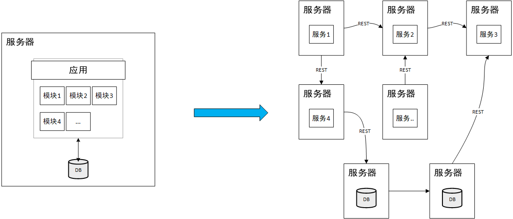
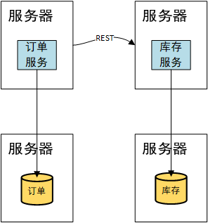
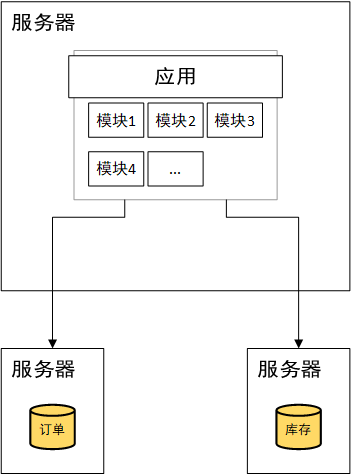

# 一、分布式事务

>   **简介**：分布式系统会把一个应用系统拆分为可独立部署的多个服务，因此需要服务与服务之间远程协作才能完成事务操作，这种分布式系统环境下由不同的服务之间通过网络远程协作完成的事务称之为==分布式事务==

## 1.1 什么是事务

什么是事务？举个生活中的例子：你去商店买东西，“一手交钱，一手交货”就是一个事务的例子，交钱和交货必须全部成功，事务才算成功，任一个活动失败，事务将撤销所有已成功的活动。

明白上述例子，再来看事务的定义：

**事务可以看做是一次大的活动，它由不同的小活动组成，这些活动要么全部成功，要么全部失败。**


## 1.2 事务的分类

### 1.2.1 本地事务

在计算机系统中，更多的是通过关系型数据库来控制事务，这是利用数据库本身的事务特性来实现的，因此叫数据库事务，由于应用主要靠关系数据库来控制事务，而数据库通常和应用在同一个服务器，所以基于关系型数据库的事务又被称为==本地事务==。

>   回顾一下数据库事务的四大基本特性：
>
>   -   A：（Atomic，原子性）组成事务的所有子操作，要么全都执行成功，要么全都执行失败，不存在部分成功的情况
>   -   C：（Consistency，一致性）无论事务是否成功执行，数据库系统的一致性约束不能破坏。以张三向李四转账100元为例，无论转账是否失败，整个系统不会多出100元也不会少去100元。
>   -   I：（Isolation，隔离性）数据库事务通常是并发执行的，隔离性是指多个事务的执行互不干扰（一个事务不能看到另一个事务的中间状态）
>   -   D：（Durability，持续性）事务一旦完成，该事务对数据的操作就会被持久化到数据
>
>   数据库事务在实现时会将一次事务涉及的所有操作全部纳入到一个不可分割的执行单元，该执行单元中的所有操作要么都成功，要么都失败，只要其中任一操作执行失败，都将导致整个事务的回滚。


### 1.2.2 分布式事务

随着互联网的快速发展，软件系统由原来的单体应用转变为分布式应用，下图描述了单体应用向微服务的演变：



分布式系统会把一个应用系统拆分为可独立部署的多个服务，因此需要服务与服务之间远程协作才能完成事务操作，这种分布式系统环境下由不同的服务之间通过网络远程协作完成事务称之为分布式事务，例如用户注册送积分事务、创建订单减库存事务，银行转账事务等都是分布式事务。

我们知道本地事务依赖数据库本身提供的事务特性来实现，因此以下逻辑可以控制本地事务：

```text
begin transaction；
	// 1.本地数据库操作：张三减少金额
	// 2.本地数据库操作：李四增加金额
commit transation;
```

但是在分布式环境下，会变成下边这样：

```text
begin transaction；
	// 1.本地应用操作：张三减少金额
	// 2.远程调用操作：李四增加金额
commit transation;
```

可以设想，当远程调用让李四增加金额成功了，由于网络问题远程调用并没有返回，此时本地事务提交失败就回滚了张三减少金额的操作，此时张三和李四的数据就不一致了。

因此在分布式架构的基础上，传统数据库事务就无法使用了——张三和李四的账户不在一个数据库中甚至不在一个应用系统里，实现转账事务需要通过远程调用，由于网络问题就会导致分布式事务问题。

#### 分布式事务产生的场景

**1、微服务架构 + 多个数据库实例**

分布式事务典型的应用场景就是微服务架构，微服务之间通过远程调用完成事务操作， 比如：电商系统中下单操作需要同时调用订单服务和库存服务来创建订单及消减库存。<u>简言之：跨JVM进程产生分布式事务。</u>




**2、单体系统 + 多个数据库实例**

当单体系统需要访问多个数据库（实例）时也会产生分布式事务。 比如：订单和库存信息存储在不同的数据库实例，电商系统执行订单操作时由于数据分布在不同的数据库实例，需要<font color = red>通过不用的数据库连接去操作数据</font>，此时产生分布式事务。<u>简言之：跨数据库实例产生分布式事务。</u>




**3、微服务架构 + 单个数据库实例**

多服务访问同一个数据库实例，比如：订单服务和库存服务即使访问同一个数据库也会产生分布式事务，原因就是跨JVM进程，两个微服务<font color = red>持有了不同的数据库链接进行数据库操作</font>，此时产生分布式事务。


# 二、CAP 理论

## 2.1 CAP 理论的含义

## 2.2 CAP 理论的论证

### CA without P

### CP without A

### AP without C

# 三、BASE 理论

