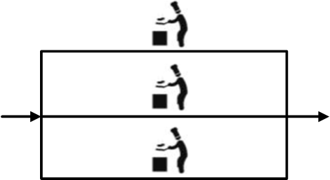
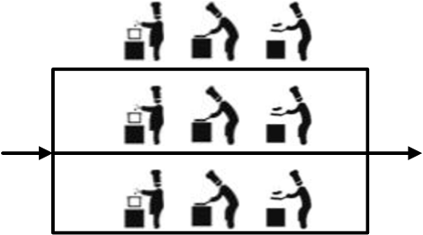
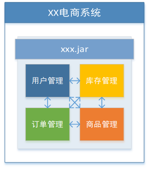
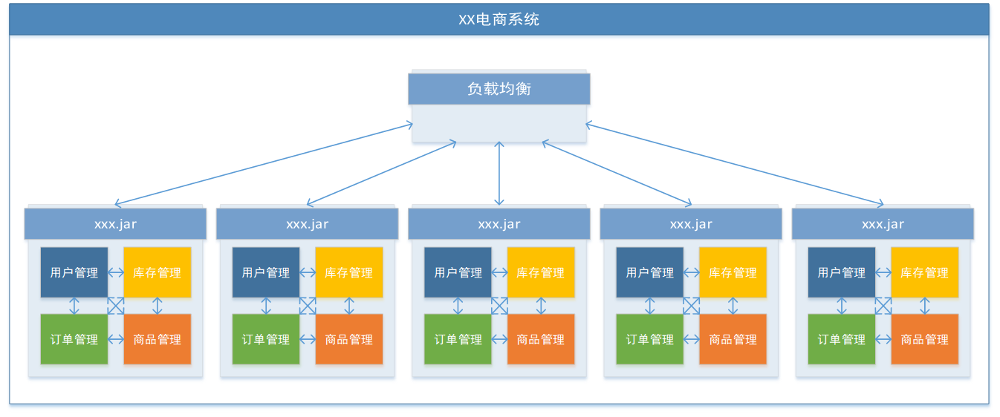
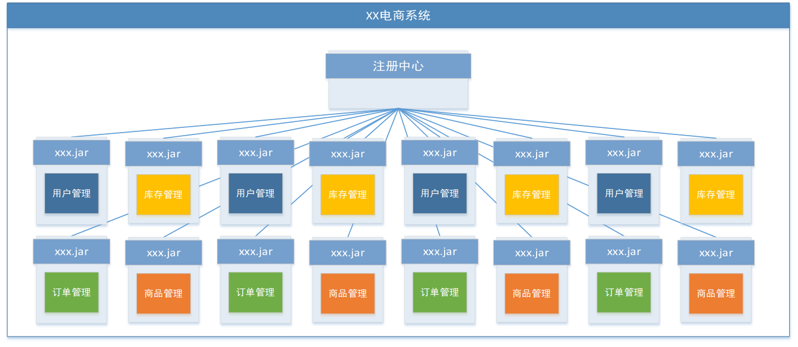
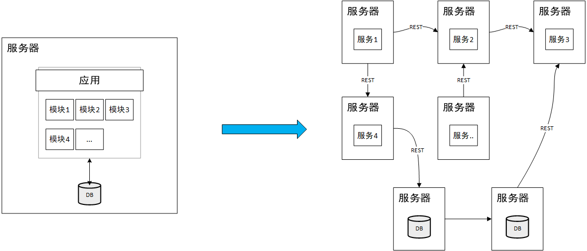
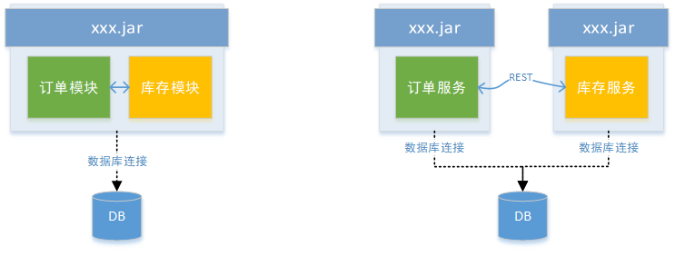
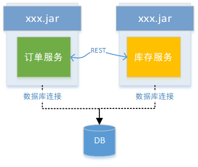
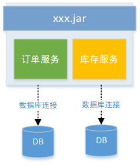

# 分布式事务基础理论

[TOC]

随着大型网站中各种高并发访问、海量数据处理的业务场景越来越多，如何实现网站的高可用、易伸缩、可拓展、安全等目标变得越来越重要。为了解决这一系列问题，大型网站的架构也在不断升级。提到大型网站的高可用架构，不得不提的就是分布式架构。本文将介绍分布式的基本概念、特点以及相关理论。

## 一、分布式架构

分布式架构是由单体架构和集群架构发展而来的一种系统架构，它的主要设计目标是实现系统的高可用。下面通过例子简单的说明分布式架构的发展历史。

1.   单体架构

     张三新开了一家饭店，雇佣了一位厨师，店内洗菜、切菜、备料、炒菜等工作全部由厨师自己完成。由于饭店刚刚开业，客流量还不高，因此一位厨师能够忙得过来。

     

2.   集群架构

     随着客流量的提高，只有一位厨师开始变得忙不过来，于是张三又雇佣了两位厨师。三位厨师能炒一样的菜，此时他们之间的关系就是集群。

     

3.   分布式架构

     随着客流量进一步提高，为了让厨师能够专注于炒菜，张三专门雇佣了几个配菜员来负责洗菜、切菜、备料。此时，配菜员与配菜员之间的关系是集群，厨师与厨师之间的关系是集群，配菜员与厨师之间的关系是分布式。

     

总结：

1.   集群的特点：节点具有相同的处理能力，单个节点独立对外提供服务。
2.   分布式的特点：节点具有不同的处理能力，多个节点配合对外提供服务。
3.   分布式与集群的关系：分布式中可以有集群，但是集群不等用于分布式。







## 二、分布式事务

### 2.1 事务

什么是事务？**事务可以看看作是一个大的活动，它有许多小的活动组成，这些活动要么全部成功，要么全部失败。**

举个例子：你去商店买东西，“买东西”这件事情就是一个事务，它由“交钱”和“交货”两个活动组成。如果光让你给钱，老板不给你东西，你肯定不愿意；如果你光拿东西不给钱，老板肯定不愿意。唯一的成功方式就是“一手交钱，一手交货”。


### 2.2 分布式事务

#### 分布式事务的含义

随着互联网的快速发展，主流软件系统架构由单体架构逐步转变为分布式架构。



在单体系统中，功能以模块的形式分布在单个工程内部，模块与模块之间通过接口调用进行通讯协作。升级为分布式系统后，功能被拆分为服务，服务分散在互联网上，并且服务与服务之间通过网络协议（例如，HTTP）进行通讯协作。

在分布式环境下，由不同的服务通过网络协议协作来完成的事务就被称为==分布式事务==。

#### 分布式事务的难点




与单体系统的事务管理相比，分布式系统的分布式事务管理有何难点？下面以电商系统下单流程为例进行说明。

在单体系统中，因为所有功能都集中在一个工程，可以直接利用关系型数据库的事务特性实现事务管理：

```tex
begin transaction;
    1.插入订单信息 //本地直接操作数据库
    2.更新库存信息 //本地直接操作数据库
end transaction;
```

而在分布式系统中，因为功能被划分到不同的服务，而不同的服务具有不用的数据库连接，所以无法直接利用数据库的事务特性：

```tex
begin transaction;
    1.插入订单信息 //本地直接操作数据库
    2.更新库存信息 //远程接口操作数据库 ⭐
end transaction;
```

由于各服务间的通讯需要需要借助网络，而网络是不可靠的，因此可能出现下面两种情况：

1.   远程调用成功→更新库存失败→<font color = red>网络异常</font>→<font color = red>响应超时</font>
2.   远程调用成功→更新库存成功→<font color = red>网络异常</font>→<font color = red>响应超时</font>

由于接口响应超时，订单服务进行事务回滚，删除创建的订单信息。对于情况1，这种操作是有效的，但是对于情况2，这种操作却是有问题的，因为库存实际已经更新成功，此时如果删除了订单信息，就会破坏数据库的数据一致性。

#### 分布式事务的出现场景

1.   跨进程

     

2.   跨数据库实例

     

## 三、CAP理论


## 四、BASE理论
