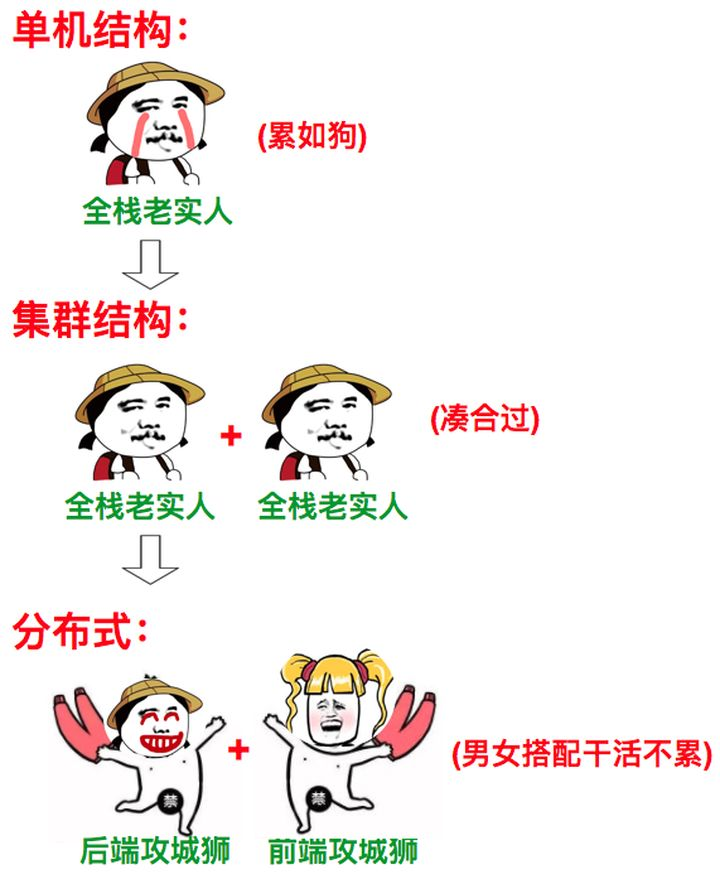

# 分布式基础理论

[TOC]

随着大型网站中各种高并发访问、海量数据处理的业务场景越来越多，如何实现网站的高可用、易伸缩、可拓展、安全等目标变得越来越重要。为了解决这一系列问题，大型网站的架构也在不断升级。提到大型网站的高可用架构，不得不提的就是分布式架构。本文将介绍分布式的基本概念、特点以及相关理论。

## 一、分布式架构

分布式架构是由单体架构和集群架构发展而来的一种系统架构，它的设计目标是实现软件系统的高可用。

### 概念

下面先通过一个例子辅助我们区分单体架构、集群架构以及分布式架构的概念：

1.   单体架构

     张三新开了一家饭店，雇佣了一位厨师，店内洗菜、切菜、备料、炒菜等工作统统由厨师自己负责。由于饭店刚开始营业，客流量还不高，因此一位厨师尚能兼顾所有工作。

     

2.   集群架构

     随着客流量不断提高，一位厨师开始变得忙不过来，于是张三又雇佣了两位厨师。所有的厨师负责相同的工作，此时他们之间的关系就是集群。

     

3.   分布式架构

     随着客流量进一步提高，同时也为了让厨师能够专注于炒菜以提高菜质量，张三专门雇佣了几个配菜员来打下手（洗菜、切菜、备料）。此时，配菜员与配菜员、厨师与厨师之间的关系是集群，配菜员与厨师之间的关系是分布式。

     

### 比较

-    单体架构

     **单体架构有什么特点？**

     开发时，所有功能模块集中在一个工程；运行时，所有功能模块跑在同一个进程。

     

     **单体架构有什么优点？**

     1.   易于开发
     2.   易于测试
     3.   易于运维

     

     **单体架构有什么缺点？**

     1.   功能高度耦合

     2.   持续部署困难：由于功能全都集中在一起，任何功能调整都需要重新部署系统

     3.   故障隔离性低：由于所有功能都在同一个进程内运行，任何功能的漏洞（例如，内存泄漏）将影响整个进程

     4.   扩展灵活度低：即使采用集群也只能同时对整个系统进行增强，无法选择性的对单个模块进行增强

          

-    集群架构

     **有什么特点？**

     1.   由一组相互独立的节点共同对外提供服务
     2.   节点各自运行在不同的进程，但提供相同的服务
     3.   需要专门的节点负责对请求进行分发（负载均衡）

     

     **有什么优点？**

     1.   整体性能高：处理大量相互独立的任务时，可以通过一群节点分而治之，能够获得较高的整体性能
     2.   性价比高：“三个臭皮匠赛过诸葛亮”，只需几台或几十台服务器，就能获取与上百万的专用超级计算机相近甚至更高的性能
     3.   可伸缩性：节点的数量可以根据需要进行调整
     4.   可靠性高：在软件和硬件上都有冗余，发生故障是由存活节点继续提供服务

     

     **有什么缺点？**

     1.   需要解决session共享问题

          >   什么是session共享问题？每一个用户访问服务器的时候会产生一个session，这个session保存了部分中间数据，并伴随用户访问的全过程，直到用户关闭浏览器结束这次会话。在集群架构中，由于请求不会总是分发到一个节点，所以如何在不同的节点间共享session是一个需要解决的问题。
          >
          >   通常的解决方法：使用Redis进行存储

     2.   集群能后解决部分问题，但并不能解决所有问题，无论是从公司成本还是运营成本来说，传统的集群架构已不适应现在的互联网行业，而且一般的公司也没有能力提供太多的服务器。

     

-    分布式架构

     **有什么特点？**

     1.   由一组节点相互协作，共同对外提供服务。
     2.   节点提供的服务可能不同

     

     **有什么优点？**

     1.   扩展灵活度高：可以选择性对某个功能进行增强
     2.   故障隔离性高：功能被分散在不同的节点，不同的节点运行在不同的进程甚至不同的服务器

     

     **有什么缺点？**

     1.   节点间的交互需要依赖网络，而网络的不可靠性无法回避，需要提供复杂的方案进行解决。
     2.   架构逻辑复杂，对开发人员要求较高
     3.   测试难度高，排错难度高，运维难度高

### 总结

3.   分布式与集群的关系：分布式中可以有集群，但是集群不等用于分布式。




## 二、分布式事务

### 2.1 事务

什么是事务？**事务可以看看作是一个大的活动，它有许多小的活动组成，这些活动要么全部成功，要么全部失败。**

举个生活中的例子：你去商店买东西，“买东西”这件事情就是一个事务，它由“交钱”和“交货”两个活动组成。如果光让你给钱，老板不给你东西，你肯定不愿意；如果你光拿东西不给钱，老板肯定不愿意。唯一的成功方式就是“一手交钱，一手交货”。


软件系统中的事务与生活中的事务基本相同。软件系统中的事务一般包含多表更新、删除操作。

### 2.2 分布式事务

#### 分布式事务的含义

随着互联网的快速发展，主流软件系统架构由单体架构逐步转变为分布式架构。


在单体系统中，功能以模块的形式分布在单个工程内部，模块与模块之间通过接口调用进行通讯协作。升级为分布式系统后，功能被拆分为服务，服务分散在互联网上，并且服务与服务之间通过网络协议（例如，HTTP）进行通讯协作。

在分布式环境下，由不同的服务通过网络协议协作来完成的事务就被称为==分布式事务==。

#### 分布式事务的难点


与单体系统的事务管理相比，分布式系统的分布式事务管理有何难点？下面以电商系统下单流程为例进行说明。

在单体系统中，因为所有功能都集中在一个工程，可以直接利用关系型数据库的事务特性实现事务管理：

```tex
begin transaction;
    1.插入订单信息 //本地直接操作数据库
    2.更新库存信息 //本地直接操作数据库
end transaction;
```

而在分布式系统中，因为功能被划分到不同的服务，而不同的服务具有不用的数据库连接，所以无法直接利用数据库的事务特性：

```tex
begin transaction;
    1.插入订单信息 //本地直接操作数据库
    2.更新库存信息 //远程接口操作数据库 ⭐
end transaction;
```

由于各服务间的通讯需要需要借助网络，而网络是不可靠的，因此可能出现下面两种情况：

1.   远程调用成功→更新库存失败→<font color = red>网络异常</font>→<font color = red>响应超时</font>
2.   远程调用成功→更新库存成功→<font color = red>网络异常</font>→<font color = red>响应超时</font>

由于接口响应超时，订单服务进行事务回滚，删除创建的订单信息。对于情况1，这种操作是有效的，但是对于情况2，这种操作却是有问题的，因为库存实际已经更新成功，此时如果删除了订单信息，就会破坏数据库的数据一致性。

#### 分布式事务的出现场景

1.   跨进程

     

2.   跨数据库实例

     

## 三、CAP理论


## 四、BASE理论
