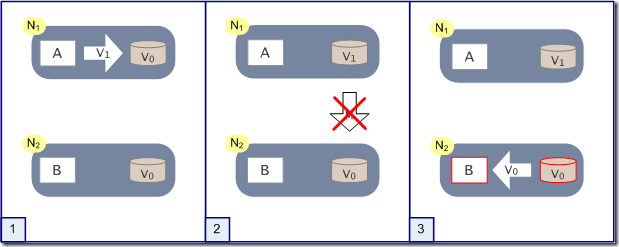

# 分布式系统：CAP、BASE理论

原文地址：

1.  [初识分布式系统](https://www.hollischuang.com/archives/655)

2.  [关于分布式一致性的探究](https://www.hollischuang.com/archives/663)

3.  [分布式系统的CAP理论](https://www.hollischuang.com/archives/666)

4.  [分布式系统的BASE理论](https://www.hollischuang.com/archives/672)

---

[toc]

## 一、分布式系统介绍

随着大型网站的各种高并发访问、海量数据处理等场景越来越多，如何实现网站的高可用、易伸缩、可扩展、安全等目标就显得越来越重要。为了解决这样一系列问题，大型网站的架构也在不断发展。提高大型网站的高可用架构，不得不提的就是分布式。

### 集中式系统

在学习分布式之前，先了解一下与之相对应的集中式系统是什么样的。

集中式系统用一句话概括就是：**一个主机带多个终端**。终端没有数据处理能力，仅负责数据的录入和输出。而运算、存储等全部在主机上进行。现在的银行系统，大部分都是这种集中式的系统，此外，在大型企业、科研单位、军队、政府等也有分布。集中式系统，主要流行于上个世纪。

集中式系统的最大的特点就是部署结构非常简单，底层一般采用从IBM、HP等厂商购买到的昂贵的大型主机。因此无需考虑如何对服务进行多节点的部署，也就不用考虑各节点之间的分布式协作问题。但是，由于采用单机部署。很可能带来系统大而复杂、难于维护、发生单点故障（单个点发生故障的时候会波及到整个系统或者网络，从而导致整个系统或者网络的瘫痪）、扩展性差等问题。

### 分布式系统

在《分布式系统概念与设计》一书中，对分布式系统做了如下定义：**分布式系统是一个硬件或软件组件分布在不同的网络计算机上，彼此之间仅仅通过消息传递进行通信和协调的系统。**

<u>简单来说就是一群独立计算机集合共同对外提供服务</u>，但是对于系统的用户来说，就像是一台计算机在提供服务一样。分布式意味着可以采用更多的普通计算机（相对于昂贵的大型机）组成分布式集群对外提供服务。计算机越多，CPU、内存、存储资源等也就越多，能够处理的并发访问量也就越大。

从分布式系统的概念中我们知道，各个主机之间通信和协调主要通过网络进行，所以，分布式系统中的计算机在空间上几乎没有任何限制，这些计算机可能被放在不同的机柜上，也可能被部署在不同的机房中，还可能在不同的城市中，对于大型的网站甚至可能分布在不同的国家和地区。但是，无论空间上如何分布，一个标准的分布式系统应该具有以下几个主要特征：

-   **分布性**

    分布式系统中的多台计算机之间在空间位置上可以随意分布，系统中的多台计算机之间没有主、从之分，即没有控制整个系统的主机，也没有受控的从机。

-   **透明性**

    系统资源被所有计算机共享。每台计算机的用户不仅可以使用本机的资源，还可以使用本分布式系统中其他计算机的资源(包括CPU、文件、打印机等)。

-   **同一性**

    系统中的若干台计算机可以互相协作来完成一个共同的任务，或者说一个程序可以分布在几台计算机上并行地运行。

-   **通信性**

    系统中任意两台计算机都可以通过通信来交换信息

和集中式系统相比，分布式系统的性价比更高、处理能力更强、可靠性更高、也有很好的扩展性。但是，分布式在解决了网站的高并发问题的同时也带来了一些其他问题。首先，分布式的必要条件就是网络，而<mark>网络是不可靠</mark>的，随时可能出现问题，这可能对性能甚至服务能力造成一定的影响；其次，一个集群中的服务器数量越多，<mark>服务器宕机</mark>的概率也就越大；另外，由于服务在集群中分布是部署，用户的请求只会落到其中一台机器上，所以，一旦处理不好就很容易产生<mark>数据一致性</mark>问题。

#### 常见分布式方案

-   **分布式应用和服务**

    将应用和服务进行分层和分割，然后将应用和服务模块进行分布式部署。这样做不仅可以提高并发访问能力、减少数据库连接和资源消耗，还能使不同应用复用共同的服务，使业务易于扩展。

-   **分布式静态资源**

    对网站的静态资源如JS、CSS、图片等资源进行分布式部署可以减轻应用服务器的负载压力，提高访问速度。

-   **分布式数据存储**

    大型网站常常需要处理海量数据，单台计算机往往无法提供足够的内存空间，可以对这些数据进行分布式存储。

-   **分布式计算**

    随着计算技术的发展，有些应用需要非常巨大的计算能力才能完成，如果采用集中式计算，需要耗费相当长的时间来完成。分布式计算将该应用分解成许多小的部分，分配给多台计算机进行处理。这样可以节约整体计算时间，大大提高计算效率。

#### 分布式与集群

**分布式（distributed）**是指在**多台不同的服务器**中部署**不同的服务模块**，通过远程调用协同工作，对外提供服务。

**集群（cluster）**是指在**多台不同的服务器**中部署**相同应用或服务模块**，构成一个集群，通过负载均衡设备对外提供服务。

## 二、CAP理论

2000年7月，加州大学伯克利分校的Eric Brewer教授在ACM PODC会议上提出CAP猜想。2年后，麻省理工学院的Seth Gilbert和Nancy Lynch从理论上证明了CAP。之后，CAP理论正式成为分布式计算领域的公认定理。

无论你是一个系统架构师，还是一个普通开发，当你开发或者设计一个分布式系统的时候，CAP理论是无论如何也绕不过去的。本节就来介绍一下到底什么是CAP理论，如何证明CAP理论，以及CAP的权衡问题。

### 定义

>   需要注意的的是，CAP理论中的CA和数据库事务中ACID的CA并完全是同一回事儿。两者之中的C都是一致性(Consistency)。但是CAP中的A指的是可用性（Availability），而ACID中的A指的是原子性（Atomicity)，切勿混为一谈。

CAP理论：一个分布式系统最多只能同时满足一致性（Consistency）、可用性（Availability）和分区容错性（Partition tolerance）这三项中的两项：

-   **一致性**

    一致性指 ==“all nodes see the same data at the same time”==，即更新操作成功并返回客户端完成后，所有节点在同一时间的数据完全一致，所以，一致性，说的就是数据一致性。一致性是因为有并发读写才有的问题，因此在理解一致性的问题时，一定要注意结合考虑并发读写的场景。

    对于一致性，可以分为从客户端和服务端两个不同的视角。从客户端来看，一致性主要指的是多并发访问时更新过的数据如何获取的问题。从服务端来看，则是更新如何复制分布到整个系统，以保证数据最终一致。

    从客户端角度，多进程并发访问时，更新过的数据在不同进程如何获取的不同策略，决定了不同的一致性：对于关系型数据库，要求更新过的数据能被后续的访问都能看到，这是**强一致性**；如果能容忍后续的部分或者全部访问不到，这是**弱一致性**；如果经过一段时间后要求能访问到更新后的数据，这是**最终一致性**。

    <mark>CAP理论中的一致性指的是强一致性。</mark>

-   **可用性**

    可用性指 ==“Reads and writes always succeed”==，即服务一直可用，而且是正常响应时间。

    对于一个可用性的分布式系统，每一个非故障的节点必须对每一个请求作出响应。所以，一般我们在衡量一个系统的可用性的时候，都是通过停机时间来计算的。

    | 可用性分类                   | 可用水平（%） | 年可容忍停机时间 |
    | ---------------------------- | ------------- | ---------------- |
    | 容错可用性                   | 99.9999       | <1 min           |
    | 极高可用性                   | 99.999        | <5 min           |
    | 具有故障自动恢复能力的可用性 | 99.99         | <53 min          |
    | 高可用性                     | 99.9          | <8.8h            |
    | 商品可用性                   | 99            | <43.8 min        |

    通常我们描述一个系统的可用性时，我们说淘宝的系统可用性可以达到5个9，意思就是说他的可用水平是99.999%，即全年停机时间不超过 `(1-0.99999)*365*24*60 = 5.256 min`，这是一个极高的要求。

    好的可用性主要是指系统能够很好的为用户服务，不出现用户操作失败或者访问超时等用户体验不好的情况。一个分布式系统，上下游设计很多系统如负载均衡、WEB服务器、应用代码、数据库服务器等，任何一个节点的不稳定都可以影响可用性。

-   **分区容错性**

    分区容错性指==“the system continues to operate despite arbitrary message loss or failure of part of the system”==，即分布式系统在遇到某节点或网络分区故障的时候，仍然能够对外提供满足一致性和可用性的服务。

    分区容错性和扩展性紧密相关。在分布式应用中，可能因为一些分布式的原因导致系统无法正常运转。好的分区容错性要求能够使应用虽然是一个分布式系统，而看上去却好像是在一个可以运转正常的整体。比如现在的分布式系统中有某一个或者几个机器宕掉了，其他剩下的机器还能够正常运转满足系统需求，或者是机器之间有网络异常，将分布式系统分隔未独立的几个部分，各个部分还能维持分布式系统的运作，这样就具有好的分区容错性。

    简单点说，就是在网络中断，消息丢失的情况下，系统如果还能正常工作，就是有比较好的分区容错性。

### 证明

如上图，是我们证明CAP的基本场景，网络中有两个节点N1和N2，可以简单的理解N1和N2分别是两台计算机，他们之间网络可以连通，N1中有一个应用程序A和一个数据库V0，N2也有一个应用程序B和一个数据库V0。现在，A和B是分布式系统的两个部分，V是分布式系统的数据存储的两个子数据库。

在满足一致性的时候，N1和N2中的数据是一样的，V0=V0。在满足可用性的时候，用户不管是请求N1或者N2，都会得到立即响应。在满足分区容错性的情况下，N1和N2有任何一方宕机，或者网络不通的时候，都不会影响N1和N2彼此之间的正常运作。

如上图，是分布式系统正常运转的流程，用户向N1机器请求数据更新，程序A更新数据库V0为V1，分布式系统将数据进行同步操作M，使得N2中的数据V0也更新为V1，N2中的数据再响应N2的请求。

这里，可以定义N1和N2的数据库V之间的数据是否一样为一致性；外部对N1和N2的请求响应为可用行；N1和N2之间的网络环境为分区容错性。这是正常运作的场景，也是理想的场景，然而现实是残酷的，当错误发生的时候，一致性和可用性还有分区容错性，是否能同时满足，还是说要进行取舍呢？

作为一个分布式系统，它和单机系统的最大区别，就在于网络，现在假设一种极端情况，N1和N2之间的网络断开了，我们要支持这种网络异常，相当于要满足分区容错性，能不能同时满足一致性和响应性呢？还是说要对他们进行取舍。

假设在N1和N2之间网络断开的时候，有用户向N1发送数据更新请求，那N1中的数据V0将被更新为V1，由于网络是断开的，所以分布式系统同步操作M无法完成，所以N2中的数据依旧是V0；这个时候，有用户向N2发送数据读取请求，由于数据还没有进行同步，应用程序没办法立即给用户返回最新的数据V1，怎么办呢？

有二种选择：

1.  牺牲数据一致性，保证可用性。响应旧的数据V0给用户；

2.  牺牲可用性，保证数据一致性。阻塞等待，直到网络连接恢复，数据更新操作M完成之后，再给用户响应最新的数据V1。

以上证明了要满足分区容错性的分布式系统，只能在一致性和可用性两者中，选择其中一个。

### 权衡

-   **CA without P**

    这种情况在分布式系统中几乎是不存在的。首先在分布式环境下，网络分区是一个自然的事实。因为分区是必然的，所以如果舍弃P，意味着要舍弃分布式系统。那也就没有必要再讨论CAP理论了。这也是为什么在前面的CAP证明中，我们以系统满足P为前提论述了无法同时满足C和A。

    比如我们熟知的关系型数据库，如MySql和Oracle就是保证了可用性和数据一致性，但是他并不是个分布式系统。一旦关系型数据库要考虑主备同步、集群部署等就必须要把P也考虑进来。

    其实，在CAP理论中。C，A，P三者并不是平等的，CAP之父在《Spanner，真时，CAP理论》一文中写到：

    >   如果说Spanner真有什么特别之处，那就是谷歌的广域网。Google通过建立私有网络以及强大的网络工程能力来保证P，在多年运营改进的基础上，在生产环境中可以最大程度的减少分区发生，从而实现高可用性。

    从Google的经验中可以得到的结论是，无法通过降低CA来提升P。要想提升系统的分区容错性，需要通过提升基础设施的稳定性来保障。

    <mark>所以，对于一个分布式系统来说，P是一个基本要求，CAP三者中，只能在CA两者之间做权衡，并且要想尽办法提升P。</mark>

-   **CP without A**

    如果一个分布式系统不要求强的可用性，即容许系统停机或者长时间无响应的话，就可以在CAP三者中保障CP而舍弃A。

    一个保证了CP而一个舍弃了A的分布式系统，一旦发生网络故障或者消息丢失等情况，就要牺牲用户的体验，等待所有数据全部一致了之后再让用户访问系统。

    设计成CP的系统其实也不少，其中最典型的就是很多分布式数据库，他们都是设计成CP的。在发生极端情况时，优先保证数据的强一致性，代价就是舍弃系统的可用性。如Redis、HBase等，还有分布式系统中常用的Zookeeper也是在CAP三者之中选择优先保证CP的。

    无论是像Redis、HBase这种分布式存储系统，还是像Zookeeper这种分布式协调组件。数据的一致性是他们最最基本的要求。一个连数据一致性都保证不了的分布式存储要他有何用？

-   **AP without C**

    要高可用并允许分区，则需放弃一致性。一旦网络问题发生，节点之间可能会失去联系。为了保证高可用，需要在用户访问时可以马上得到返回，则每个节点只能用本地数据提供服务，而这样会导致全局数据的不一致性。

    这种舍弃强一致性而保证系统的分区容错性和可用性的场景和案例非常多。前面我们介绍可用性的时候说到过，很多系统在可用性方面会做很多事情来保证系统的全年可用性可以达到N个9，所以，对于很多业务系统来说，比如淘宝的购物，12306的买票。都是在可用性和一致性之间舍弃了一致性而选择可用性。

    你在12306买票的时候肯定遇到过这种场景，当你购买的时候提示你是有票的（但是可能实际已经没票了），你也正常的去输入验证码，下单了。但是过了一会系统提示你下单失败，余票不足。这其实就是先在可用性方面保证系统可以正常的服务，然后在数据的一致性方面做了些牺牲，会影响一些用户体验，但是也不至于造成用户流程的严重阻塞。

    但是，我们说很多网站牺牲了一致性，选择了可用性，这其实也不准确的。就比如上面的买票的例子，其实舍弃的只是强一致性。退而求其次保证了最终一致性。也就是说，虽然下单的瞬间，关于车票的库存可能存在数据不一致的情况，但是过了一段时间，还是要保证最终一致性的。

    对于多数大型互联网应用的场景，主机众多、部署分散，而且现在的集群规模越来越大，所以节点故障、网络故障是常态，而且要保证服务可用性达到N个9，即保证P和A，舍弃C（退而求其次保证最终一致性）。虽然某些地方会影响客户体验，但没达到造成用户流程的严重程度。

上面介绍了如何CAP中权衡及取舍以及典型的案例。孰优孰略，没有定论，只能根据场景定夺，适合的才是最好的。

对于涉及到钱财这样不能有一丝让步的场景，C必须保证。网络发生故障宁可停止服务，这是保证CP，舍弃A。比如前几年支付宝光缆被挖断的事件，在网络出现故障的时候，支付宝就在可用性和数据一致性之间选择了数据一致性，用户感受到的是支付宝系统长时间宕机，但是其实背后是无数的工程师在恢复数据，保证数数据的一致性。

对于其他场景，比较普遍的做法是选择可用性和分区容错性，舍弃强一致性，退而求其次使用最终一致性来保证数据的安全。这其实是分布式领域的另外一个理论——BASE理论。

## 三、BASE理论

eBay的架构师Dan Pritchett源于对大规模分布式系统的实践总结，在ACM上发表文章提出BASE理论，**BASE理论是对CAP理论的延伸**，核心思想是即使无法做到强一致性（CAP的一致性就是强一致性），但应用可以采用适合的方式达到最终一致性。

BASE是指基本可用（Basically Available）、软状态（ Soft State）、最终一致性（ Eventual Consistency）：

-   **基本可用**

    基本可用是指分布式系统在出现故障的时候，允许损失部分可用性，即保证核心可用。

    电商大促时，为了应对访问量激增，部分用户可能会被引导到降级页面，服务层也可能只提供降级服务。这就是损失部分可用性的体现。

-   **软状态**

    软状态是指允许系统存在中间状态，而该中间状态不会影响系统整体可用性。分布式存储中一般一份数据至少会有三个副本，允许不同节点间副本同步的延时就是软状态的体现。mysql replication的异步复制也是一种体现。

-   **最终一致性**

    最终一致性是指系统中的所有数据副本经过一定时间后，最终能够达到一致的状态。弱一致性和强一致性相反，最终一致性是弱一致性的一种特殊情况。

### ACID和BASE的区别和联系

ACID是传统数据库常用的设计理念，追求强一致性模型；BASE支持的是大型分布式系统，提出通过牺牲强一致性获得高可用性。

ACID和BASE代表了两种截然相反的设计哲学。

在分布式系统设计的场景中，系统组件对一致性要求是不同的，因此ACID和BASE又会结合使用。

## 四、分布式一致性

CAP理论告诉我们，任何一个分布式系统无法同时满足一致性、可用性和分区容错性，最多只能满足其中的两项。但是，一个分布式系统无论在CAP三者之间如何进行权衡，都无法彻底放弃一致性。如果彻底放弃一致性，那么就说明这个系统中的数据根本不可信，数据也就没有意义，那么这个系统也就没有任何价值可言。所以，无论如何，分布式系统的一致性问题都需要重点关注。

通常情况下，我们所说的分布式一致性问题通常指的是数据一致性问题。那么我们就先来了解一下什么是数据一致性。

#### 数据一致性

数据一致性其实是数据库系统中的概念。我们可以简单的把一致性理解为正确性或者完整性，那么数据一致性通常指关联数据之间的逻辑关系是否正确和完整。我们知道，在数据库系统中通常用事务（访问并可能更新数据库中各种数据项的一个程序执行单元）来保证数据的一致性和完整性。而在分布式系统中，数据一致性往往指的是由于数据的复制，不同数据节点中的数据内容是否完整并且相同。

比如在集中式系统中，有一些关键的配置信息，可以直接保存在服务器的内存中，但是在分布式系统中，如何保存这些配置信息，又如何保证所有机器上的配置信息都保持一致，又如何保证修改一个配置能够把这次修改同步到所有机器中呢？

再比如，在集中式系统中，进行一个同步操作要写同一个数据的时候，可以直接使用事务+锁来管理保证数据的ACID。但是，在分布式系统中如何保证多台机器不会同时写同一条数据呢？

除了上面提到的同一个数据的一致性，还有一种情况也可以叫做数据的一致性：比如我们在电商网站下单，需要经历扣减库存、扣减红包、扣减折扣券等一系列操作。如果库存库存扣减成功，但是红包和折扣券扣减失败的话，也可以说是数据没有保证一致性。

如何保证数据的一致性，是分布式系统中必须面对的问题。

#### 为什么会有数据一致性问题

虽然分布式系统有着诸多优点，但是由于采用多机器进行分布式部署的方式提供服务，必然存在着数据的复制（如数据库的异地容灾，多地部署）。分布式系统的数据复制需求主要来源于以下两个原因：

-   可用性：将数据复制到分布式部署的多台机器中，可以消除单点故障。防止系统由于某台（些）机器宕机导致的不可用。
-   性能：通过负载均衡技术，能够让分布在不同地方的数据副本全都对外提供服务。有效提高系统性能。

分布式系统为了提升可用性和性能，会通过复制技术来进行数据同步。复制机制的目的是为了保证数据的一致性。但是数据复制面临的主要难题也是如何保证多个副本之间的数据一致性。在分布式系统引入复制机制后，不同的数据节点之间由于<mark>网络延时</mark>等原因很容易产生数据不一致的情况。

如果上面提到的数据复制场景你不是很熟悉的话，下面这个例子你肯定遇到过。就是现在很多网站都是微服务化的，一个网站被垂直拆分成多个功能模块。各模块之间独立部署。模块间通过RPC或者HTTP交互。由于这种RPC或者HTTP的交互可能存在网络延迟导致超时的情况。甚至被调用方也有可能执行出错等情况，这时候就可能导致数据不一致。

比如下单操作要依次扣减红包、扣减折扣券、扣减库存。在下单应用的执行过程中，调用红包系统扣减红包成功了，但是再调用折扣券系统扣减折扣券的时候网络超时了。这时候下单应用根本不知道折扣券系统到底有没有执行成功。这时候他就需要一些机制来决定是要回滚红包的扣减，还是继续执行库存的扣减。这种机制，其实就是数据一致性的解决方案了。

由于应用分布式部署，就无法通过数据库事务保证多个写操作的原子性。一旦某个操作失败，其他操作如果不回滚的话就会发生数据不一致问题。

因此，如何能既保证数据一致性，又保证系统的性能，是每一个分布式系统都需要重点考虑和权衡的。一致性模型可以在做这些权衡的时候给我们很多借鉴和思考。

#### 一致性模型

##### 强一致性

当更新操作完成之后，任何多个后续进程或者线程的访问都会返回最新的更新过的值。这种是对用户最友好的，就是用户上一次写什么，下一次就保证能读到什么。

但是这种实现对性能影响较大，因为这意味着，只要上次的操作没有处理完，就不能让用户读取数据。

##### 弱一致性

系统并不保证进程或者线程的访问都会返回最新的更新过的值。系统在数据写入成功之后，不承诺立即可以读到最新写入的值，也不会具体的承诺多久之后可以读到。但会尽可能保证在某个时间级别（比如秒级别）之后，可以让数据达到一致性状态。

###### 最终一致性

弱一致性的特定形式。系统保证在没有后续更新的前提下，系统最终返回上一次更新操作的值。在没有故障发生的前提下，不一致窗口的时间主要受通信延迟，系统负载和复制副本的个数影响。DNS是一个典型的最终一致性系统。

最终一致性模型存在如下变种：

-   **因果一致性**：如果A进程在更新之后向B进程通知更新的完成，那么B的访问操作将会返回更新的值。如果没有因果关系的C进程将会遵循最终一致性的规则。
-   **读己所写一致性**：因果一致性的特定形式。一个进程总可以读到自己更新的数据。
    -   **会话一致性**：读己所写一致性的特定形式。进程在访问存储系统同一个会话内，系统保证该进程读己之所写。
-   **单调读一致性**：如果一个进程已经读取到一个特定值，那么该进程不会读取到该值以前的任何值。
-   **单调写一致性**：系统保证对同一个进程的写操作串行化。

上述最终一致性的不同方式可以进行组合，例如单调读一致性和读己之所写一致性就可以组合实现。并且从实践的角度来看，这两者的组合，读取自己更新的数据，和一旦读取到最新的版本不会再读取旧版本，对于此架构上的程序开发来说，会少很多额外的烦恼。

Redis为什么是CP

MySQL为什么是CA