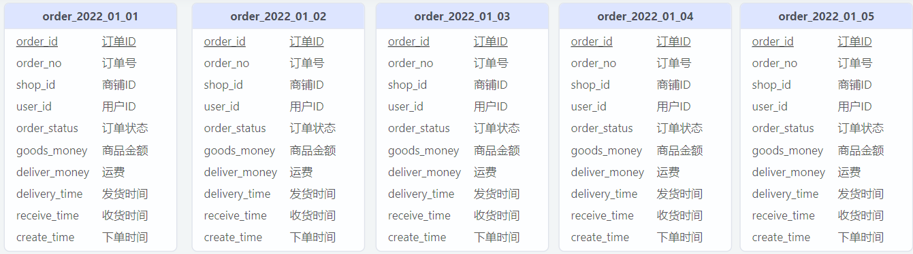
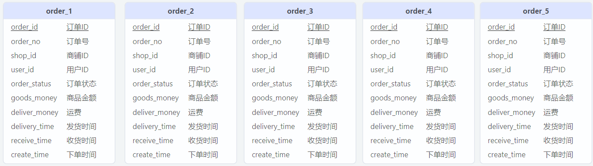

# 分库分表常见问题 - 跨节点排序分页

## 水平分表

对于大数据量且访问频繁的表，通常会将其水平分割成多个表：



<center>图1. 按照日期分表</center>



<center>图2. 按照订单号取模分表</center>

虽然分表降低了单张表数据存储以及数据访问的压力，但是增加了数据排序查询、分页查询的难度。下面对如何处理分表场景下的排序、分页查询进行分析。


### Sharding-key


分库分表的时候通常需要设置 Sharding-key，以图1、图2为例：

-   图1：以 create_time 为 Sharding-key，将相同日期的订单放在同一张表
-   图2：以 order_no 为 Sharding-key，将 order_no%5 结果相同的订单放在同一张表


如果查询条件中存在 Sharding-key，那么处理起来就很简单：先根据 Sharding-key 定位到数据表，然后进行排序分页查询。

例如，对于以下 SQL：

```mysql
SELECT
    ...
FROM 
    order
WHERE
    create_time = '2022-01-03' and ...
ORDER BY
    ...
LIMIT ...
```

可以先在业务层根据 create_time 定位到表 order_2022_01_03，然后向数据库发送 SQL：

```mysql
SELECT
    ...
FROM 
    order_2022_01_03
WHERE
    ...
ORDER BY
    ...
LIMIT ...
```

配合上索引的话，查询速度应该是有保障的。


### 暴力解法

如果查询条件里面没有 Sharding-key 怎么办？最简单，最直接，最暴力的解法：

1.  根据查询条件、排序条件到每张分表筛选数据
2.  对从每张表筛选出的数据进行归并处理
3.  对归并后的数据进行分页处理

缺点：查询速度慢、数据量大


### 曲线救国

实际上分表查询需要解决的关键问题是如何获得一个“全局视野”，也就是说，只要能提供一个全局计算的地方就可以快速查询数据，这个时候我们可以手动维护一张索引表：

|  库  |  表  | 主键 | 查询条件… | 排序条件… |
| :--: | :--: | :--: | :-------: | :-------: |
|      |      |      |           |           |

有了索引表以后，可以先根据查询条件、排序条件到索引表找到目标数据所在的库、表以及主键，然后再进行查询。

缺点：额外维护索引表，影响目标表更新速度