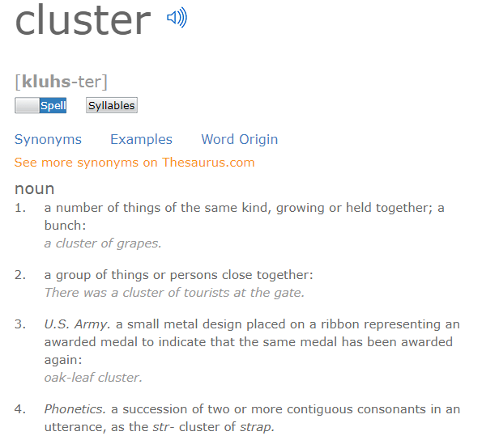
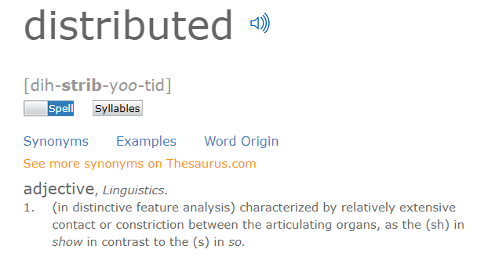

# 单机结构、集群结构、分布式结构

原文地址：[分布式与集群的区别是什么？](https://www.zhihu.com/question/20004877/answer/282033178)

---

## 浅显的认识

### 单机结构

单机结构是大家最熟悉的系统结构，当一个系统业务量还很小的时候（项目初期或系统访问量就是很小），所有代码都放在一个项目，项目部署在一台服务器。整个系统的服务都由这个项目提供；整个项目的支持都由这台服务器负责，这就是单机结构。

-   优点：成本低。适合刚起步的、业务量小的、对可靠性要求低的系统。

-   缺点：单个服务器资源、处理能力有限，单个服务器不够保险。

当一台服务器无法满足业务需求，此时便出现了集群模式。

### 集群结构

单机处理到达瓶颈的时候，你就把单机复制几份，这样就构成了一个“集群”。集群中每台服务器就叫做这个集群的一个“节点”，所有节点构成了一个集群。每个节点都提供相同的服务，那么这样系统的处理能力就相当于提升了好几倍（有几个节点就相当于提升了这么多倍）。

但问题是用户的请求究竟由哪个节点来处理呢？最好能够让此时此刻负载较小的节点来处理，这样使得每个节点的压力都比较平均。要实现这个功能，就需要在所有节点之前增加一个“调度者”的角色，用户的所有请求都先交给它，然后它根据当前所有节点的负载情况，决定将这个请求交给哪个节点处理。这个“调度者”有个牛逼了名字——负载均衡服务器。

集群结构的好处就是系统扩展非常容易。如果随着你们系统业务的发展，当前的系统又支撑不住了，那么给这个集群再增加节点就行了。但是，当你的业务发展到一定程度的时候，你会发现一个问题——无论怎么增加节点，貌似整个集群性能的提升效果并不明显了。这时候，你就需要使用微服务结构了。

### 分布式结构

先来对前面的知识点做个总结。

从单机结构到集群结构，你的代码基本无需要作任何修改，你要做的仅仅是多部署几台服务器，每台服务器上运行相同的代码就行了。但是，当你要从集群结构演进到微服务结构的时候，之前的那套代码就需要发生较大的改动了。所以对于新系统我们建议，系统设计之初就采用微服务架构，这样后期运维的成本更低。但如果一套老系统需要升级成微服务结构的话，那就得对代码大动干戈了。所以，对于老系统而言，究竟是继续保持集群模式，还是升级成微服务架构，这需要你们的架构师深思熟虑、权衡投入产出比。

OK，下面开始介绍所谓的分布式结构。

分布式结构就是将一个完整的系统，按照业务功能，拆分成一个个独立的子系统，在分布式结构中，每个子系统就被称为“服务”。这些子系统能够独立运行在web容器中，它们之间通过RPC方式通信。

举个例子，假设需要开发一个在线商城。按照微服务的思想，我们需要按照功能模块拆分成多个独立的服务，如：用户服务、产品服务、订单服务、后台管理服务、数据分析服务等等。这一个个服务都是一个个独立的项目，可以独立运行。如果服务之间有依赖关系，那么通过RPC方式调用。

这样的好处有很多：

1.  系统之间的耦合度大大降低，可以独立开发、独立部署、独立测试，系统与系统之间的边界非常明确，排错也变得相当容易，开发效率大大提升。
2.  系统之间的耦合度降低，从而系统更易于扩展。我们可以针对性地扩展某些服务。假设这个商城要搞一次大促，下单量可能会大大提升，因此我们可以针对性地提升订单系统、产品系统的节点数量，而对于后台管理系统、数据分析系统而言，节点数量维持原有水平即可。
3.  服务的复用性更高。比如，当我们将用户系统作为单独的服务后，该公司所有的产品都可以使用该系统作为用户系统，无需重复开发。

## 深入的理解

### ①

前面的答案说的不太准确，==其实分布式不一定就是不同的组件，同一个组件也可以，关键在于是否通过交换信息的方式进行协作==。比如说Zookeeper的节点都是对等的，但它自己就构成一个分布式系统。

也就是说，==分布式是指通过网络连接的多个组件，通过交换信息协作而形成的系统。而集群，是指同一种组件的多个实例，形成的逻辑上的整体==。

可以看出这==两个概念并不完全冲突，分布式系统也可以是一个集群==，例子就是前面说的zookeeper等，它的特征是服务之间会互相通信协作。是分布式系统不是集群的情况，就是多个不同组件构成的系统；是集群不是分布式系统的情况，比如多个经过负载均衡的HTTP服务器，它们之间不会互相通信，如果不带上负载均衡的部分的话，一般不叫做分布式系统。

### ②

IT术语，尤其是国外先发明的概念，看英文更清楚点：

-   集群：主要的提法是cluster
-   分布式：主要的提法是distributed

IT的术语，很多都是来自于自然概念的借鉴，cluster本来什么意思？

distributed, 本来什么意思？

所以，你可以看到，集群主要描述了一个集合，一些相似的东西，提供相似的功能，这个就叫做集群。而分布式，主要是将一个东西，分发给一堆相似的内容或东西。==集群描述了受众的状态，也就是处理机不是单一体，是一个相似的个体组成的群体。分布式描述了源头的处理方式，是将单一源分发给多个处理机，而非单一处理机进行处理==。

当我们讲集群，我们着重描述这个处理机的静态状态，==强调个体和群体之间的联系==。

当我们讲分布式，我们着重描述这个处理机的动态状态，==强调请求和处理之间的分发状况==。
