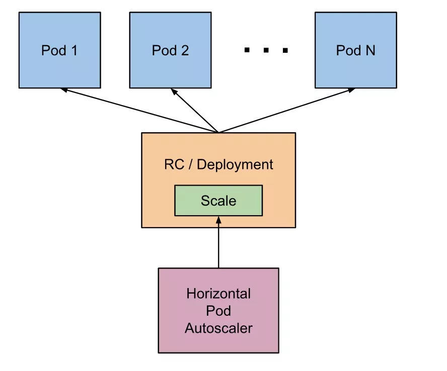
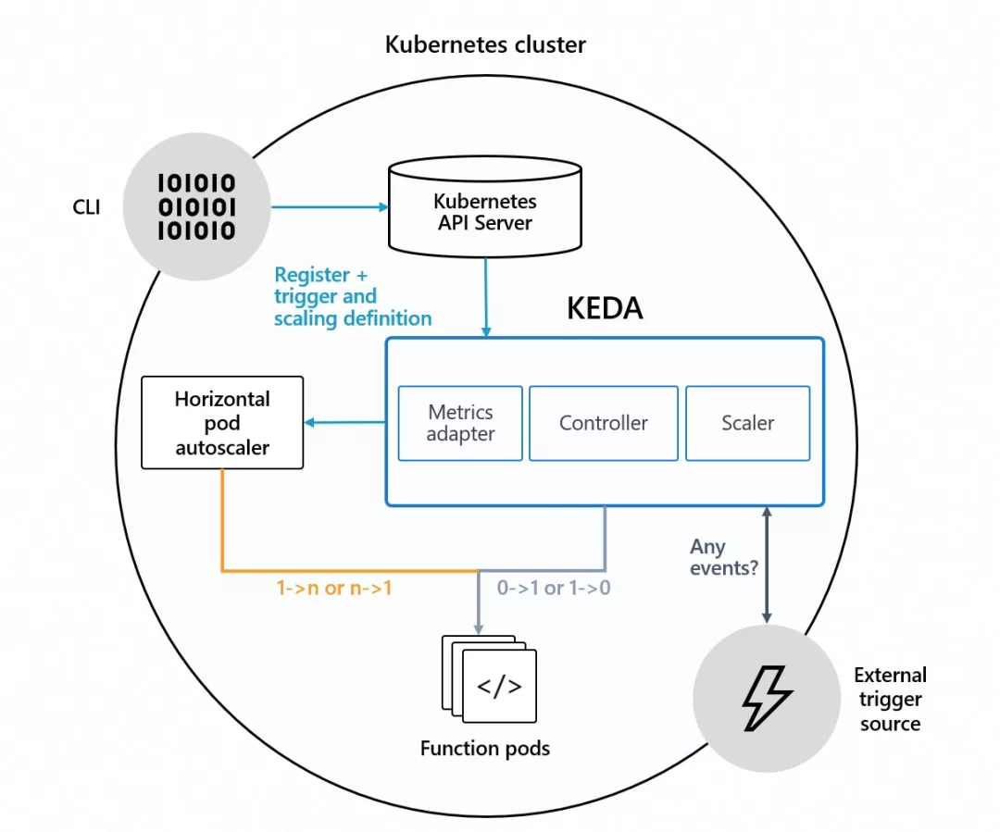
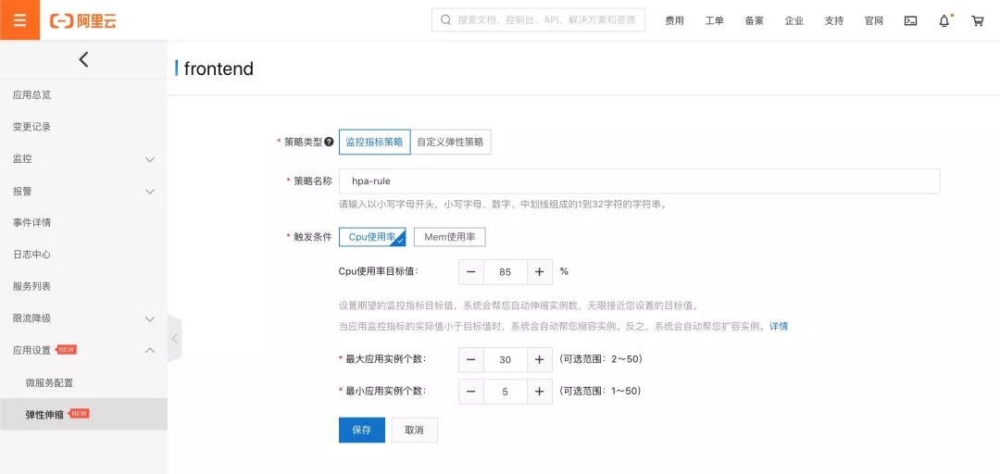
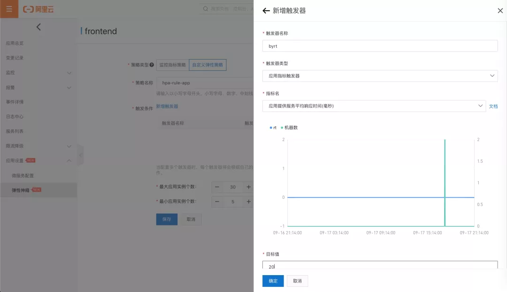
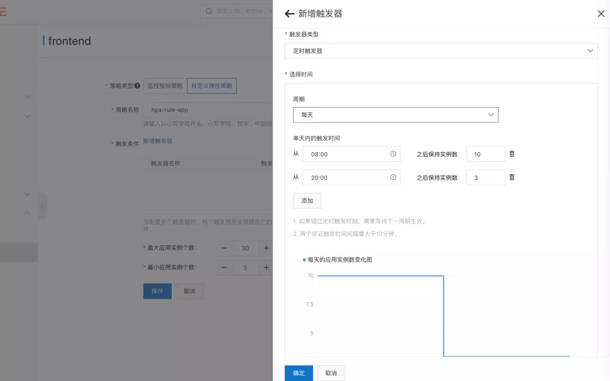
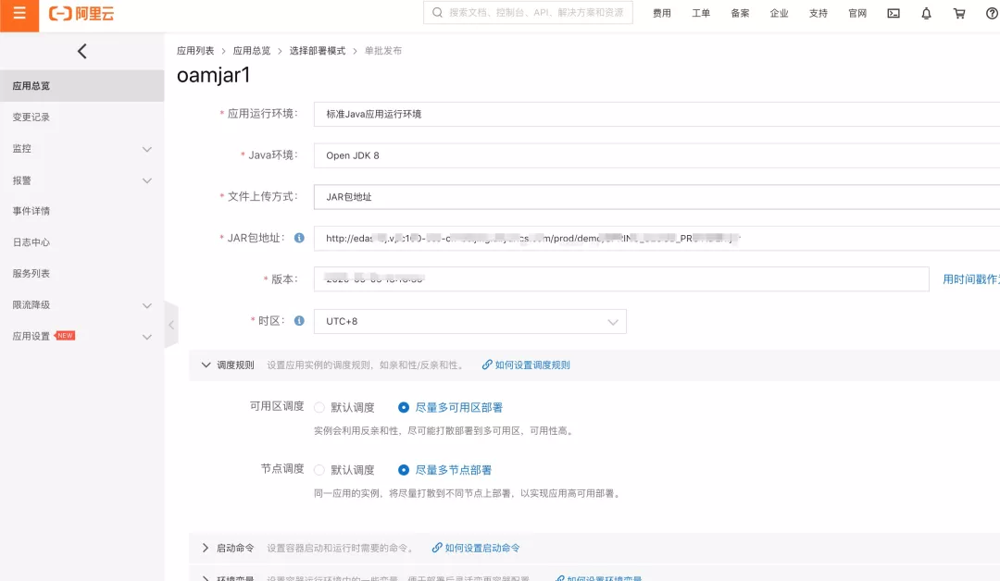
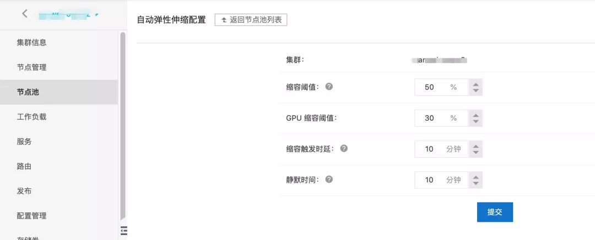
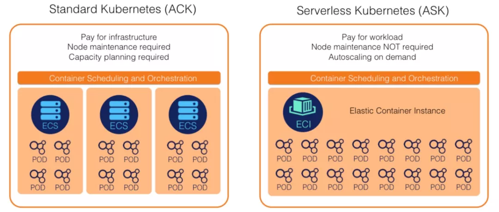
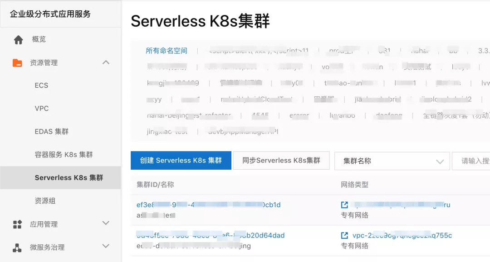

# SpringCloud 应用在 Kubernetes 上的最佳实践 —— 高可用（弹性伸缩）

原文地址：[SpringCloud 应用在 Kubernetes 上的最佳实践 —— 高可用（弹性伸缩）](https://developer.aliyun.com/article/775329?utm_content=g_1000189184)

## 前言

==弹性伸缩是一种为了满足业务需求、保证服务质量、平衡服务成本的重要应用管理策略。==弹性伸缩让应用的部署规模能够根据实时的业务量产生动态调整，在业务高峰期扩大部署规模，保证服务不被业务冲垮；在业务低谷期缩减部署规模，避免资源浪费。

由于大部分云资源是按需取用，按量计费模式，相比使用 IDC，使用云的用户从弹性伸缩获得的==成本优势==是非常明显的，弹性伸缩也是大多数云上用户的选择。而关于如何用好弹性伸缩，一直是用户非常关心的问题，本文尝试围绕这个话题，给出一些相关的思考和优化实践。

有两种实现弹性伸缩方法，一种是“**垂直弹性**”，即“Scale Up”，另一种是“**水平弹性**”，也就是“Scale Out”。

### 1. 垂直弹性伸缩

垂直弹性伸缩一般是指通过==升降服务器的规格==来实现的弹性伸缩。这种伸缩方式对应用本身几乎没有约束，可以被大部分应用或组件使用，它的问题主要在两个方面：

-   动态调整服务器的规格而不影响上层部署的应用，对基础设施要求比较高，对于许多云厂商而言是个难题，<u>并不能实现业务完全无感的动态变配</u>；
-   垂直弹性无法突破单台物理设备的规格限制，面向巨量的突发业务增长，<u>垂直弹性的应对能力是有上限的</u>。

### 2. 水平弹性伸缩

而水平弹性伸缩恰恰相反，它依靠==增减服务器的数量==来实现弹性伸缩，对基础设施的要求不高，水平弹性除了可以解决容量上限的问题，多副本部署还能带来更高的可靠性，因为被广泛的使用在生产系统中，很多时候水平弹性也成了弹性伸缩的代名词，所以我们后文的讲述的主要也是水平弹性。

## 微服务与弹性伸缩

水平弹性虽然存在诸多优势，但它对于应用本身的要求相比垂直弹性是更高的，开发者在使用前需要要考虑好以下的问题：

-   多副本部署要求应用本身无状态化，如何抽离应用中的状态信息并保持配置同步？
-   弹性伸缩导致应用实例本身是不稳定的，如何保证应用实例之间能实现可靠的相互调用？

这些恰好也是微服务架构要解决的问题，而 SpringCloud 作为广泛使用的微服务框架自然不例外，拿问题对号入座的来看：

-   其一，通过 SpringCloud，开发者可以将原先单体应用中无状态的部分拆解出来，以服务的形式来组织业务逻辑，无状态的服务本身是可以进行水平伸缩的，另外 SpringCloud 提供了很易用的集中式配置管理能力，确保了配置信息可以被高效的分发和同步；
-   其二，SpringCloud 的服务注册和发现机制，使得服务可以动态的增加或移除实例，通过熔断等服务治理机制可以进一步提升远程调用的可靠性。

换个角度看，催生微服务的驱动力之一，就是开发者希望利用云的弹性伸缩能力来实现运营成本和服务质量的平衡，因此微服务从设计上就考虑到了要利用弹性伸缩的能力，它们之间是本来就是相辅相成，紧密相关的。

## 原生的弹性伸缩

应用架构支持只是使用弹性伸缩的必要条件之一，想用好弹性伸缩，另外还有两个关键点需要考虑：在什么时机触发弹性伸缩，以及弹性伸缩产生出来的应用如何部署，即**规则触发**和**实例调度**。

在云原生的体系中，K8s 控制了应用的生命周期管理，在弹性规则触发与实例调度方面，K8s 也提供了相关的能力，足够完成应用弹性伸缩的整个过程。

K8s 中，无状态应用通常以 Deployment 的形式进行部署，弹性伸缩过程由 Horizontal Pod  Autoscaler（HPA）来进行控制，开发者设定 CPU 或内存的目标使用率与 Deployment 的副本数区间，由 HPA  负责定时从监控数据中计算并设定目标的副本数，至于实例的调度过程则交由 K8s 的 Scheduler 来控制。

参考：https://kubernetes.io/docs/tasks/run-application/horizontal-pod-autoscale/ 

## 如何优化弹性伸缩？

看起来借助 K8s 的 HPA 机制就可以很轻易的给微服务应用提供弹性伸缩能力，但这样真的就足够了吗？没有那么简单，在弹性伸缩上，目前  SpringCloud 和 K8s  的默认机制仍然存在诸多不足，如果缺少完备而健壮的方案，将其直接用于生产系统，其实是很容易踩坑的。怎么做才能保证弹性伸缩精准到位，过程如丝般顺滑，这是我们写作本文，提供最佳实践的意义。

EDAS 作为一站式的分布式应用管理平台，对于弹性伸缩这样涉及应用监、管、控全方位的场景，在对弹性伸缩的支持上做了系统的设计，打磨出许多功能点，目的是为用户使用弹性伸缩的“减负”，使其能真正落地到用户生产系统中。

顺着刚提到的两个关键点，规则触发与实例调度，我们来看 EDAS 在优化弹性伸缩方面是如何思考与实现的。

### 1. 规则触发

常用的弹性伸缩规则是基于监控数据来进行触发的，K8s 也自带了基于 CPU 和内存监控来触发弹性伸缩的功能。但仅有这两种指标并不够，相比基础监控数据，应用指标数据对于业务量的反馈更为直接和敏感，可以说是适合弹性伸缩参考的“黄金指标”。

但由于 K8s 无法获取到应用的监控信息，这些信息只能通过自定义扩展 API 的方式来实现，对于用户来说，需要理解 K8s 的扩展机制，有一定的学习成本；而且，基于监控数据的规则无法实现实例数从 0 到 1 的扩容，这也不利于实现极致的成本控制。

#### 1）KEDA

针对这些痛点，开源社区发展了很多项目，其中最为典型的是 KEDA（Kubernetes Event-driven Autoscaling），通过事件流来辅助 K8s 进行弹性伸缩，架构如下：

**KEDA 项目地址：https://keda.sh/**

KEDA 可以被方便地安装到任意的 K8s 集群，它的 Controller（Operator）提供了将应用从 0  副本扩缩的能力，KEDA 也提供了监控指标服务，通过不同的 Scaler 来对接各种开源与供应商的监控指标，并将这些指标提供给 HPA  控制器，来完成多副本的弹性伸缩。

#### 2）EDAS 的应用弹性策略

KEDA 的功能很强大，但对于一般用户而言使用的门槛比较高，为了解决这一问题，EDAS 结合 ARMS 提供的应用监控能力，在保留 KEDA 核心功能同时对其做了增强，使得弹性的规则配置更为易用。

EDAS 的弹性伸缩既支持 K8s 原生的 HPA 规则的配置能力：

还能使用应用黄金指标，如服务每秒请求量（QPS）和平均响应时间（RT）：

此外，EDAS 不仅支持指标弹性，还支持定时弹性，通过为不同时段设置合理的副本数区间，定时弹性能最大程度的保证用户体验：

### 2. 实例调度

弹性伸缩的规则触发将产生实例调度的请求，但如何将这些请求分配到节点，并在节点部署应用实例，调度是必经的流程，也是 K8s 的核心能力。对于弹性伸缩这一场景，由于涉及大量新实例创建和旧实例的替换，实例调度的动作非常频繁，首先选择合适的调度策略就非常重要。

#### 1）调度策略

K8s 提供了丰富配置项供开发者设定调度策略，比如节点选择，节点亲和，污点和容忍等。但如何搭配所需的调度规则并没有放之四海而皆准的做法，需要根据业务实际情况来进行制定，这里列举一些设置调度规则时，常见的考虑：

-   弹性伸缩发生时系统往往处于比较繁忙状态，尽可能将新增实例发布到不同节点，可以有效避免集群压力分布不均带来的服务质量受损或资源浪费；
-   将节点分开并均衡部署到多个可用区能有效提升系统的可用性；
-   对于具有密切关联性的应用实例，可以考虑部署到同样的节点或可用区，可以减少调用开销，提升稳定性。

对于第 3 点，仅靠调整调度规则还不够，还要依赖微服务治理的能力，使得关联实例能完成就近的服务路由，这也是 EDAS 正在解决的问题之一，而对同应用分节点或者可用区部署 EDAS 已经提供了直接的支持，用户只需要部署时勾选即可：

弹性伸缩时另一个常见的问题是集群节点资源被用尽，因为 K8s 不会主动扩展节点，此时即使弹性伸缩产生了准确的调度请求，K8s  也无法分配出新的应用实例。考虑到这种可能性，这要求用户预留一部分节点资源以应对弹性的需求，但由于资源池的存在，导致用户付出的成本并非是完全的按用量计费，这又与弹性伸缩的初衷相悖，我们不禁会想，怎么做能让节点资源既能物尽其用又能取之不竭？

#### 2）Cluster AutoScaler

社区的 Cluster AutoScaler 项目提供了集群节点的自动扩缩，一定程度上解决了资源的按需申请问题，各容器服务提供商也提供了对应的 Cluster AutoScaler 实现，阿里云也不例外，在 ACK 的管控台可以直接配置集群的自动伸缩：

但 Cluster AutoScaler 也有其不足的地方，比如：

-   首先，Cluster AutoScaler 是在产生了无法满足的实例调度请求之后才开始介入的，而购买新实例的时间比较长（可能在分钟级），远大于 Pod 的启动时间，这等于降低了弹性伸缩的灵敏度，增加了服务受损的风险；
-   其次，在缩容时，由于应用实例是随机释放的，因此会产生一些遗留的应用实例分散在不同节点上，变成碎片，Cluster AutoScaler 在缩容节点前会尝试迁移这些实例，需要消耗时间甚至引发稳定性问题，也不利于成本控制。

#### 3）Serverless Kubernetes

问题的根本还是出在调度上，K8s 需要匹配实例与节点，在这个过程中有太多的复杂度需要用户去考虑和处理。那是否消除掉 K8s  集群的节点，去掉调度的过程，就是通往极致的弹性的方向？答案是肯定的，而且阿里云的 Serverless Kubernetes  服务（ASK）在这个方向上提供了一条现成的途径。

使用 ASK 服务，用户不用关心节点资源是否充足，应用实例秒级调度，按量计费，完美的契合了弹性伸缩的需求：

EDAS 也支持了 ASK 集群的接管，用户可以直接在 EDAS 创建 Serverless 应用，就能得到“彻底”的弹性伸缩能力：

## 结语

本文介绍了微服务应用在云原生体系下的弹性伸缩的用法，并尝试从弹性伸缩的两个关键点来探讨优化的方向和做法，以及 EDAS 是如何看待并解决这些问题的。

弹性伸缩包含了应用生命周期的整个过程，这过程中就涉及到多项应用管理能力的联动，举个例子，如应用实例缩容时如何进行节点的无损下线，这在弹性伸缩过程中就是非常重要的功能，类似的场景非常多，受限于篇幅，本文不做展开。

对于 EDAS 来说，弹性伸缩就是一场综合的能力测验，只有在每个环节都做到位，才能更好的用户业务保驾护航。而我们也相信 EDAS 通过与云原生技术和云产品的全面融合，能带给用户更佳的体验，助用户“躺着”用好弹性伸缩，享受到云的福利。

相关文章推荐：

-   [《SpringCloud 应用在 Kubernetes 上的最佳实践 —— 开发篇》](http://mp.weixin.qq.com/s?__biz=MzUzNzYxNjAzMg==&mid=2247491668&idx=1&sn=c9839f78ff31d6f5da285a259d804f53&chksm=fae6eb9bcd91628d28b0db9b53a091132df7535d320aee9c85fea241dc4e964e746b83a69dc8&scene=21#wechat_redirect)
-   [《SpringCloud 应用在 Kubernetes 上的最佳实践 — 部署篇(开发部署）》](https://mp.weixin.qq.com/s?__biz=MzUzNzYxNjAzMg==&mid=2247492052&idx=1&sn=8ff93e6f7b398e6a509239910b61b975&scene=21#wechat_redirect)
-   [《SpringCloud 应用在 Kubernetes 上的最佳实践 — 部署篇(工具部署)》](http://mp.weixin.qq.com/s?__biz=MzUzNzYxNjAzMg==&mid=2247492264&idx=1&sn=0bb4d0364b42af36886face9f3adec10&chksm=fae6e967cd916071e691a9296282755b771036a4a1182f51dadcbb3a3aebe76a6bdad298b69d&token=888059135&lang=zh_CN&scene=21#wechat_redirect)
-   [《SpringCloud 应用在 Kubernetes 上的最佳实践 — 线上发布（可灰度）》](http://mp.weixin.qq.com/s?__biz=MzUzNzYxNjAzMg==&mid=2247492479&idx=1&sn=ac1463d4cd7b4323590766643d92dcb0&chksm=fae6e8b0cd9161a6d02057ca28971101aec9bc8ee823f0f4d12fc9b691bc8e122e542725f7ac&scene=21#wechat_redirect)
-   [《SpringCloud 应用在 Kubernetes 上的最佳实践 — 诊断（线上联调）》](http://mp.weixin.qq.com/s?__biz=MzUzNzYxNjAzMg==&mid=2247492850&idx=1&sn=03793cf561ceca40d75b50c0c23c708e&chksm=fae6ef3dcd91662b7cd92d07beba3bab05c1ef641bce204b3f9dd80cad55ea7dd1ccee1c2109&scene=21#wechat_redirect)
-   [《SpringCloud 应用在 Kubernetes 上的最佳实践 — 线上发布（可监控）》](http://mp.weixin.qq.com/s?__biz=MzUzNzYxNjAzMg==&mid=2247494008&idx=1&sn=652adea2451811af1eacd1455c7fe939&chksm=fae6e2b7cd916ba1cbbee83a31f04cd79f0471b62979c26374d291ee89c6f9a24feeaa3f4481&scene=21#wechat_redirect)
-   [《SpringCloud 应用在 Kubernetes 上的最佳实践 — 线上发布（可回滚）》](http://mp.weixin.qq.com/s?__biz=MzUzNzYxNjAzMg==&mid=2247494202&idx=1&sn=1c22caff3014652c595f5169bff20a10&chksm=fae6e1f5cd9168e37c5dd9ec7d19573c443d8c926309bcde4bd0e57ffa2aee12be697e15cdc2&scene=21#wechat_redirect)
-   [《SpringCloud 应用在 Kubernetes 上的最佳实践 — 线上发布（优雅上下线）》](http://mp.weixin.qq.com/s?__biz=MzUzNzYxNjAzMg==&mid=2247494244&idx=1&sn=d6b6ff87866a7b29ee7c4e5eb37b3d82&chksm=fae6e1abcd9168bddf4b03d2908d0423b17f3383ce89f6a8349bea06b36ab5fcbd79028d4781&scene=21#wechat_redirect)
-   [《SpringCloud 应用在 Kubernetes 上的最佳实践 — 高可用（熔断）》](http://mp.weixin.qq.com/s?__biz=MzUzNzYxNjAzMg==&mid=2247494380&idx=2&sn=04dbcc6f5bf25dd2bd1d20d95034f41a&chksm=fae6e123cd916835aa46f18d3098c143fab1fd8931985adc55f3f2226d31fa685fbcf9739543&scene=21#wechat_redirect)
-   [《Spring Cloud 应用在 Kubernetes 上的最佳实践 — 高可用（混沌工程）》](http://mp.weixin.qq.com/s?__biz=MzUzNzYxNjAzMg==&mid=2247494460&idx=2&sn=2d50c4257bf7ee4f780255923c3f4c51&chksm=fae6e0f3cd9169e56378a5c85ca54a1eda4e607bd339192be19d99774889fc1818f554f925db&scene=21#wechat_redirect)
-   [《SpringCloud 应用在 Kubernetes 上的最佳实践 —— 高可用（容量评估）》](http://mp.weixin.qq.com/s?__biz=MzUzNzYxNjAzMg==&mid=2247494790&idx=2&sn=5eed1563d00b91df4d502e1482914615&chksm=fae6e749cd916e5f435f89d4c8008f6b830af9a9b017d095f99b21f85655038014f559607cc2&scene=21#wechat_redirect)