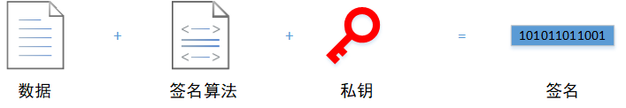
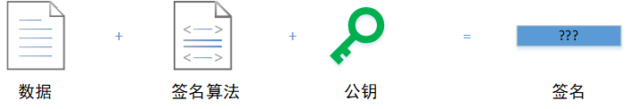
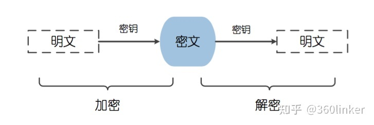
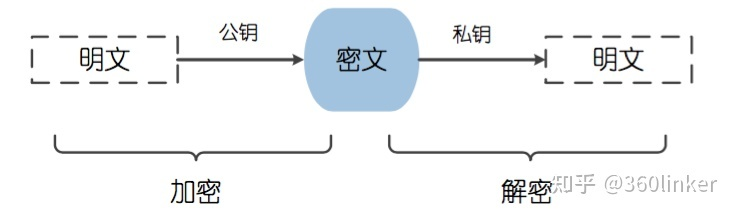

# 数据加密

[toc]

## 一、概念

### 1.1 签名 VS 加密

数字签名、数据加密是常用的软件开发技术，一般的使用场景包括信息通讯、用户登录、数据脱敏，根据不同的应用场景往往会选择不同的签名和加密算法，另外，签名和加密算法可以搭配使用。

#### 数字签名的概念

数据签名，简单来说就是一种用于==证明数据发送者身份==的方式。

-   签名过程：

    

-   验证过程：

    

数据发送方使用私钥计算出数据的一个签名，将数据和签名一起发送出去；数据接收方使用公钥计算出数据的一个签名，通过比较两个签名是否一致判断数据是否被篡改过。需要注意的是，私钥和公钥必须是一对的，否则即使数据一致，计算出来的签名也是不同的。

#### 数据加密的概念

数据加密，简单来说就是一种用于==防止数据被第三方==获取的方式。

-   加密过程：使用加密算法将原数据转换为加密数据
-   解密过程：使用相同加密算法的逆算法将加密数据转换回原数据

#### 总结

签名和加密是不同的两个概念，两者的用途是不一样的，但可以搭配使用。

-   签名：数据接收方可以以此判断数据是否被篡改，然后决定是否继续使用数据

-   加密：数据传输双方可以确保数据在传输过程中不被第三方恶意获取

### 1.2 对称加密 VS 非对称加密

加密算法常被分为两类：对称加密、非对称加密。<u>其中对称加密算法在加密和解密过程中使用的秘钥是相同的，而非对称加密算法在加密和解密过程中使用的秘钥是不同的。</u>此外，还有依赖不需要秘钥的加密算法——散列加密

#### 对称加密的概念

对称加密是应用较早的一类加密方式，通常也被称为“<u>共享秘钥加密算法</u>”。在对称加密算法中，加、解密过程使用的秘钥是一样的，发送和接收数据的双发都使用同一个秘钥对数据进行加密和解密。

#### 非对称加密的概念

非对称加密通常也被称为“公开秘钥加密算法”。因为在非对称加密算法中，加、解密过程使用的秘钥是不一样的：

-   公钥：
-   私钥：

1.   如果使用【公钥】进行解密，只能使用对应的【私钥】进行解密
2.   如果使用【私钥】进行解密，只能使用对应的【公钥】进行解密

#### 总结

1.   安全性：对称加密算法的安全性不如非对称加密算法，比较适合在单机系统或内部系统使用（秘钥被许多人知道，比较容易泄露）。非对称加密算法的安全性比对称加密算法高，因为私钥不是所有人都知道。
2.   效率：非对称解密算法计算量比较大，计算速度相对较慢，比较适合对较短的数据进行加密

## 二、方案

### 2.1 签名

#### MD5

MD5 是一种散列算法，对于不同长度的输入，总是能够产生一个长度为 128bit（16字节） 的散列值。

>   1992年，MD5 公开，用以取代 MD4
>
>   1996年，MD5 被证实可以被破解。专家建议，对于需要高度安全性的数据，改用其他算法，如 SHA-2
>
>   2004年，MD5 被证实无法防止碰撞，因此不适用于安全性认证

#### SHA-1

SHA-1 是一种散列算法，安全性比 MD5 高，可以生成长度为 160bit（20字节）的散列值。

>   2005年，密码分析人员发现了对SHA-1的有效攻击方法，这表明该算法可能不够安全，不能继续使用

#### HMAC

HMAC 利用散列算法（MD5、SHA-1等），以一个秘钥和消息作为输入，计算出消息的摘要。

### 2.2 对称加密

### 2.3 非对称加密

## 三、总结