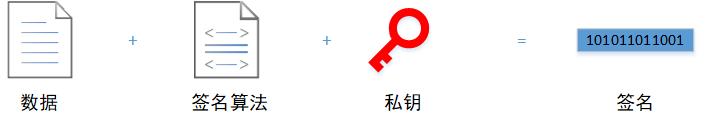
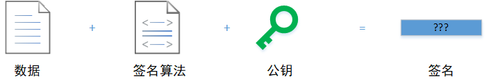

# 数据加密

[toc]

## 一、概念

### 1.1 签名 VS 加密

数字签名、数据加密是常用的软件开发技术，一般的使用场景包括信息通讯、用户登录、数据脱敏，根据不同的应用场景往往会选择不同的签名和加密算法，另外，签名和加密算法可以搭配使用。

#### 数字签名的概念

数据签名，简单来说就是一种用于==证明数据发送者身份==的方式。

-   签名过程：

    

-   验证过程：

    

数据发送方使用私钥计算出数据的一个签名，将数据和签名一起发送出去；数据接收方使用公钥计算出数据的一个签名，通过比较两个签名是否一致判断数据是否被篡改过。需要注意的是，私钥和公钥必须是一对的，否则即使数据一致，计算出来的签名也是不同的。

#### 数据加密的概念

数据加密，简单来说就是一种用于==防止数据被第三方==获取的方式。

-   加密过程：使用加密算法将原数据转换为加密数据
-   解密过程：使用相同加密算法的逆算法将加密数据转换回原数据

#### 总结

签名和加密是不同的两个概念，两者的用途是不一样的，但可以搭配使用。

-   签名：数据接收方可以以此判断数据是否被篡改，然后决定是否继续使用数据

-   加密：数据传输双方可以确保数据在传输过程中不被第三方恶意获取

### 1.2 对称加密 VS 非对称加密

加密算法常被分为两类：对称加密、非对称加密。<u>其中对称加密算法在加密和解密过程中使用的秘钥是相同的，而非对称加密算法在加密和解密过程中使用的秘钥是不同的。</u>此外，还有依赖不需要秘钥的加密算法——散列加密

#### 对称加密的概念

对称加密是应用较早的一类加密方式，通常也被称为“<u>共享秘钥加密算法</u>”。在对称加密算法中，加、解密过程使用的秘钥是一样的，发送和接收数据的双发都使用同一个秘钥对数据进行加密和解密。

#### 非对称加密的概念

非对称加密通常也被称为“公开秘钥加密算法”。因为在非对称加密算法中，加、解密过程使用的秘钥是不一样的：

-   公钥：
-   私钥：

1.   如果使用【公钥】进行解密，只能使用对应的【私钥】进行解密
2.   如果使用【私钥】进行解密，只能使用对应的【公钥】进行解密

#### 总结

1.   安全性：对称加密算法的安全性不如非对称加密算法，比较适合在单机系统或内部系统使用（秘钥被许多人知道，比较容易泄露）。非对称加密算法的安全性比对称加密算法高，因为私钥不是所有人都知道。
2.   效率：非对称解密算法计算量比较大，计算速度相对较慢，比较适合对较短的数据进行加密

## 二、方案

### 2.1 签名

#### MD5

MD5 是一种散列算法，对于不同长度的输入，总是能够产生一个长度为 128bit（16字节） 的散列值。

>   1992年，MD5 公开，用以取代 MD4
>
>   1996年，MD5 被证实可以被破解。专家建议，对于需要高度安全性的数据，改用其他算法，如 SHA-2
>
>   2004年，MD5 被证实无法防止碰撞，因此不适用于安全性认证

#### SHA-1

SHA-1 是一种散列算法，安全性比 MD5 高，可以生成长度为 160bit（20字节）的散列值。

>   2005年，密码分析人员发现了对SHA-1的有效攻击方法，这表明该算法可能不够安全，不能继续使用

#### HMAC

HMAC 利用散列算法（MD5、SHA-1等），以一个秘钥和消息作为输入，计算出消息的摘要。

### 2.2 对称加密

#### DES

DES 全称 Data Encryption Standard，即数据加密标准。DES 是一种使用秘钥进行加密的`块算法`。DES 的入口参数有 3 个：

-   Key：秘钥，7字节（56位）
-   Data：待加密/解密的数据，8字节（64位）
-   Mode：工作模式（加密或解密）

DES 算法的输出：密文/明文，8字节（64位）

>   1977年，被美国联邦政府的国家标准局确定为联邦资料处理标准，并授权在非密级政府通信中使用，随后该算法在国际上被广泛流传开。

#### 3DES

3DES（即 Triple DES）是 DES 向 AES 过渡的加密算法，<u>它使用 2 条长度为 56 位 的密钥对数据进行 3 次加密</u>。相比 DES，3DES 更加安全。

-   加密过程：加密-解密-解密
-   解密过程：解密-加密-解密

#### AES

AES 全称 Advanced Encryption Standard，即高级加密标准。AES 的入口参数也是 3 个：

-   Key：密钥，128位、192位、256位
-   Data：待加密/解密的数据，128 位
-   Mode：工作模式（加密或解密）

>   AES的出现是为了取代DES，因为DES算法的密钥长度是56Bit，因此算法的理论安全强度是<u>2^56</u>。但二十世纪中后期正是计算机飞速发展的阶段，元器件制造工艺的进步使得<u>计算机的处理能力越来越强</u>，虽然出现了3DES的加密方法，但由于它的加密时间是DES算法的3倍多，64Bit的分组大小相对较小，所以还是不能满足人们对安全性的要求。于是1997年1月2号，美国国家标准技术研究所宣布希望征集高级加密标准，用以取代DES。

### 2.3 非对称加密

#### 

#### RSA

RSA是1977年由罗纳德·李维斯特（Ron **R**ivest）、阿迪·萨莫尔（Adi **S**hamir）和伦纳德·阿德曼（Leonard **A**dleman）一起提出的，RSA就是他们三人姓氏开头字母拼在一起组成的。RSA允许你自己选择公钥的大小，但低于 512 位的密钥是不够安全的，768 位的密钥则基本没法破解。<u>RSA算法的保密强度随其密钥的长度增加而增强</u>。但是，密钥越长，其加解密所耗用的时间也越长。因此，要根据所保护信息的敏感程度与攻击者破解所要花费的代价值不值得以及系统所要求的反应时间来综合考虑，尤其对于商业信息领域更是如此

由于进行的都是大数计算，使得RSA最快的情况也比DES慢上好几倍，无论是软件还是硬件实现。<u>速度一直是RSA的缺陷</u>。一般来说只用于少量数据加密。RSA的速度比对应同样安全级别的对称密码算法要慢1000倍左右。

## 三、总结

签名和加密的比较：

| -    | 目标                   |
| ---- | ---------------------- |
| 签名 | 用于鉴别数据是否被篡改 |
| 加密 | 防止数据泄露           |

签名算法比较：

| 名称  | 安全性 | 计算速度 |
| ----- | ------ | -------- |
| SHA-1 | 高     | 慢       |
| MD5   | 中     | 快       |

对称加密算法比较：

| 名称 | 秘钥长度（位） | 安全性 | 计算速度 | 资源消耗 |
| ---- | -------------- | ------ | -------- | -------- |
| DES  | 56             | 低     | 较快     | 中       |
| 3DES | 112、168       | 中     | 慢       | 高       |
| AES  | 128、192、256  | 高     | 快       | 低       |

对称加密与非对称加密的比较：

| -          | 密钥管理                             | 安全性 | 计算速度               |
| ---------- | ------------------------------------ | ------ | ---------------------- |
| 对称加密   | 较难，不适合互联网，一般用于内部系统 | 中     | 快，适合大数据量的加密 |
| 非对称加密 | 容易                                 | 高     | 慢，适合少数据量的加密 |

