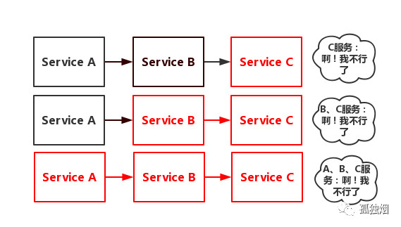

# 服务降级、熔断、限流

参考文章

1.   [谈谈服务雪崩、降级与熔断](https://www.cnblogs.com/rjzheng/p/10340176.html)
2.   [面试官：说说降级、熔断、限流](https://juejin.cn/post/6844903838231576589)

[toc]

## 服务雪崩

假设存在如下调用链：

`Service A`的流量波动很大，流量经常会突然性增加！那么在这种情况下，就算`Service A`能扛得住请求，`Service B`和`Service C`未必能扛得住这突发的请求。此时，如果`Service C`因为抗不住请求，变得不可用。那么`Service B`的请求也会阻塞，慢慢耗尽`Service B`的线程资源，`Service B`就会变得不可用。紧接着，`Service A`也会不可用，这一过程如下图所示：

如上图所示，一个服务失败，导致整条链路的服务都失败的情形，我们称之为服务雪崩。而服务降级、服务熔断、服务限流便是解决服务雪崩的常用手段。

## 降级

对系统功能进行优先级划分，当系统资源紧张时，牺牲部分低优先级功能（降低可用性或完全关闭），保证核心功能的可用性。以电商系统为例，商品下单、订单支付是系统的核心功能，当服务器压力较大时，可以暂时关闭商品评论、修改头像、主题设置等非核心功能。

常见降级方案：

1.   手动降级|开关降级。在系统中设置若干开关，由配置中心对开关进行管理，通过配置中心实现服务手动降级（通常将在应用中设置开关的过程称为“埋点”）—— Sentinel
2.   自动降级。通过代码对接口情况（响应时间、请求成功率…）进行监视，例如接口超时降级、失败重试多次降级等。具体失败几次，超时设置多久，由你们的业务等其他因素决定。开个小会，定个值，扔线上去看看情况。根据情况再调优。 —— Hystrix

ps：整体负荷；弃卒保车

## 熔断

**降级一般而言指的是我们自身的系统出现了故障而降级。而熔断一般是指依赖的外部接口出现故障的情况断绝和外部接口的关系。**

例如你的A服务里面的一个功能依赖B服务，这时候B服务出问题了，返回的很慢。这种情况可能会因为这么一个功能而拖慢了A服务里面的所有功能，因此我们这时候就需要熔断！即当发现A要调用这B时就直接返回错误(或者返回其他默认值啊啥的)，就不去请求B了。

那什么时候熔断合适呢？也就是到达哪个阈值进行熔断，5分钟内50%的请求都超过1秒？还是啥？参考降级。

## 限流

上面说的两个算是请求过来我们都受理了，这个限流就更狠了，直接跟请求说对不起再见！也就是系统规定了多少承受能力，只允许这么些请求能过来，其他的请求就说再见了。

一般限制的指标有：**请求总量或某段时间内请求总量**。

请求总量：比如秒杀的，秒杀100份产品，我就放5000名进来，超过的直接拒绝请求了。

某段时间内请求总量：比如规定了每秒请求的峰值是1W，这一秒内多的请求直接拒绝了。咱们下一秒再见。

## 总结

降级：服务分优先级，牺牲非核心服务（不可用），保证核心服务稳定；从整体负荷考虑

熔断：依赖的下游服务故障触发熔断，避免引发本系统崩溃；系统自动执行和恢复

限流：限制并发的请求访问量，超过阈值则拒绝

