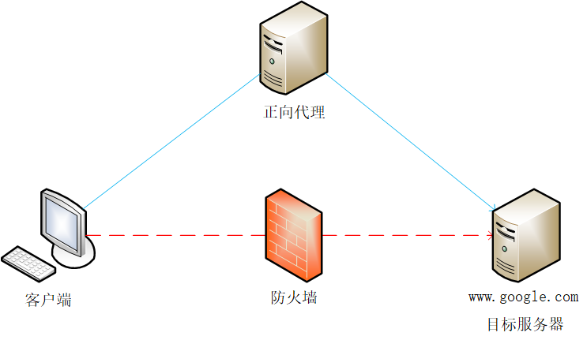

# 一、代理

**从内部网络、外部网络的角度分析：**

-   正向代理：内网用户访问外网资源的“窗口”
-   反向代理：外玩用户访问内网资源的“窗口”

**从客户端、服务端的角度分析：**

-   正向代理

    1.   用户能够感知正向代理服务器的存在
    2.   正向代理服务器可能是用户自己搭建的、第三方提供的

-   反向代理

    1.   用户无法感知反向代理服务器的存在
    2.   反向代理服务器是服务方自己搭建的

    

# 二、负载均衡

理解：一家规模很大的酒店，它的厨房肯定有不止一名厨师，客户向服务员点了若干道菜，服务员把炒菜的任务分配给各个厨师。客户 = 客户端，服务员 = 代理服务器，原始服务器 = 厨师

分析：

1.   系统处理能力高：有多个厨子，能够应付很高的客流量
2.   系统稳定性高：即使个别厨子临时请假，系统还能正常运转
3.   系统可拓展：可以招更多的厨子
4.   系统复杂度高

# 三、动静分离

分析：

1.   分摊访问数据流量和服务器IO负载
2.   能够灵活的对静态资源进行优化

