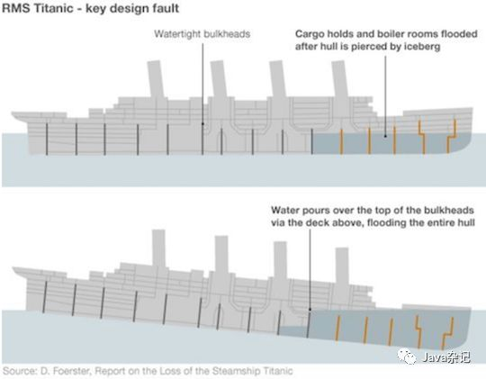
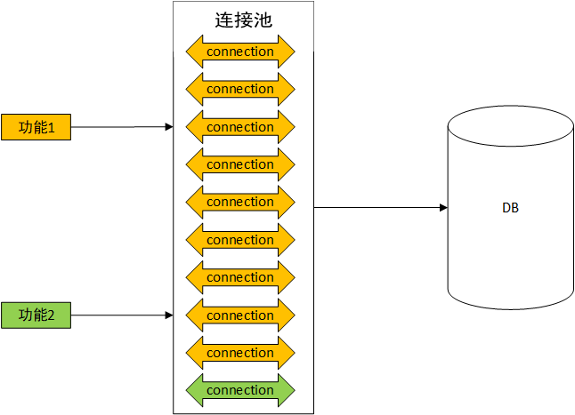
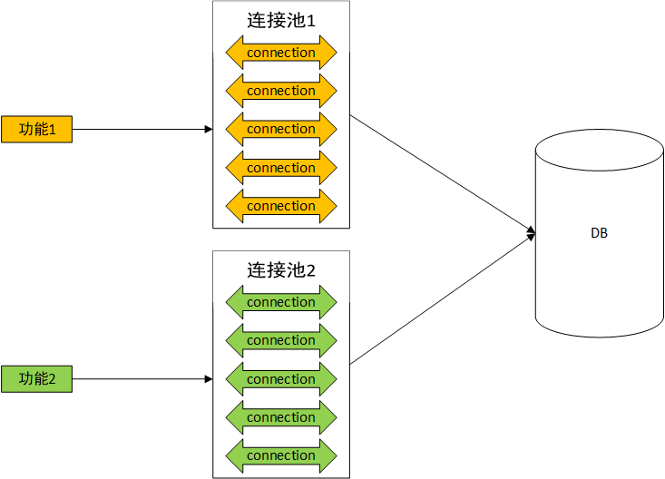

# 舱壁隔离（舱壁模式）

[toc]

## 闲扯：舱壁隔离与泰坦尼克号沉没

现代轮船的船底一般都是一个个相互隔离的船舱，这样设计的好处是，即使个别船舱发生漏水，只要迅速关闭与其他船舱相同的闸门，其他船舱就不会受到影响，船只就能够继续保持浮力正常航行。

泰坦尼克号沉没的主要原因之一，是其失败的舱壁设计：泰坦尼克号上有16个防水舱，设计可以保障如果只有4个舱进水，密闭和隔离可以阻止水继续进入下一个防水舱，从而保证船的基本浮力。但是当时冰山从侧面划破了船体，从而导致有5个防水舱同时进水，而为了建造豪华的头等舱大厅，也就是电影里杰克和罗斯约会的地方，5号舱的顶部并未达到密闭所需要的高度，水就一层层进入了船体，隔离的失败导致了泰坦尼克的沉没。 

## 舱壁隔离（舱壁模式）

舱壁模式是保证系统健壮性的一种设计模式：通过隔离各个功能所使用到的关键资源，如线程池、连接池、内存、CPU，进而避免单个功能消耗、占用大量资源，导致其他功能出现故障的场景。

## 场景说明

假设数据库的连接数上限为10

不做舱壁隔离：把所有连接放在一个连接池，所有功能从同一个连接池获取连接

分析：如果个别功能长时间占用大量连接，导致其他功能等待连接超时

舱壁隔离：根据功能将连接划分到不同的连接池，各个功能从自己的连接池获取连接

分析：由于每个功能的连接池的独立的，无论一个功能的连接使用情况怎么样，都不会影响到其他功能

