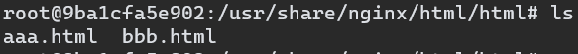
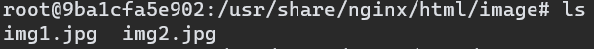
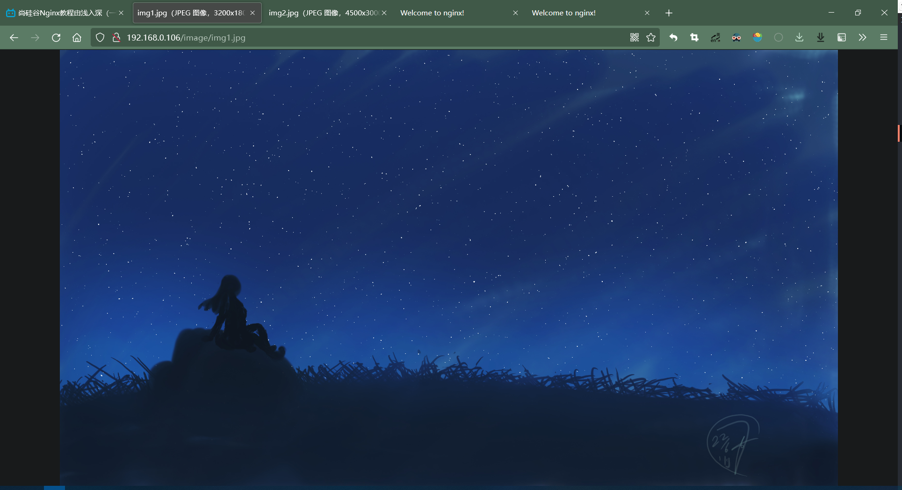
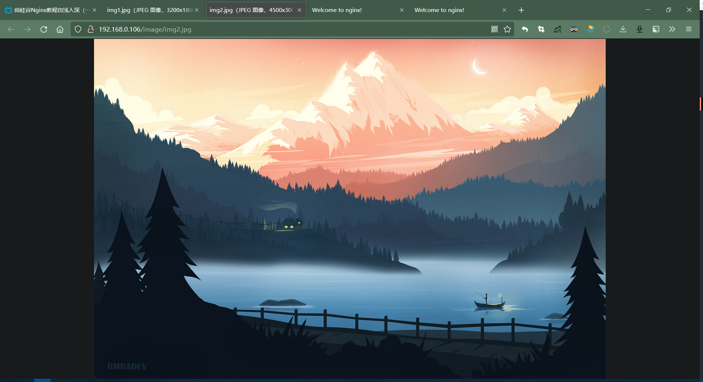
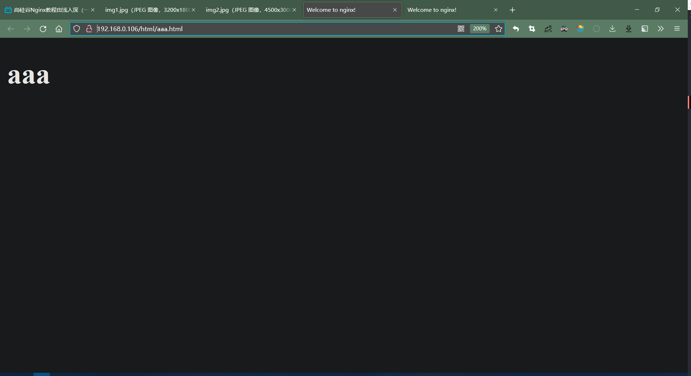
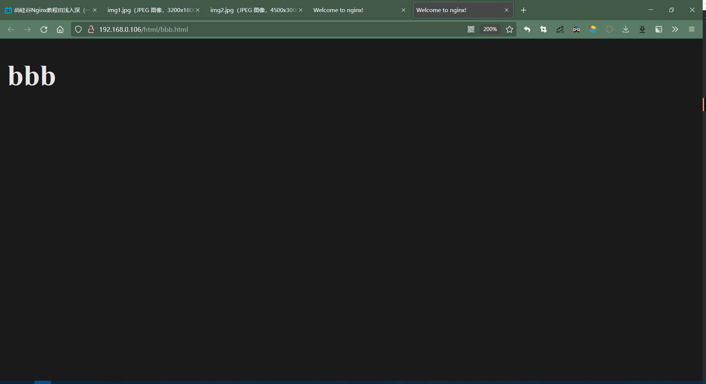

# Nginx 实战 - 动静分离

（环境：Win10 + Docker）

1.   查看 Nginx 全局配置文件 /etc/nginx/nginx.conf

     ```nginx
     user  nginx;
     worker_processes  auto;
     
     error_log  /var/log/nginx/error.log notice;
     pid        /var/run/nginx.pid;
     
     
     events {
         worker_connections  1024;
     }
     
     
     http {
         include       /etc/nginx/mime.types;
         default_type  application/octet-stream;
     
         log_format  main  '$remote_addr - $remote_user [$time_local] "$request" '
                           '$status $body_bytes_sent "$http_referer" '
                           '"$http_user_agent" "$http_x_forwarded_for"';
     
         access_log  /var/log/nginx/access.log  main;
     
         sendfile        on;
         #tcp_nopush     on;
     
         keepalive_timeout  65;
     
         #gzip  on;
     
         include /etc/nginx/conf.d/*.conf;
     }
     ```

     依照配置文件最后一句 “ include /etc/nginx/conf.d/*.conf; ”，到 /etc/nginx/conf.d 目录下创建自定义配置

2.   准备静态资源

     

     

3.   创建自定义配置

     ```nginx
     server {
         listen       80;
         server_name  127.0.0.1;
         
         location /html/ {
            root /usr/share/nginx/html/;
         }
         
         location /image/ {
             root /usr/share/nginx/html/;
             autoindex on;
         }
     }
     ```

4.   重启 Nginx

5.   测试

     

     

     

     

