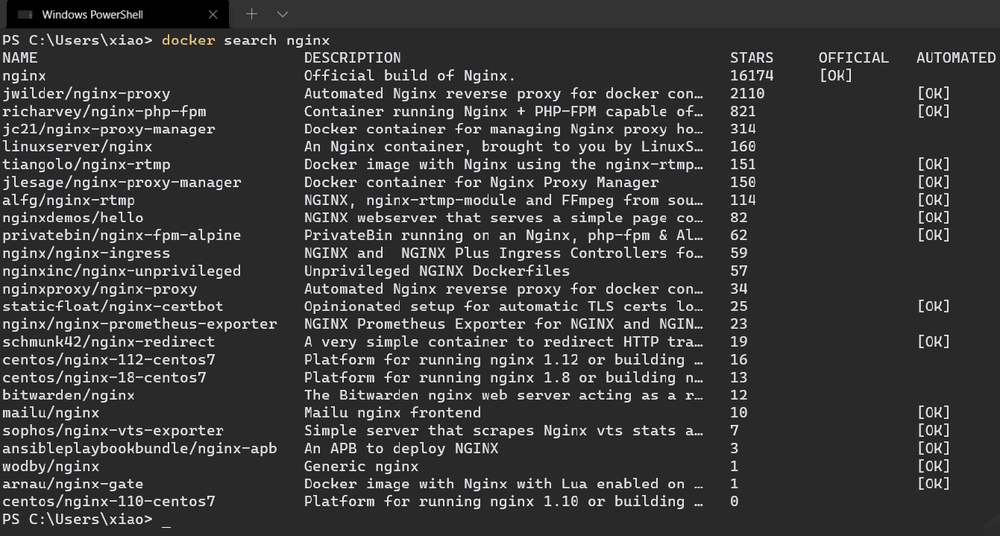
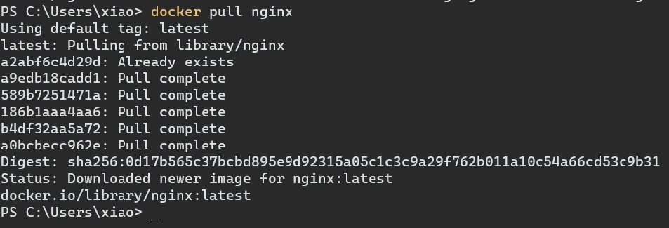
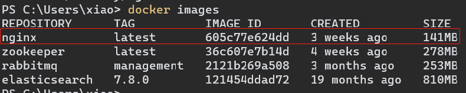
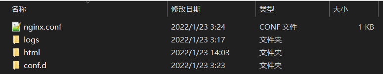
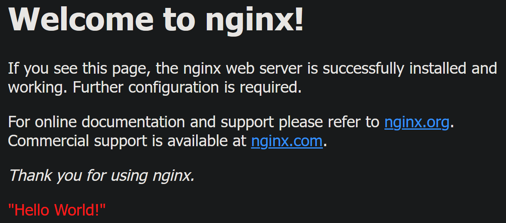

# Nginx 安装

## Win10 + Docker 环境

1.   搜索镜像

     ```shell
     docker search nginx
     ```

     

     

2.   拉取镜像

     ```shell
     # 拉取最高版本的Nginx镜像
     docker pull nginx
     ```

     

     

     

3.   创建并启动容器

     ```shell
     docker run -itd -p 80:80 -v /e/Docker/mount/nginx/nginx.conf:/etc/nginx/nginx.conf -v  /e/Docker/mount/nginx/conf.d:/etc/nginx/conf.d -v /e/Docker/mount/nginx/logs:/var/log/nginx -v /e/Docker/mount/nginx/html:/usr/share/nginx/html --name MyNginx nginx
     ```

     -   -p 80:80 # 端口映射

     -   -v /e/Docker/mount/nginx/nginx.conf:/etc/nginx/nginx.conf # 映射全局配置文件

     -   -v  /e/Docker/mount/nginx/conf.d:/etc/nginx/conf.d # 映射自定义配置文件

     -   -v /e/Docker/mount/nginx/logs:/var/log/nginx # 映射日志文件

     -   -v /e/Docker/mount/nginx/html:/usr/share/nginx/html # 映射html文件

         

         ./nginx.conf
         
         ```
         user  nginx;
         worker_processes  auto;
         
         error_log  /var/log/nginx/error.log notice;
         pid        /var/run/nginx.pid;
         
         
         events {
             worker_connections  1024;
         }
         
         
         http {
             include       /etc/nginx/mime.types;
             default_type  application/octet-stream;
         
             log_format  main  '$remote_addr - $remote_user [$time_local] "$request" '
                               '$status $body_bytes_sent "$http_referer" '
                               '"$http_user_agent" "$http_x_forwarded_for"';
         
             access_log  /var/log/nginx/access.log  main;
         
             sendfile        on;
             #tcp_nopush     on;
         
             keepalive_timeout  65;
         
             #gzip  on;
         
             include /etc/nginx/conf.d/*.conf;
         }
         ```

         ./conf.d/default.config
         
         ```
         server {
             listen       80;
             listen  [::]:80;
             server_name  localhost;
         
             #access_log  /var/log/nginx/host.access.log  main;
         
             location / {
                 root   /usr/share/nginx/html;
                 index  index.html index.htm;
             }
         
             #error_page  404              /404.html;
         
             # redirect server error pages to the static page /50x.html
             #
             error_page   500 502 503 504  /50x.html;
             location = /50x.html {
                 root   /usr/share/nginx/html;
             }
         
             # proxy the PHP scripts to Apache listening on 127.0.0.1:80
             #
             #location ~ \.php$ {
             #    proxy_pass   http://127.0.0.1;
             #}
         
             # pass the PHP scripts to FastCGI server listening on 127.0.0.1:9000
             #
             #location ~ \.php$ {
             #    root           html;
             #    fastcgi_pass   127.0.0.1:9000;
             #    fastcgi_index  index.php;
             #    fastcgi_param  SCRIPT_FILENAME  /scripts$fastcgi_script_name;
             #    include        fastcgi_params;
             #}
         
             # deny access to .htaccess files, if Apache's document root
             # concurs with nginx's one
             #
             #location ~ /\.ht {
             #    deny  all;
             #}
         }
         ```
         
         ./html/50x.html
         
         ```html
         <!DOCTYPE html>
         <html>
             <head>
                 <title>Error</title>
                 <style>
                     html { color-scheme: light dark; }
                     body { width: 35em; margin: 0 auto;
                     font-family: Tahoma, Verdana, Arial, sans-serif; }
                 </style>
             </head>
             <body>
                 <h1>An error occurred.</h1>
                 <p>Sorry, the page you are looking for is currently unavailable.<br/>Please try again later.</p>
                 <p>If you are the system administrator of this resource then you should check the error log for detail</p>
                 <p><em>Faithfully yours, nginx.</em></p>
             </body>
         </html>
         ```
         
         ./html/index.html
         
         ```html
         <!DOCTYPE html>
         <html>
             <head>
                 <title>Welcome to nginx!</title>
                 <style>
                     html { color-scheme: light dark; }
                     body { width: 35em; margin: 0 auto;
                     font-family: Tahoma, Verdana, Arial, sans-serif; }
                 </style>
             </head>
             <body>
                 <h1>Welcome to nginx!</h1>
                 <p>If you see this page, the nginx web server is successfully installed and
                 working. Further configuration is required.</p>
         
                 <p>For online documentation and support please refer to
                 <a href="http://nginx.org/">nginx.org</a>.<br/>
                 Commercial support is available at
                 <a href="http://nginx.com/">nginx.com</a>.</p>
         
                 <p><em>Thank you for using nginx.</em></p>
                 <p><font color = red>"Hello World!"</font></p>
             </body>
         </html>
         ```
         
         

4.   查看容器是否正常启动

     ```shell
     docker container ls
     ```

     

     

5.   验证Nginx是否正常启动

     <(￣︶￣)↗[GO!](http://127.0.0.1:80)

     
