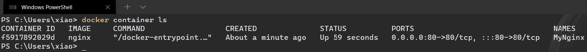

# Nginx 安装

## Win10 + Docker 环境

1.   搜索镜像

     ```shell
     docker search nginx
     ```

     

     

2.   拉取镜像

     ```shell
     # 拉取最高版本的Nginx镜像
     docker pull nginx
     ```

     

     

     

3.   创建并启动容器

     ```shell
     docker run -itd -p 80:80 -v /e/Docker/mount/nginx/nginx.conf:/etc/nginx/nginx.conf --name MyNginx nginx
     ```

     -   -itd # 后台运行

     -   -p 80:80 # 端口映射

     -   --name MyNginx # 容器命名

     -   -v /e/Docker/mount/nginx/nginx.conf:/etc/nginx/nginx.conf # 文件映射

         nginx.conf

         ```
         user  nginx;
         worker_processes  auto;
         
         error_log  /var/log/nginx/error.log notice;
         pid        /var/run/nginx.pid;
         
         
         events {
             worker_connections  1024;
         }
         
         
         http {
             include       /etc/nginx/mime.types;
             default_type  application/octet-stream;
         
             log_format  main  '$remote_addr - $remote_user [$time_local] "$request" '
                               '$status $body_bytes_sent "$http_referer" '
                               '"$http_user_agent" "$http_x_forwarded_for"';
         
             access_log  /var/log/nginx/access.log  main;
         
             sendfile        on;
             #tcp_nopush     on;
         
             keepalive_timeout  65;
         
             #gzip  on;
         
             include /etc/nginx/conf.d/*.conf;
         }
         ```

         

         

4.   查看容器是否正常启动

     ```shell
     docker container ls
     ```

     

     

5.   验证Nginx是否正常启动

     <(￣︶￣)↗[GO!](http://127.0.0.1:80)

     

