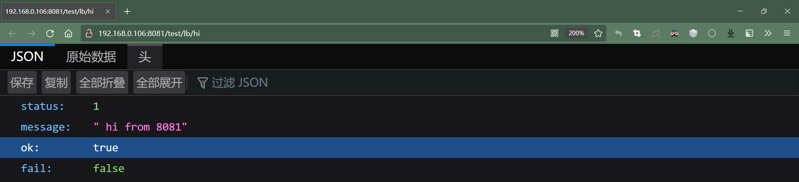
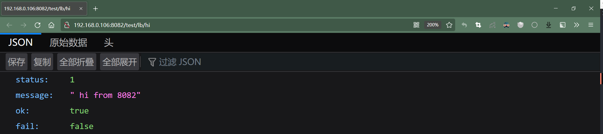
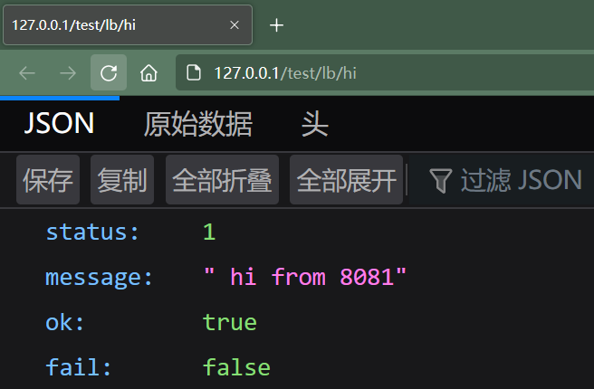
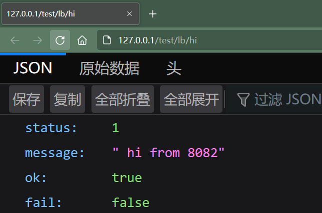
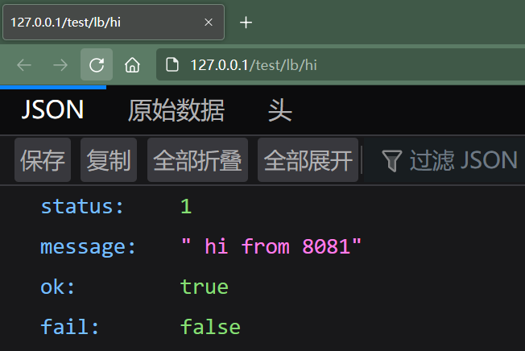

# Nginx 实战 - 负载均衡

（环境：Win10 + Docker）

1.   查看 Nginx 全局配置文件 /etc/nginx/nginx.conf

     ```nginx
     user  nginx;
     worker_processes  auto;
     
     error_log  /var/log/nginx/error.log notice;
     pid        /var/run/nginx.pid;
     
     
     events {
         worker_connections  1024;
     }
     
     
     http {
         include       /etc/nginx/mime.types;
         default_type  application/octet-stream;
     
         log_format  main  '$remote_addr - $remote_user [$time_local] "$request" '
                           '$status $body_bytes_sent "$http_referer" '
                           '"$http_user_agent" "$http_x_forwarded_for"';
     
         access_log  /var/log/nginx/access.log  main;
     
         sendfile        on;
         #tcp_nopush     on;
     
         keepalive_timeout  65;
     
         #gzip  on;
     
         include /etc/nginx/conf.d/*.conf;
     }
     ```

     依照配置文件最后一句 “ include /etc/nginx/conf.d/*.conf; ”，到 /etc/nginx/conf.d 目录下创建自定义配置

2.   创建自定义配置

     ```nginx
     upstream serverInstance {
         [xxx;] # 负载均衡策略
         server 192.168.0.106:8081 weight=1;
         server 192.168.0.106:8082 weight=1;
     }
     
     server {
         listen       80;
         server_name  127.0.0.1;
         
         location ~ /lb/ {
             proxy_pass http://serverInstance;
             proxy_connect_timeout 10;
         }
     }
     ```

     >   负载均衡策略：
     >
     >   -   默认：轮询分发请求
     >   -   weight：根据权重分配请求
     >   -   ip_hash：根据每个请求的 ip 进行 hash 计算，然后根据计算结果分配服务实例，可以保证相同的ip总是访问到相同的服务实例。
     >   -   fair：响应时间短的服务实例优先分配请求

3.   重启 Nginx

4.   测试

     不通过 Nginx ，直接访问服务：

     

     

     通过 Nginx 访问服务：

     （访问1）

     

     （访问2）

     

     （访问3）

     

     访问4、访问5… 通过返回的消息可以看出，请求被 Nginx 轮询分发到了 192.168.0.106:8081 和 192.168.0.106:8082