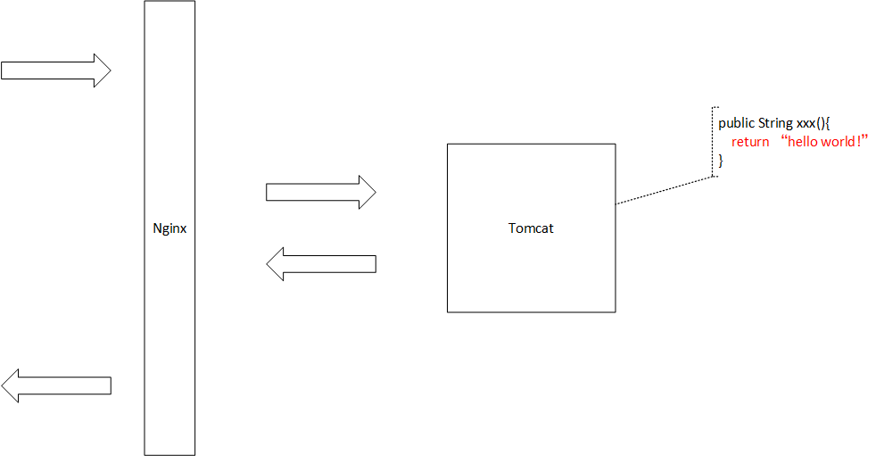

# OpenResty 理论

[toc]


## 官网

英文：http://openresty.org/en/

中文：http://openresty.org/cn/


## 非阻塞IO模型

[异步非阻塞IO模型.md](../../方法论/异步非阻塞IO模型.md)


## OpenResty 是什么？


打开官网，在 Logo 下的显目位置可以看到官方对 OpenResty 的定义：

>   1.  通过 Lua 扩展 NGINX 实现的可伸缩的 Web 平台
>   2.  OpenResty® 是一款基于 NGINX 和 LuaJIT 的 Web 平台
>
>   关键字：Lua、Nginx、Web平台


继续往下看，能够看到官方更详细的说明：

>   OpenResty® 是一个基于 [Nginx](http://openresty.org/cn/nginx.html) 与 Lua 的高性能 Web 平台，其内部集成了大量精良的 Lua 库、第三方模块以及大多数的依赖项。<u>用于方便地搭建能够处理超高并发、扩展性极高的动态 Web 应用、Web 服务和动态网关。</u>
>
>   OpenResty® 通过汇聚各种设计精良的 [Nginx](http://openresty.org/cn/nginx.html) 模块（主要由 OpenResty 团队自主开发），从而将 [Nginx](http://openresty.org/cn/nginx.html) 有效地变成一个强大的通用 Web 应用平台。这样，<u>Web 开发人员和系统工程师可以使用 Lua 脚本语言调动 [Nginx](http://openresty.org/cn/nginx.html) 支持的各种 C 以及 Lua 模块，快速构造出足以胜任 10K 乃至 1000K 以上单机并发连接的高性能 Web 应用系统。</u>
>
>   <font color = red>OpenResty® 的目标是让你的Web服务直接跑在 [Nginx](http://openresty.org/cn/nginx.html) 服务内部，充分利用 [Nginx](http://openresty.org/cn/nginx.html) 的非阻塞 I/O 模型</font>，不仅仅对 HTTP 客户端请求,甚至于对远程后端诸如 MySQL、PostgreSQL、Memcached 以及 Redis 等都进行一致的高性能响应。


---

基于传统 Nginx 的系统：


基于 OpenResty 的系统：


基于传统 Nginx 的系统：



基于 OpenResty 的系统：


## OpenResty 能干嘛？

下面的内容来自：<(￣︶￣)↗[使用Nginx+Lua(OpenResty)开发高性能Web应用 ](https://www.iteye.com/blog/jinnianshilongnian-2280928)


在互联网公司，Nginx 可以说是标配组件，但是主要负责的还是负载均衡、反向代理、代理缓存、限流等工作。而把 Nginx 作为一个 Web 容器使用的还不是那么广泛。

Nginx 的高性能是大家公认的，而 Nginx 开发主要是以 C/C++ 模块的形式进行，整体学习和开发成本偏高。如果有一种简单的语言来实现 Web 应用的开发，那么 Nginx 绝对是把好的瑞士军刀。

目前 Nginx 团队也开始意识到这个问题，开发了 NginxScript：可以在 Nginx 中使用 JavaScript 进行动态配置一些变量和动态脚本执行。而目前市面上用的非常成熟的扩展是由章亦春将 Lua 和 Nginx 粘合的 ngx_lua 模块：将 Nginx核心、LuaJIT、ngx_lua 模块、许多有用的 Lua 库和常用的第三方 Nginx 模块组合在一起成为 OpenResty，这样开发人员就可以安装 OpenResty，使用 Lua 编写脚本，然后部署到Nginx Web容器中运行。从而非常轻松就能开发出高性能的 Web 服务。

接下来我们就认识下 Nginx、Lua、ngx_lua 模块和 ngx_lua 到底能开发哪些类型的 web 应用。

### 一、ngx_lua 简介

#### 1、Nginx优点

Nginx 设计为一个主进程多个工作进程的工作模式，每个进程是单线程来处理多个连接（==I/O多路复用==），而且每个工作进程采用了==异步非阻塞I/O== 来处理多个连接，从而减少了线程上下文切换，从而实现了公认的高性能、高并发；因此在生成环境中会通过把 CPU 绑定给 Nginx 工作进程从而提升其性能；另外因为单线程工作模式的特点，内存占用就非常少了。

Nginx 更改配置重启速度非常快，可以毫秒级，而且支持不停止 Nginx 进行升级 Nginx 版本、动态重载 Nginx 配置。

Nginx 模块也是非常多，功能也很强劲，不仅可以作为 http 负载均衡，Nginx 发布1.9.0版本还支持 TCP负载均衡，还可以很容易的实现内容缓存、web服务器、反向代理、访问控制等功能。

#### 2、Lua 的优点

<u>Lua 是一种轻量级、可嵌入式的脚本语言，这样可以非常容易的嵌入到其他语言中使用</u>。另外 Lua 提供了协程并发，即以同步调用的方式进行异步执行，从而实现并发，比起回调机制的并发来说代码更容易编写和理解，排查问题也会容易。Lua 还提供了闭包机制，函数可以作为 First Class Value 进行参数传递，另外其实现了标记清除垃圾收集。

因为Lua的小巧轻量级，可以在 Nginx 中嵌入 Lua VM，请求的时候创建一个 VM，请求结束的时候回收VM。

#### 3、什么是 ngx_lua

ngx_lua 是 Nginx 的一个模块，<u>将 Lua 嵌入到 Nginx 中，从而可以使用 Lua 来编写脚本，这样就可以使用 Lua 编写应用脚本，部署到 Nginx 中运行，即 Nginx 变成了一个Web容器——这样开发人员就可以使用 Lua 语言开发高性能 Web 应用了</u>

ngx_lua 提供了与 Nginx 交互的很多的API，对于开发人员来说只需要学习这些API就可以进行功能开发，而对于开发web应用来说，如果接触过Servlet的话，其开发和Servlet类似，无外乎就是知道接收请求、参数解析、功能处理、返回响应这几步的API是什么样子的。

#### 4、开发环境

我们可以使用 [OpenResty](https://openresty.org/) 来搭建开发环境，OpenResty 将 Nginx 核心、LuaJIT、许多有用的 Lua 库和Nginx 第三方模块打包在一起，这样开发人员只需要安装 OpenResty，不需要了解 Nginx 核心和写复杂的 C/C++ 模块就可以，只需要使用 Lua 语言进行 Web 应用开发了。

如何安装可以参考《[跟我学Nginx+Lua开发](http://jinnianshilongnian.iteye.com/blog/2190344)》。

#### 5、OpenResty 生态

OpenResty 提供了一些常用的 ngx_lua 开发模块，如：

-   lua-resty-memcached
-    lua-resty-mysql
-   lua-resty-redis
-   lua-resty-dns
-   lua-resty-limit-traffic 
-   lua-resty-template

这些模块涉及到如 mysql、redis、限流、模块渲染等常用功能组件，另外也有很多第三方的 ngx_lua 组件供我们使用，对于大部分应用场景来说现在生态环境中的组件已经足够多了，如果不满足需求也可以自己去写来完成自己的需求。

#### 6、场景

<u>理论上可以使用 ngx_lua 开发各种复杂的 web 应用，不过 Lua 是一种脚本/动态语言，不适合业务逻辑比较重的场景，适合小巧的应用场景，代码行数保持在几十行到几千行</u>。目前见到的一些应用场景：

-   **web应用**：会进行一些业务逻辑处理，甚至进行耗 CPU 的模板渲染，一般流程：mysql/redis/http 获取数据、业务处理、产生 JSON/XML/模板渲染内容，比如京东的列表页/商品详情页；

-   **接入网关**：实现如数据校验前置、缓存前置、数据过滤、API 请求聚合、AB 测试、灰度发布、降级、监控等功能，比如京东的交易大 Nginx 节点、无线部门正在开发的无线网关、单品页统一服务、实时价格、动态服务；

-   **Web防火墙**：可以进行 IP/URL/UserAgent/Referer 黑名单、限流等功能；

-   **缓存服务器**：可以对响应内容进行缓存，减少到后端的请求，从而提升性能；

-   **其他**：如静态资源服务器、消息推送服务、缩略图裁剪等。

### 二、基于 Nginx + Lua 的常用架构模式

#### 1、负载均衡


如上图，我们首先通过 LVS+HAProxy 将流量转发给核心 Nginx 1 和核心 Nginx 2，即实现了流量的负载均衡，此处可以使用如轮训、一致性哈希等调度算法来实现负载的转发，然后核心 Nginx 会根据请求特征如 “Host:item.jd.com”，转发给相应的业务 Nginx 节点如单品页 Nginx 1。此处为什么分两层呢？

1.  ==核心 Nginx 层==是无状态的，可以在这一层实现流量分组（内网和外网隔离、爬虫和非爬虫流量隔离）、内容缓存、请求头过滤、故障切换（机房故障切换到其他机房）、限流、防火墙等一些通用型功能
2.  ==业务 Nginx==如单品页 Nginx，可以在在业务 Nginx 实现业务逻辑、或者反向代理到如 Tomcat，在这一层可以实现内容压缩（放在这一层的目的是减少核心 Nginx 的CPU压力，将压力分散到各业务Nginx）、AB测试、降级，即这一层的 Nginx 跟业务有关联，实现业务的一些通用逻辑。

不管是核心Nginx还是业务Nginx，都应该是无状态设计，可以水平扩容。


业务 Nginx 一般会把请求直接转发给后端的业务应用，如 Tomcat、PHP，即将请求内部转发到相应的业务应用。当有的 Tomcat 出现问题了，可以在这一层摘掉；或者有的业务路径变了在这一层进行  rewrite；或者有的后端 Tomcat 压力太大也可以在这一层降级，减少对后端的冲击；或者业务需要灰度发布时也可以在这一层 Nginx 上控制。

#### 2、单机闭环

<font color = red>所谓单机闭环即所有想要的数据都能从本服务器直接获取，在大多数时候无需通过网络去其他服务器获取。</font>


如上图所示，主要有三种应用模式：

1.  图一：

    图一所示的是 Nginx 应用谁也不依赖，比如我们的 Cookie 白名单应用，其目的是不在白名单中的 Cookie 将被清理，防止大家随便将 Cookie 写到 jd.om 根下；大家访问 http://www.jd.com 时，会看到一个 http://ccc.jd.com/cookie_check 的请求用来清理 Cookie 的，对于这种应用非常简单，不需要依赖数据源，直接单应用闭环即可。

    

2.  图二：

    图二所以的是读取本机文件系统，如静态资源合并：比如访问 http://item.jd.com/1856584.html，查看源码会发现下面这种请求：<u>多个请求合并为一个发给服务端，服务端进行了文件资源的合并</u>

    ```
    <link type="text/css" rel="stylesheet" href="//misc.360buyimg.com/jdf/1.0.0/unit/??ui-base/1.0.0/ui-base.css,shortcut/2.0.0/shortcut.css,global-header/1.0.0/global-header.css,myjd/2.0.0/myjd.css,nav/2.0.0/nav.css,shoppingcart/2.0.0/shoppingcart.css,global-footer/1.0.0/global-footer.css,service/1.0.0/service.css"/>
    ```

    

    目前有成熟的Nginx模块如[nginx-http-concat](https://github.com/alibaba/nginx-http-concat)进行静态资源合并；因为我们使用了OpenResty，那么我们完全可以使用Lua编写程序实现该功能，比如已经有人写了[nginx-lua-static-merger](https://github.com/grasses/nginx-lua-static-merger)来实现这个功能。

    

    还一些业务型应用场景如下图所示：

    

    商品页面是由商品框架和其他维度的页面片段（面包屑、相关分类、商家信息、规格参数、商品详情）组成；或者首页是由首页框架和一些页面片段（分类、轮播图、楼层1、楼层N）组成；分维度是因为不同的维度是独立变化的。对于这种静态内容但是需要进行框架内容嵌入的方式，Nginx自带的SSI（Server Side Include）可以很轻松的完成；也可以使用Lua程序更灵活的完成（读取框架、读取页面片段、合并输出）。

    

    比如商品页面的架构我们可以这样：

    

    

3.  图三：

    第三张图和第二张图的不同处是不再直接读取文件系统，而是读取本机的 Redis 或者 Redis 集群或者如 SSDB 这种持久化存储或者其他存储系统都是可以的，比如直接说的商品页面可以使用 SSDB 进行存储实现。文件系统一个很大的问题是当多台服务器时需要 Worker 去写多台服务器，而这个过程可以使用 SSDB 的主从实现。

    

    此处可以看到，不管是图二还是图三架构，都需要 Worker 去进行数据推送，假设本机数据丢了可怎么办？因此<u>实际大部分应用不会是完全单机闭环的，而是会采用如下架构：</u>

    

    

    即首先读本机，如果没数据会回源到相应的 Web 应用从数据源拉取原始数据进行处理。这种架构的大部分场景本机都可以命中数据，只有很少一部分情况会回源到 Web 应用。

    

    如京东的实时价格/动态服务就是采用类似架构。

    

#### 3、分布式闭环


单机闭环会遇到如下两个主要问题： 

1.  数据不一致问题（比如没有采用主从架构导致不同服务器数据不一致）
2.  遇到存储瓶颈（磁盘或者内存遇到了天花板）

解决数据不一致的比较好的办法是采用主从或者分布式集中存储，而遇到存储瓶颈就需要进行按照业务键进行分片，将数据分散到多台服务器。

如采用如下架构，按照尾号将内容分布到多台服务器：


即第一步先读取分布式存储（JIMDB是京东的一个分布式缓存/存储系统，类似于Redis）；如果不命中则回源到Tomcat集群（其会调用数据库、服务总线获取相关数据）来获取相关数据。可以参考《[构建需求响应式亿级商品详情页](https://www.iteye.com/blog/2235572)》来获取更详细的架构实现。

JIMDB集群会进行多机房主从同步，各自机房读取自己机房的从JIMDB集群，如下图


#### 4、接入网关

接入网关也可以叫做接入层，即接收到流量的入口，在入口我们可以进行如下事情：


**核心接入Nginx会做如下事情**

-   动态负载均衡；
    1.  普通流量走一致性哈希，提升命中率；热点流量走轮训减少单服务器压力；
    2.  根据请求特征将流量分配到不同分组并限流（爬虫、或者流量大的IP）；
    3.  动态流量（动态增加upstream或者减少upstream或者动态负载均衡）可以使用balancer_by_lua或者微博开源的upsync；

-   防DDOS攻击限流：可以将请求日志推送到实时计算集群，然后将需要限流的IP推送到核心Nginx进行限流；

-   非法请求过滤：比如应该有Referer却没有，或者应该带着Cookie却没有Cookie；

-   请求聚合：比如请求的是http://c.3.cn/proxy?methods=a,b,c，核心接入Nginx会在服务端把Nginx并发的请求并把结果聚合然后一次性吐出；

-   请求头过滤：有些业务是不需要请求头的，因此可以在往业务Nginx转发时把这些数据过滤掉；

-   缓存服务：使用Nginx Proxy Cache实现内容页面的缓存；


**业务接入Nginx会做如下事情**

-   缓存：对于读服务会使用大量的缓存来提升性能，我们在设计时主要有如下缓存应用：首先读取Nginx本地缓存 Shared  Dict或者Nginx Proxy  Cache，如果有直接返回内容给用户；如果本地缓存不命中，则会读取分布式缓存如Redis，如果有直接返回；如果还是不命中则回源到Tomcat应用读取DB或调用服务获取数据。另外我们会按照维度进行数据的缓存。

-   业务逻辑：我们会进行一些数据校验/过滤逻辑前置（如商品ID必须是数字）、业务逻辑前置（获取原子数据，然后在Nginx上写业务逻辑）。

-   细粒度限流：按照接口特征和接口吞吐量来实现动态限流，比如后端服务快扛不住了，那我们就需要进行限流，被限流的请求作为降级请求处理；通过lua-resty-limit-traffic可以通过编程实现更灵活的降级逻辑，如根据用户、根据URL等等各种规则，如降级了是让用户请求等待（比如sleep 100ms，这样用户请求就慢下来了，但是服务还是可用）还是返回降级内容。

-   降级：降级主要有两种：主动降级和被动降级；如请求量太大扛不住了，那我们需要主动降级；如后端挂了或者被限流了或者后端超时了，那我们需要被动降级。降级方案可以是：1、返回默认数据如库存默认有货；2、返回静态页如预先生成的静态页；3、部分用户降级，告诉部分用户等待下再操作；4、直接降级，服务没数据，比如商品页面的规格参数不展示；5、只降级回源服务，即可以读取缓存的数据返回，实现部分可用，但是不会回源处理；

-   AB测试/灰度发布：比如要上一个新的接口，可以通过在业务Nginx通过Lua写复杂的业务规则实现不同的人看到不同的版本。

-   服务质量监控：我们可以记录请求响应时间、缓存响应时间、反向代理服务响应时间来详细了解到底哪块服务慢了；另外记录非200状态码错误来了解服务的可用率。


京东的交易大Nginx节点、无线部门正在开发的无线Nginx网关、和单品页统一服务都是接入网关的实践，而单品页统一服务架构可以参考《[京东商品详情页服务闭环实践](https://www.iteye.com/blog/2258111)》。

#### 5、Web 应用

此处所说的 Web 应用指的是页面模板渲染类型应用或者 API 服务类型应用；比如京东列表页/商品详情页就是一个模板渲染类型的应用，核心业务逻辑都是使用 Lua 写的，部署到 Nginx 容器。目前核心业务代码行数有5000多行，模板页面有2000多行，涉及到大量的计算逻辑，性能数据可以参考《[构建需求响应式亿级商品详情页](https://www.iteye.com/blog/2235572)》。

 

整体处理过程和普通 Web 应用没什么区别：首先接收请求并进行解析；然后读取 JIMDB 集群数据、如果没有则回源到 Tomcat 获取；然后进行业务逻辑处理；渲染模板；将响应内容返回给用户。

### 三、如何使用 Nginx + Lua 开发 Web应用

### 四、基于 Nginx + Lua 的常用功能总结

到此我们对于 Nginx 开发已经有了一个整体的认识，对于 Nginx 粘合 Lua 来开发应用可以说是一把锋利的瑞士军刀，可以帮我们很容易的解决很多问题，可以开发 Web 应用、接入网关、API网关、消息推送、日志采集等应用，不过个人认为适合开发业务逻辑单一、核心代码行数较少的应用，不适合业务逻辑复杂、功能繁多的业务型或者企业级应用。最后我们总结下基于 Nginx+Lua 的常用架构模式中一些常见实践和场景：

-   动态负载均衡
-   防火墙（DDOS、IP/URL/UserAgent/Referer黑名单、防盗链等）

-   限流
-   降级
-   AB测试/灰度发布
-    多级缓存模式
-    服务端请求聚合
-    服务质量监控

 

**一些问题**

1.  在开发nginx应用时使用UTF-8编码可以减去很多麻烦；
2.  GBK转码解码时使用GB18030，否则一些特殊字符会出现乱码；
3.  cjson库对于如\uab1这种错误的unicode转码会失败，可以使用纯Lua编写的dkjson；
4.  社区版nginx不支持upstream的域名动态解析；可以考虑proxy_pass  http://p.3.local/prices/mgets$is_args$args，然后配合resolver来实现；或者在lua中进行http调用；如果DNS遇到性能瓶颈可以考虑在本机部署如dnsmasq来缓存；或者考虑使用balancer_by_lua功能实现动态upstream；
5.  为响应添加处理服务器IP的响应头，方便定位问题；
6.  根据业务设置合理的超时时间；
7.  走CDN的业务当发生错误时返回的500/503/302/301等非正常响应不要设置缓存。