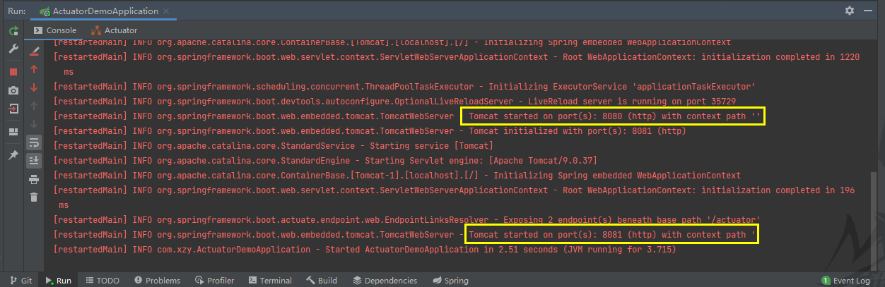
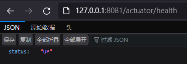
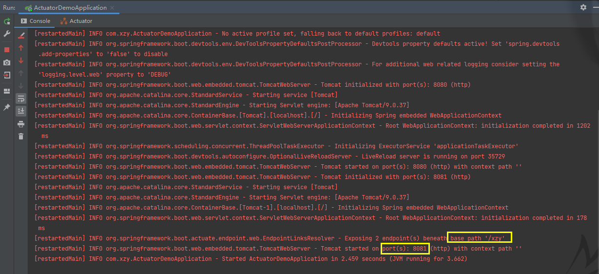
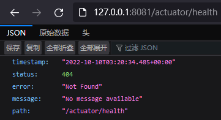
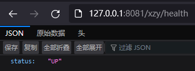

# 集成 Actuator

---

## 集成

在 SpringBoot 应用中集成 Actuator 很简单，只要在 Maven 中添加 Actuator 的依赖即可：

```xml
<!--actuator-->
<dependency>
    <groupId>org.springframework.boot</groupId>
    <artifactId>spring-boot-starter-actuator</artifactId>
</dependency>
```

依赖添加成功后启动项目，然后就可以访问默认启动的 Endpoint：


## 细节

### 1、端口

默认使用 `server.port` 配置项配置的端口访问 Actuator

```properties
server.port=8080
```

但是可以通过 `management.server.port` 配置项为 Actuator 单独配置访问端口：

```properties
server.port=8080

# 默认情况下 Actuator 采用 server.port 配置的端口，但可以通过下面的配置项为 Actuator 单独配置访问端口
management.server.port=8081
```

通过日志可以看出已经为 Actuator 分配了专门的端口：



使用 management.server.port 配置专门的访问端口后，就不能再使用 server.port 的端口：


成功采用 management.server.port 配置的端口访问 Endpoint：




### 2、base-path

Endpoint 的访问路径一般是这种格式：==/base-path/endpoint-id==

默认情况下 base-path 的值等于 actuator，但是可以通过 management.endpoints.web.base-path 配置项进行调整：

```properties
server.port=8080

# 默认情况下 Actuator 采用 server.port 配置的端口，但可以通过下面的配置项为 Actuator 单独配置访问端口
management.server.port=8081
# 默认情况下，Actuator 的 base-path 等于 actuator，但是可以通过下面的配置项进行修改
management.endpoints.web.base-path=/xzy
```

从日志可以看出，新的 base-path 已经生效：



原来的 base-path 已经失效：



新的 base-path 已经生效：

