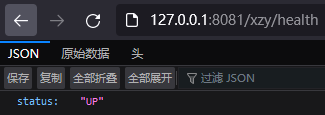
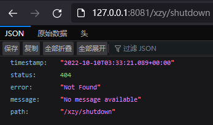
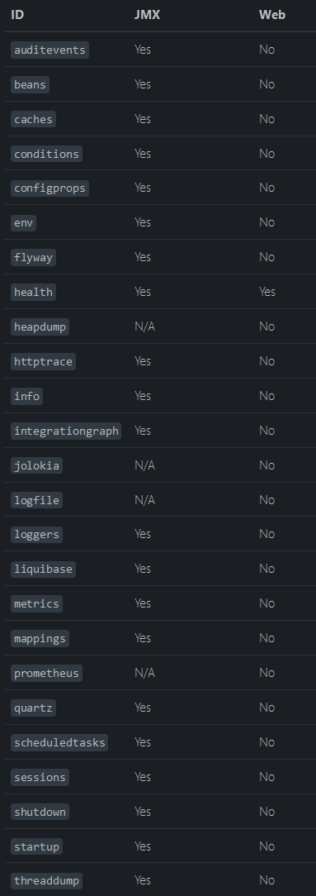
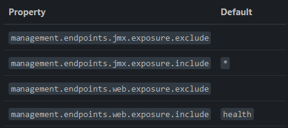
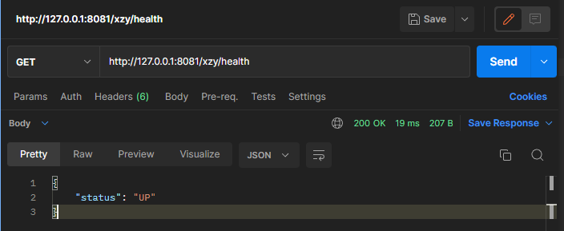
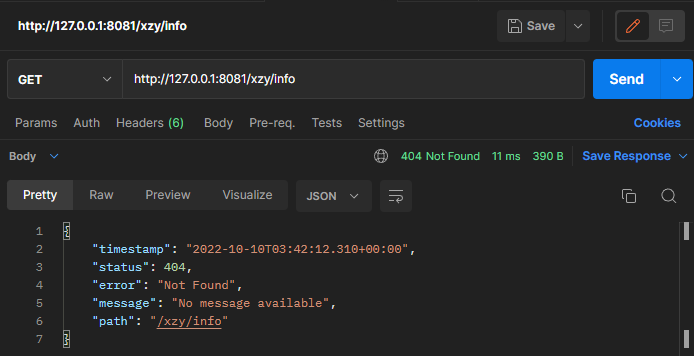
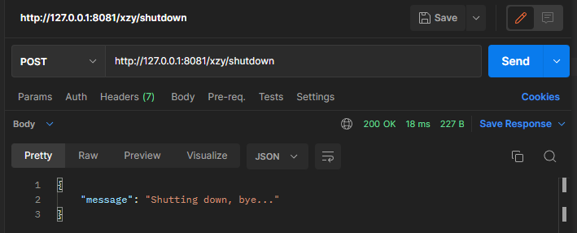

# 暴露 Endpoint

==外部能够访问 Endpoint 的两个前提条件：Endpoint 已经开启、Endpoint 对外暴露==


## 开启 Endpoint

如果要配置某个 Endpoint 的开关状态，需要使用 management.endpoint.<id>.enabled 配置项。以开启 shutdown 为例

```properties
management.endpoint.shutdown.enabled=true
```

默认情况下，除了 shutdown 其他 Endpoint 都是开启的，如果不希望如此，可以通过以下配置将所有 Endpoint 的默认状态置为关闭，然后根据需要选择性的开启 Endpoint：

```properties
management.endpoints.enabled-by-default=false
```


```properties
server.port=8080

# 默认情况下 Actuator 采用 server.port 配置的端口，但可以通过下面的配置项为 Actuator 单独配置访问端口
management.server.port=8081
# 默认情况下，Actuator 的 base-path 等于 actuator，但是可以通过下面的配置项进行修改
management.endpoints.web.base-path=/xzy
# 默认情况下，Actuator 会启用除了 shutdown 之外的所有 Endpoint，但是可以通过下面的配置项将所有 Endpoint 调整为默认关闭
management.endpoints.enabled-by-default=false
# 采用下面的配置项准确的开关某个 Endpoint，格式：management.endpoint.<id>.enabled
management.endpoint.health.enabled=true
management.endpoint.shutdown.enabled=true
```

采用上述配置后，health Endpoint 可以成功访问，但是 shutdown Endpoint 还是无法访问。其实上文已经提到了，除了启动 Endpoint，还需要对外暴露 Endpoint，外界才能访问到 Endpoint，而 默认情况下，Actuator 对外只暴露 health 这一个 Endpoint：






## 暴露 Endpoint

Endpoint 可能暴露系统的敏感信息，因此对外暴露的时候需要慎重。默认情况下，各个 Endpoint 的暴露状态如下：



使用 include 和 exclude 配置项可以配置 Endpoint 的暴露状态：



include 配置项用于罗列需要对外暴露的 Endpoint，exclude 配置项用于罗列不对外暴露的 Endpoint，配置项后面的值是 Endpoint 的 ID（* 代表所有 Endpoint）。 exclude 配置项的优先级高于 include。


测试：

```properties
server.port=8080

# 默认情况下 Actuator 采用 server.port 配置的端口，但可以通过下面的配置项为 Actuator 单独配置访问端口
management.server.port=8081
# 默认情况下，Actuator 的 base-path 等于 actuator，但是可以通过下面的配置项进行修改
management.endpoints.web.base-path=/xzy
# 默认情况下，Actuator 会启用除了 shutdown 之外的所有 Endpoint，但是可以通过下面的配置项将所有 Endpoint 调整为默认关闭
management.endpoints.enabled-by-default=false
# 采用下面的配置项准确的开关某个 Endpoint，格式：management.endpoint.<id>.enabled
management.endpoint.shutdown.enabled=true
# 默认情况下，Actuator 只对外暴露 health 这一个 Endpoint，但是可以通过下面的配置项进行调整
management.endpoints.web.exposure.include=health,shutdown,info
```

采用上述配置后，health、shutdown 这两个 Endpoint 已经能够成功访问，但是 info Endpoint 不能访问，这是因为我们并没有开启 info Endpoint：








