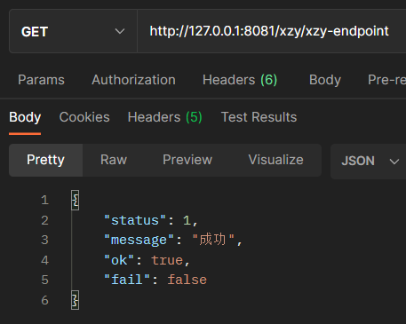
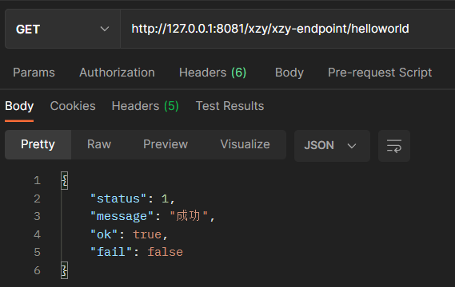
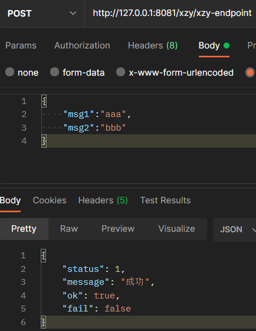
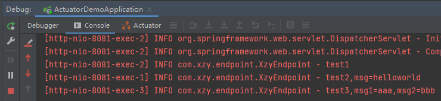

# 自定义 Endpoint

---

实现自定义 Endpoint 类：

```java
package com.xzy.endpoint;

import com.xzy.common.msg.Message;
import org.slf4j.Logger;
import org.slf4j.LoggerFactory;
import org.springframework.boot.actuate.endpoint.annotation.Endpoint;
import org.springframework.boot.actuate.endpoint.annotation.ReadOperation;
import org.springframework.boot.actuate.endpoint.annotation.Selector;
import org.springframework.boot.actuate.endpoint.annotation.WriteOperation;
import org.springframework.stereotype.Component;

/**
 * 自定义的Endpoint
 *
 * @author xzy.xiao
 * @date 2022/10/10  13:28
 */
@Component
@Endpoint(id = "xzy-endpoint")
public class XzyEndpoint {
    private final Logger logger = LoggerFactory.getLogger(XzyEndpoint.class);

    /**
     * GET /xzy/xzy-endpoint
     */
    @ReadOperation
    public Message test1() {
        logger.info("test1");
        return Message.ok();
    }

    /**
     * GET /xzy/xzy-endpoint/{msg}
     */
    @ReadOperation
    public Message test2(@Selector String msg) {
        logger.info("test2,msg={}", msg);
        return Message.ok();
    }

    /**
     * POST /xzy/xzy-endpoint
     * {"msg1":"","msg2":""}
     */
    @WriteOperation
    public Message test3(String msg1, String msg2) {
        logger.info("test3,msg1={},msg2={}", msg1, msg2);
        return Message.ok();
    }
}
```

修改配置，启用并对外暴露自定义的 Endpoint：

```properties
server.port=8080

# 默认情况下 Actuator 采用 server.port 配置的端口，但可以通过下面的配置项为 Actuator 单独配置访问端口
management.server.port=8081
# 默认情况下，Actuator 的 base-path 等于 actuator，但是可以通过下面的配置项进行修改
management.endpoints.web.base-path=/xzy
# 默认情况下，Actuator 会启用除了 shutdown 之外的所有 Endpoint，但是可以通过下面的配置项将所有 Endpoint 调整为默认关闭
management.endpoints.enabled-by-default=false
# 采用下面的配置项准确的开关某个 Endpoint，格式：management.endpoint.<id>.enabled
management.endpoint.xzy-endpoint.enabled=true
# 默认情况下，Actuator 只对外暴露 health 这一个 Endpoint，但是可以通过下面的配置项进行调整
management.endpoints.web.exposure.include=xzy-endpoint
```

测试：







