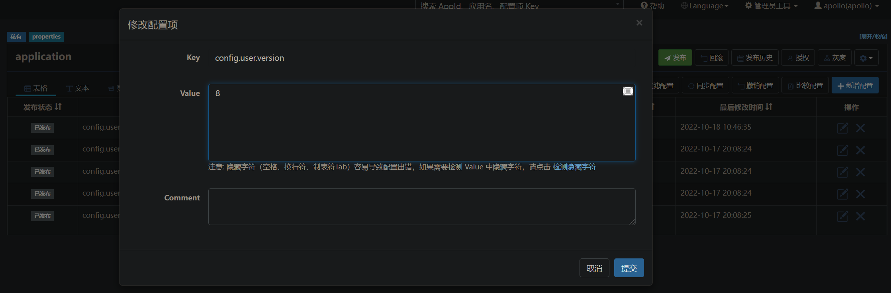

# SpringBoot 整合 Apollo

>   参考文章：
>
>   -   https://www.apolloconfig.com/#/zh/usage/java-sdk-user-guide
>   -   https://www.jianshu.com/p/3c21c18afdc1

[TOC]


## V1：Quick Start

1.   部署 Apollo 配置中心

     不做赘述，详见 [Apollo 实战 - 单机部署.md](./Apollo 实战 - 单机部署.md)

     添加配置：

     

     

2.   依赖文件

     pom.xml

     ```xml
     <dependency>
         <groupId>com.ctrip.framework.apollo</groupId>
         <artifactId>apollo-client</artifactId>
         <version>1.5.0-SNAPSHOT</version>
     </dependency>
     ```

     

3.   配置文件

     application.properties

     ```properties
     server.port=8081
     # Apollo
     app.id=xzy-apollo-test
     apollo.meta=http://127.0.0.1:8080
     apollo.bootstrap.enabled=true
     apollo.bootstrap.eagerLoad.enabled=true
     # Logging
     logging.level.com.xzy=debug
     ```

     -   app.id：当前应用需要获取哪个 Application 层次下的配置信息

         Apollo 的配置按照4个层次进行划分管理：

         

         

     -   apollo.meta：配置中心的地址

     -   apollo.bootstrap.enabled：在应用启动的 bootstrap 阶段，注入默认 Namespace 的数据

     -   apollo.bootstrap.eagerLoad.enabled：从1.2.0版本开始，如果希望把日志相关的配置（如`logging.level.root=info`或`logback-spring.xml`中的参数）也放在Apollo管理，那么可以额外配置`apollo.bootstrap.eagerLoad.enabled=true`来使Apollo的加载顺序放到日志系统加载之前

     >   配置参数详细说明：https://www.apolloconfig.com/#/zh/usage/java-sdk-user-guide?id=_12-%e5%bf%85%e9%80%89%e8%ae%be%e7%bd%ae

     

4.   测试类

     ```java
     @RestController
     @RequestMapping(path = "/user/config_center")
     public class ConfigCenterController {
     
         /**
          * 本地配置文件设置的配置信息
          */
         @Value("${server.port}")
         private String serverPort;
     
         /**
          * 配置中心设置的配置信息
          */
         @Value("${config.user.version}")
         private String version;
         @Value("${config.user.description}")
         private String description;
         @Value("${config.user.datasource.username}")
         private String dbUsername;
         @Value("${config.user.datasource.password}")
         private String dbPassword;
         @Value("${config.user.datasource.url}")
         private String dbUrl;
     
         @GetMapping("/all")
         public MessageBox<Map<String, String>> getAll() {
             Map<String, String> configFromCenter = new HashMap<>(5);
             configFromCenter.put("config.user.version", version);
             configFromCenter.put("config.user.description", description);
             configFromCenter.put("config.user.datasource.username", dbUsername);
             configFromCenter.put("config.user.datasource.password", dbPassword);
             configFromCenter.put("config.user.datasource.url", dbUrl);
             return MessageBox.ok("server port：" + serverPort, configFromCenter);
         }
     }
     ```

     启动应用，调用接口：

     


## V2：热刷

在配置中心修改配置：



发布修改：


客户端接收到通知：


测试更新结果：

