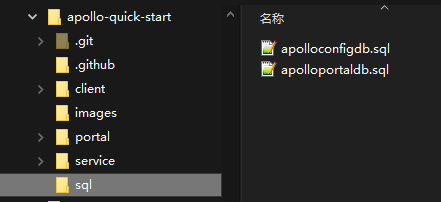

# Apollo 单机部署

>   官方文档：https://www.apolloconfig.com/#/zh/deployment/quick-start


## 1、项目拉取

为了让开发人员能够快速上手和了解 Apollo 配置中心，官方提供了一个 Quick Start 项目：https://github.com/apolloconfig/apollo-quick-start


将该项目下载或 Clone 到本地。

-   sql：存储构建 Apollo 所属数据库的 sql 脚本

-   demo.sh：启动 Apollo 的脚本

-   apollo-all-in-one.jar：为了方便开发人员快速使用，官方把关键的 jar 包打到了一起

    

## 2、环境准备

### 2.1 Java

版本要求：

-   Apollo 服务端：1.8+
-   Apollo 客户端：1.8+
    -   如需运行在 Java 1.7 运行时环境，请使用 1.x 版本的 apollo 客户端，如 1.9.1

>   使用下列命令可以查看当前环境的 Java 信息：
>
>   ```bash
>   java -version
>   ```


### 2.2 MySQL 

版本要求：5.6.5+

>   连接上 MySQL 后，可以通过如下命令检查 MySQL 版本信息：
>
>   ```mysql
>   SHOW VARIABLES WHERE Variable_name = 'version';
>   ```


Quick Start 工程的 sql 路径下存在两个 sql 文件：




执行 sql 文件，构建 Apollo 服务端运行所需要的数据库：


## 3、启动 Apollo

修改 Quick Start 项目下 demo.sh 启动脚本中的数据库信息：


执行启动脚本：

```sh
./demo.sh start
```

>   执行成功会输出日志：
>
>   ```
>   ==== starting service ====
>   Service logging file is ./service/apollo-service.log
>   Started [10768]
>   Waiting for config service startup.......
>   Config service started. You may visit http://localhost:8080 for service status now!
>   Waiting for admin service startup....
>   Admin service started
>   ==== starting portal ====
>   Portal logging file is ./portal/apollo-portal.log
>   Started [10846]
>   Waiting for portal startup......
>   Portal started. You can visit http://localhost:8070 now!
>   ```
>
>   如果遇到异常，失败信息分别存在 service 和 portal 路径下的 log 文件。


打开配置管理页面：[http://127.0.0.1:8070](http://127.0.0.1:8070)


-   账号/密码：apollo/admin


>   demo.sh 脚本会启动三个服务实例，分别使用 8070、8080、8090 端口，确保这三个端口未被占用。
>
>   
>
>   >   
>   >
>   >   -   apollo-adminservice：提供配置的修改、发布等功能，服务于 apollo-portal
>   >   -   apollo-portal：可视化的配置管理页面
>   >   -   apollo-configservice：提供配置的读取、推送等功能，服务对象是 Apollo 客户端（可就是我们的开发的应用程序）
>   >       -   eureka：apollo-configservice 内部集成了 eureka


