# 基于 Bus 优化 Config——实现动态刷新


>   Note：本文内容基于[《Config 实战 - 客户端手动刷新配置》](../Config/Config 实战 - 客户端手动刷新配置.md)，部分重复的内容不再赘述。


[TOC]


## 前景回顾

-   [《Config 实战 - 客户端重启刷新配置》](../Config/Config 实战 - 客户端重启刷新配置.md)
-   [《Config 实战 - 客户端手动刷新配置》](../Config/Config 实战 - 客户端手动刷新配置.md)


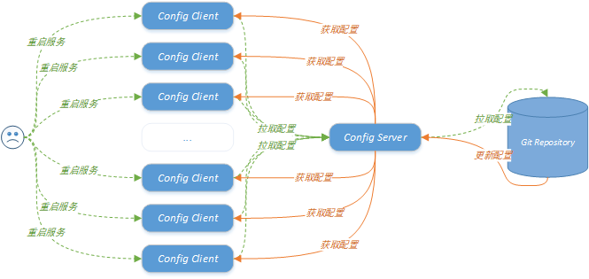

<center>图1. 单独使用 Config</center>


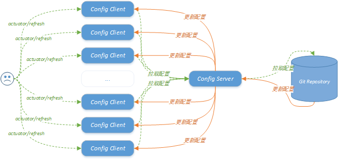

<center>图2. 基于 Actuator 优化 Config</center>


## 基于 Bus 优化 Config


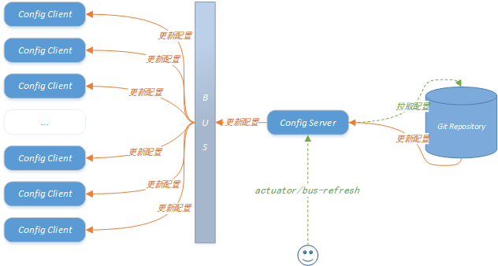

<center>图3. 基于 Actuator + Bus 优化 Config</center>


### 一、Message Broker

Bus 支持两种 Message Broker：RabbitMQ 和 Kafka。本文使用的是 RabbitMQ，具体安装过程不再赘述，可以参考以前的文章：

-   [《RabbitMQ 安装》](../../中间件/RabbitMQ/实战/RabbitMQ安装与使用.md)
-   [《Kafka 安装》](../../中间件/Kafka/Kafka 实战 - 安装.md)


### 二、Config Server

#### 依赖文件

```xml
<?xml version="1.0" encoding="UTF-8"?>
<project xmlns = "http://maven.apache.org/POM/4.0.0"
         xmlns:xsi = "http://www.w3.org/2001/XMLSchema-instance"
         xsi:schemaLocation = "http://maven.apache.org/POM/4.0.0 http://maven.apache.org/xsd/maven-4.0.0.xsd">
    <parent>
        <artifactId>spring-cloud-demo-2020</artifactId>
        <groupId>org.xzy</groupId>
        <version>1.0-SNAPSHOT</version>
    </parent>
    
    <modelVersion>4.0.0</modelVersion>
    <artifactId>cloud-config-config</artifactId>
    <description>配置中心</description>
    
    <dependencies>
        <!--spring-->
        <dependency>
            <groupId>org.springframework.boot</groupId>
            <artifactId>spring-boot-starter-web</artifactId>
        </dependency>
        <dependency>
            <groupId>org.springframework.boot</groupId>
            <artifactId>spring-boot-starter-actuator</artifactId>
        </dependency>
        <!--spring-boot-configuration-processor-->
        <dependency>
            <groupId>org.springframework.boot</groupId>
            <artifactId>spring-boot-configuration-processor</artifactId>
        </dependency>
        <!--lombok-->
        <dependency>
            <groupId>org.projectlombok</groupId>
            <artifactId>lombok</artifactId>
        </dependency>
        <!--eureka-client-->
        <dependency>
            <groupId>org.springframework.cloud</groupId>
            <artifactId>spring-cloud-starter-netflix-eureka-client</artifactId>
        </dependency>
        <!--config-server-->
        <dependency>
            <groupId>org.springframework.cloud</groupId>
            <artifactId>spring-cloud-config-server</artifactId>
        </dependency>
        <!--bus-->
        <dependency>
            <groupId>org.springframework.cloud</groupId>
            <artifactId>spring-cloud-starter-bus-amqp</artifactId>
        </dependency>
    </dependencies>
</project>
```

重点：**spring-cloud-starter-bus-amqp**


#### 配置文件

```yaml
server:
  port: 7011

spring:
  application:
    name: cloud-config-center
  cloud:
    config:
      server:
        git:
          uri: https://gitee.com/zhengyuxiao/spring-cloud-demo-2020    # 存储配置文件的git仓库地址
          default-label: phase8-bus    # 仓库分支
          # username: # github账号
          # password: # github密码
          search-paths: spring-cloud-demo-2020/config-repository    # git仓库存储配置文件的地址

  rabbitmq:
    host: 127.0.0.1
    port: 5672
    username: admin
    password: admin

eureka:
  client:
    service-url:
      defaultZone: http://eureka-register2:7002/eureka/,http://eureka-register3:7003/eureka/

logging:
  level:
    root: debug

# 暴露监控端点
management:
  endpoints:
    web:
      exposure:
        include: "bus-refresh"   # 调用 http://127.0.0.1:7011/actuator/bus-refresh 接口，通知配置中心刷新配置，同时通过总线通知连接配置中心的客户端重新获取配置
```

重点：

-   **spring.rabbitmq.***
-   **mamagement.endpoints.web.exposure.include**


### 三、Config Client

#### 依赖文件

```xml
<?xml version="1.0" encoding="UTF-8"?>
<project xmlns = "http://maven.apache.org/POM/4.0.0"
         xmlns:xsi = "http://www.w3.org/2001/XMLSchema-instance"
         xsi:schemaLocation = "http://maven.apache.org/POM/4.0.0 http://maven.apache.org/xsd/maven-4.0.0.xsd">
    <parent>
        <artifactId>spring-cloud-demo-2020</artifactId>
        <groupId>org.xzy</groupId>
        <version>1.0-SNAPSHOT</version>
    </parent>
    
    <modelVersion>4.0.0</modelVersion>
    <artifactId>cloud-service-user</artifactId>
    <description>用户服务</description>
    
    <dependencies>
        <!--other module-->
        <dependency>
            <groupId>org.xzy</groupId>
            <artifactId>cloud-api-common</artifactId>
            <version>1.0-SNAPSHOT</version>
        </dependency>
        <!--spring-->
        <dependency>
            <groupId>org.springframework.boot</groupId>
            <artifactId>spring-boot-starter-web</artifactId>
        </dependency>
        <dependency>
            <groupId>org.springframework.boot</groupId>
            <artifactId>spring-boot-starter-actuator</artifactId>
        </dependency>
        <!--spring-boot-tools-->
        <dependency>
            <groupId>org.springframework.boot</groupId>
            <artifactId>spring-boot-devtools</artifactId>
            <scope>runtime</scope>
            <optional>true</optional>
        </dependency>
        <!--spring-boot-configuration-processor-->
        <dependency>
            <groupId>org.springframework.boot</groupId>
            <artifactId>spring-boot-configuration-processor</artifactId>
        </dependency>
        <!--lombok-->
        <dependency>
            <groupId>org.projectlombok</groupId>
            <artifactId>lombok</artifactId>
        </dependency>
        <!--eureka-client-->
        <dependency>
            <groupId>org.springframework.cloud</groupId>
            <artifactId>spring-cloud-starter-netflix-eureka-client</artifactId>
        </dependency>
        <!--config-->
        <dependency>
            <groupId>org.springframework.cloud</groupId>
            <artifactId>spring-cloud-starter-config</artifactId>
        </dependency>
        <!--bus-->
        <dependency>
            <groupId>org.springframework.cloud</groupId>
            <artifactId>spring-cloud-starter-bus-amqp</artifactId>
        </dependency>
    </dependencies>


</project>
```

重点：**spring-cloud-starter-bus-amqp**


#### 配置文件

（bootstrap.yaml）

```yaml
spring:
  application:
    name: cloud-user-service
  cloud:
    # Config客户端配置
    config: # 配置中心 -> phase8-bus分支 -> config-dev.yml
      label: phase8-bus
      name: config
      profile: dev
      # uri: http://127.0.0.1:7011    # 直接指定 Config-Server，不推荐
      discovery:                      # 指定服务名称，通过注册中心中转，推荐
        enabled: true
        service-id: cloud-config-center

  rabbitmq:
    host: 127.0.0.1
    port: 5672
    username: admin
    password: admin

eureka:
  client:
    service-url:
      defaultZone: http://eureka-register1:7001/eureka/,http://eureka-register2:7002/eureka/,http://eureka-register3:7003/eureka/
```

重点：**spring.rabbitmq.***


### 四、测试


#### 4.1 全局广播

1.   启动注册中心节点，启动 Config Server 节点，启动 Config Client 节点

     

     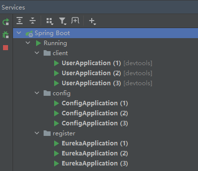

     

     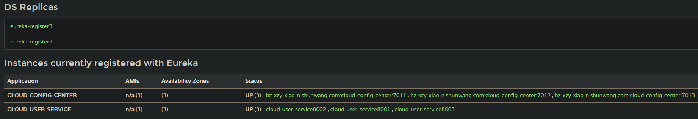

     

     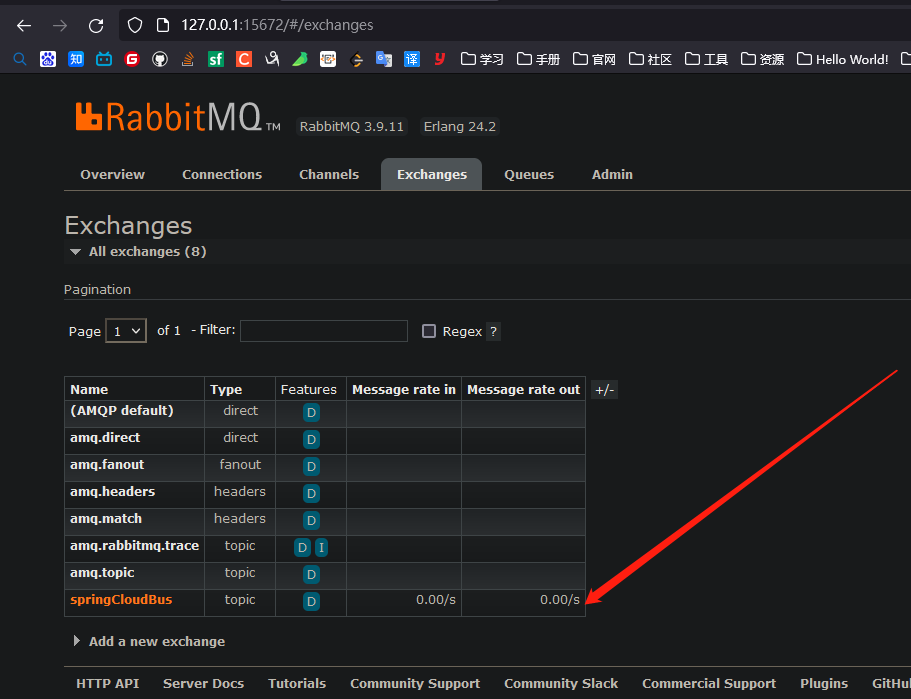

     

     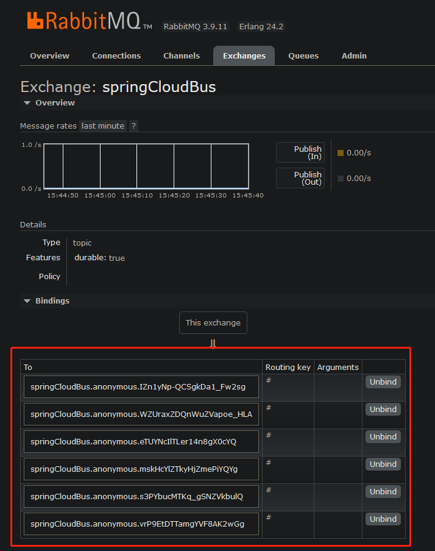

     

     

2.   调用接口打印 Config Client 当前的配置信息

     GET http://localhost:8001/user/config_center/all

     GET http://localhost:8002/user/config_center/all

     GET http://localhost:8003/user/config_center/all

     

     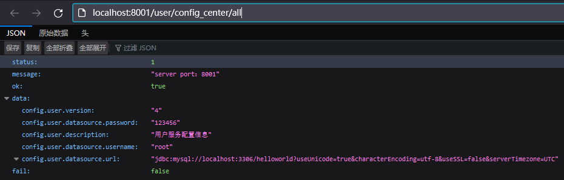

     

3.   到配置中心修改配置文件

     

     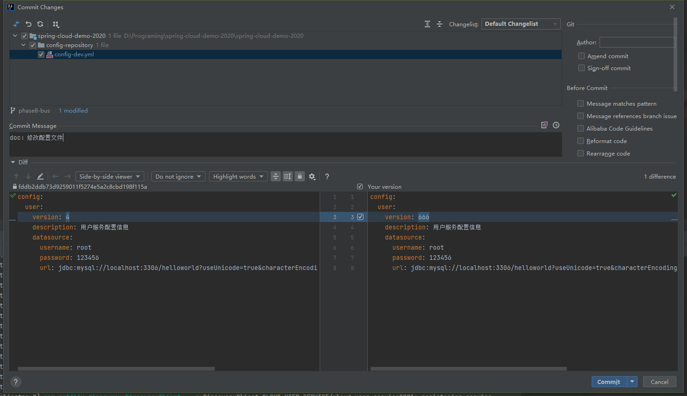

     

4.   对任意 Config Server 节点发送 Bus 刷新请求

     POST http://127.0.0.1:7011/actuator/bus-refresh

     

5.   调用接口打印 Config Client 当前的配置信息

     GET http://localhost:8001/user/config_center/all

     GET http://localhost:8002/user/config_center/all

     GET http://localhost:8003/user/config_center/all

     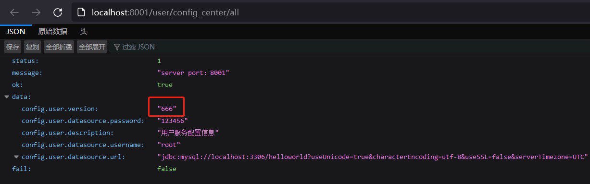

     

     从打印信息可以看出，我们实现了通过总线通知所有 Config Client 更新配置信息。


#### 4.2 定点通知

1.   到配置中心修改配置文件

     

     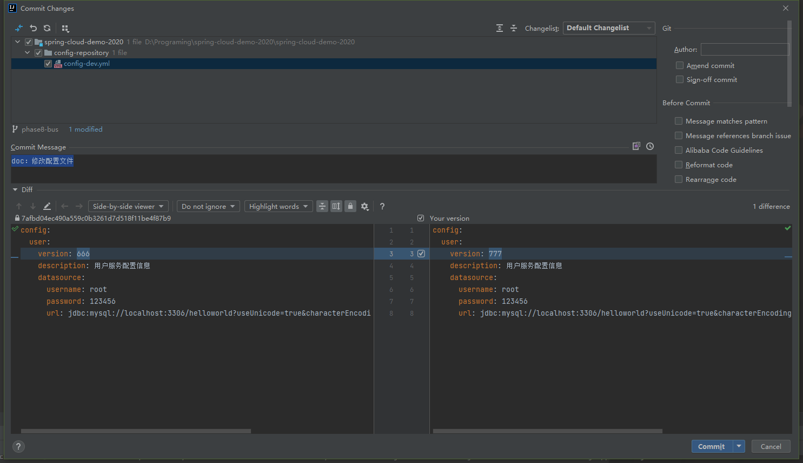

     

2.   只改变某个节点的配置信息

     -   方案一：像 [《Config 实战 - 客户端重启刷新配置》](../Config/Config 实战 - 客户端重启刷新配置.md) 中记录的一样，直接重启某个节点

     -   方案二：像 [《Config 实战 - 客户端手动刷新配置》](../Config/Config 实战 - 客户端手动刷新配置.md) 中记录的一样，调用 Config Client 的 Actuator 接口手动刷新配置

     -   方案三：调用 Config Server 的 Actuator 接口，通过 Bus 总线通知某个节点刷新配置

         

         到注册中心查询节点名称：

         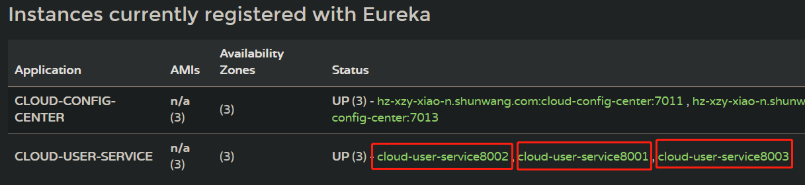

         调用 Config Server 接口：POST http://127.0.0.1:7011/actuator/bus-refresh/cloud-user-service:8001

         >   接口格式：/actuator/bus-refresh/{节点}

         

3.   打印被通知节点的配置信息

     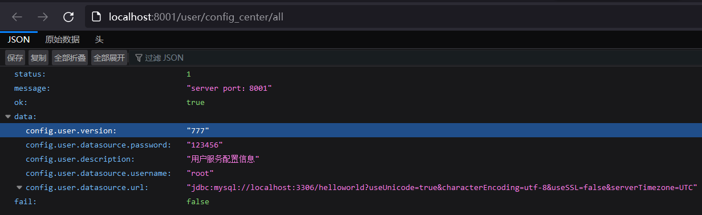

     

4.   打印未被通知节点的配置信息

     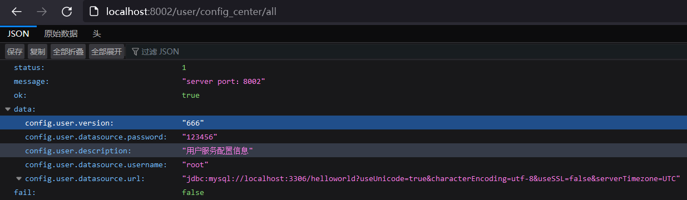

     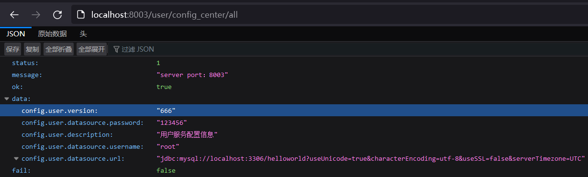

     