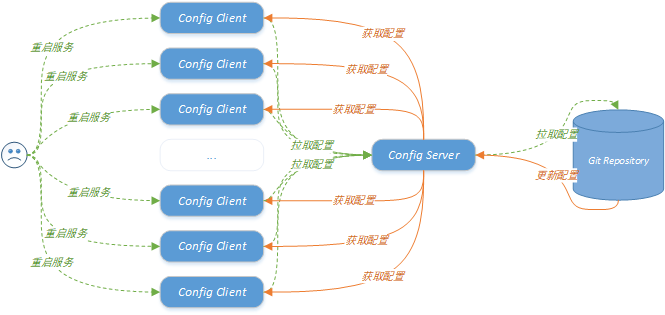
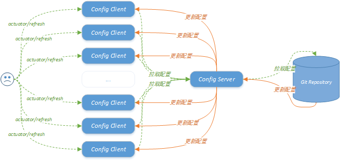
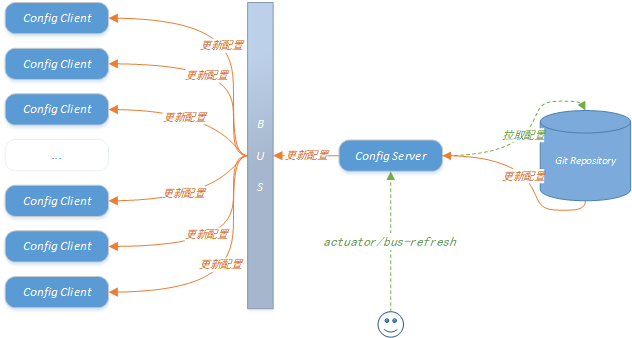
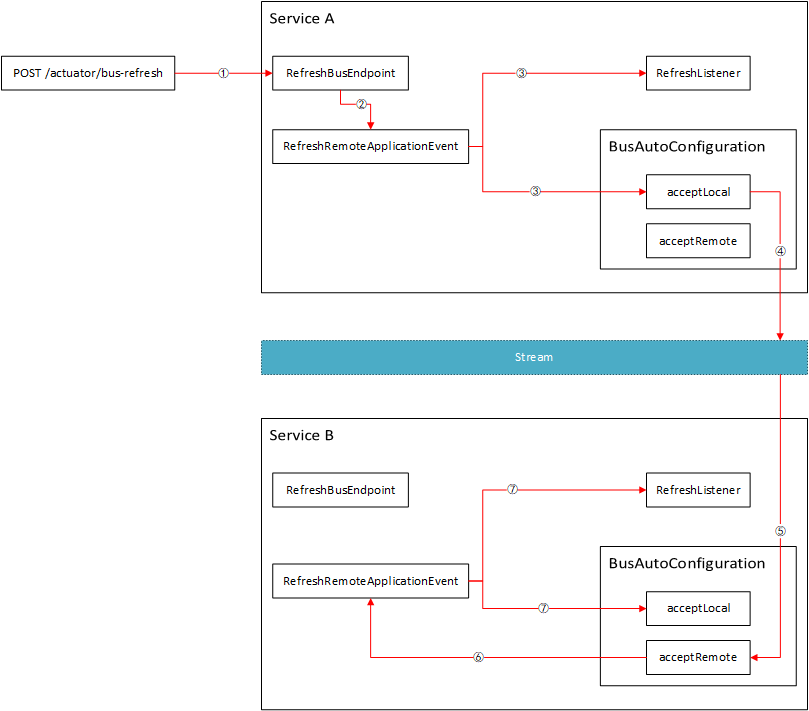

# 基于 Bus 优化 Config 的底层原理

>   相关文档：
>
>   1.   [Config 实战 - 客户端重启刷新配置.md](../Config/Config 实战 - 客户端重启刷新配置.md)
>   2.   [Config 实战 - 客户端手动刷新配置.md](../Config/Config 实战 - 客户端手动刷新配置.md)
>        -   [基于 Endpoint 和 @Scope 的热刷机制.md](../SpringCloud/基于 Endpoint 和 @Scope 的热刷机制.md)
>
>   3.   [Bus 实战 - 基于 Bus 优化 Config——实现动态刷新.md](./Bus 实战 - 基于 Bus 优化 Config——实现动态刷新.md)
>        -   基于 Bus 优化 Config 的底层原理（本文）


[toc]


## 前言


阅读本文前需要先掌握以下内容：

-   Spring 的事件机制

    参考 <(￣︶￣)↗[Spring实战 - 事件机制.md](../Spring/Spring实战 - 事件机制.md)

-   Spring Boot 的 Endpoint 机制

    参考 <(￣︶￣)↗[Actuator 实战 - 02 - 自定义 Endpoint.md](../Actuator/Actuator 实战 - 02 - 自定义 Endpoint.md)

-   Spring Cloud 的热刷机制

    参考 <(￣︶￣)↗[基于 Endpoint 和 @Scope 的热刷机制.md](../SpringCloud/基于 Endpoint 和 @Scope 的热刷机制.md)

-   Spring Cloud Stream 的基本使用

    参考 <(￣︶￣)↗[GO!]()


在 [Config 实战 - 客户端重启刷新配置.md](../Config/Config 实战 - 客户端重启刷新配置.md) 一文中我们提到，Spring 应用通过整合 Config 可以实现配置信息的集中管理。但服务只会在启动的时候从配置中心拉取一次配置，之后如果修改了配置，只能重启服务已拉取最新的配置。



<center>图1. 单独使用 Config</center>

在 [Config 实战 - 客户端手动刷新配置.md](../Config/Config 实战 - 客户端手动刷新配置.md) 一文中我们提到，Spring 应用在整合 Config 的基础上再整合进 Actuator，就可以实现在不重启服务的情况下重新拉取配置。在 [基于 Endpoint 和 @Scope 的热刷机制.md](../SpringCloud/基于 Endpoint 和 @Scope 的热刷机制.md) 一文中我们对底层的原理进行了分析，发现底层采用了 Spring Cloud 提供的基于 Endpoint 和 @Scope 实现的热刷机制。



<center>图2. 基于 Actuator 优化 Config</center>

整合 Actuator 后，虽然服务重新拉取配置信息不需要重启了，但依然需要我们逐个服务的调用 HTTP 接口，服务数量一多也会很蛋疼。于是在 [Bus 实战 - 基于 Bus 优化 Config——实现动态刷新.md](./Bus 实战 - 基于 Bus 优化 Config——实现动态刷新.md) 一文中我们介绍了最终的解决方案——整合Bus。整合进 Bus 后，我们只需要调用 HTTP 接口通知其中一个服务，这个服务就会将“命令”转发给其他服务，最终其他服务也会更新配置。



<center>图3. 基于 Actuator + Bus 优化 Config</center>

本文将探究 Bus 底层的实现逻辑：更新命令到底是如何传递到其他服务的？


## 正文


下图展示的是刷新命令在服务间传递的流程，后文将对流程细节进行说明：




### 1、RefreshBusEndpoint

```java
package org.springframework.cloud.bus.endpoint;
...
@Endpoint(id = "bus-refresh")
public class RefreshBusEndpoint extends AbstractBusEndpoint {

   public RefreshBusEndpoint(ApplicationEventPublisher context, String id) {
      super(context, id);
   }

   @WriteOperation
   public void busRefreshWithDestination(@Selector String destination) {
      publish(new RefreshRemoteApplicationEvent(this, getInstanceId(), destination)); // 发布一个事件，由事件监听器触发热刷机制
   }

   @WriteOperation
   public void busRefresh() {
      publish(new RefreshRemoteApplicationEvent(this, getInstanceId(), null)); // 发布一个事件，由事件监听器触发热刷机制
   }
}
```

RefreshBusEndpoint 是 Bus 定义的一个 Endpoint，跟 Spring Cloud 定义的那个 RefreshEndpoint 一样，主要是作为外部通知服务更新配置的一个入口，最终都会触发 Spring Cloud 实现的热刷机制。但是二者略有区别：

-   RefreshEndpoint：直接触发热刷机制
-   RefreshBusEndpoint：发布一个事件，由监听器触发热刷机制


>   ```java
>   package org.springframework.cloud.endpoint;
>   ...
>   @Endpoint(id = "refresh")
>   public class RefreshEndpoint {
>   
>      private ContextRefresher contextRefresher;
>   
>      public RefreshEndpoint(ContextRefresher contextRefresher) {
>         this.contextRefresher = contextRefresher;
>      }
>   
>      @WriteOperation
>      public Collection<String> refresh() {
>         Set<String> keys = this.contextRefresher.refresh(); // 直接触发热刷机制
>         return keys;
>      }
>   
>   }
>   ```
>
>   读到这里你可能会疑惑：“这不是脱裤子放屁吗？为什么不直接跟 RefreshEndpoint 一样直接触发热刷机制？为什么要搞个事件发布机制？”
>
>   原因：
>
>   1.   RefreshBusEndpoint 的监听器其实有两个：**一个负责触发本地的热刷机制，一个负责将刷新命令传递到其他服务**
>   2.   采用事件机制实现了功能间的解耦，通知使得应用更易于拓展——你也可以实现一个监听器去处理 RefreshRemoteApplicationEvent 事件！


### 2、RefreshRemoteApplicationEvent

```java
package org.springframework.cloud.bus.event;
...
public class RefreshRemoteApplicationEvent extends RemoteApplicationEvent {
   ...
   public RefreshRemoteApplicationEvent(Object source, String originService, String destinationService) {
      super(source, originService, destinationService);
   }
}
```

```java
package org.springframework.cloud.bus.event;
...
public abstract class RemoteApplicationEvent extends ApplicationEvent {
   ...  
   private final String originService; // 发布事件的服务
   private final String destinationService;// 接收事件的服务
   private final String id; // 事件的唯一标识
   ...
}
```

RefreshRemoteApplicationEvent 是 Spring Cloud 自定义的一个事件，它继承了 RemoteApplicationEvent。RemoteApplicationEvent 内部包含很多事件的信息：发布事件的服务、需要接收事件的服务、事件的唯一标识


### 3、RefreshListener

```java
package org.springframework.cloud.bus.event;

...

public class RefreshListener implements ApplicationListener<RefreshRemoteApplicationEvent> {

   private ContextRefresher contextRefresher;

   ...

   @Override
   public void onApplicationEvent(RefreshRemoteApplicationEvent event) {
      Set<String> keys = this.contextRefresher.refresh(); // Spring Cloud 的热刷机制。
   }
}
```

RefreshListener 是一个针对 RefreshRemoteApplicationEvent 事件的监听器，它的工作很简单：监听 RefreshRemoteApplicationEvent 事件，然后执行 Spring Cloud 的热刷机制，==刷新当前服务==


>   关于 Spring Cloud 的热刷机制，详细内容可见 [基于 Endpoint 和 @Scope 的热刷机制.md](../SpringCloud/基于 Endpoint 和 @Scope 的热刷机制.md) 


### 4、BusAutoConfiguration

#### 传播本地事件

```java
package org.springframework.cloud.bus;
...
@Configuration(proxyBeanMethods = false)
@ConditionalOnBusEnabled
@EnableBinding(SpringCloudBusClient.class)
@EnableConfigurationProperties(BusProperties.class)
public class BusAutoConfiguration implements ApplicationEventPublisherAware {
    
    private MessageChannel cloudBusOutboundChannel;
    
    @Autowired
	@Output(SpringCloudBusClient.OUTPUT)
	public void setCloudBusOutboundChannel(MessageChannel cloudBusOutboundChannel) {
		this.cloudBusOutboundChannel = cloudBusOutboundChannel;
	}
    
    ...
    
    @EventListener(classes = RemoteApplicationEvent.class)
	public void acceptLocal(RemoteApplicationEvent event) {
		if (this.serviceMatcher.isFromSelf(event) && !(event instanceof AckRemoteApplicationEvent)) {
             // 通过Steam将本地事件传递到其他服务
			this.cloudBusOutboundChannel.send(MessageBuilder.withPayload(event).build());
		}
	}
 
    ...
}
```

BusAutoConfiguration 中定义了一个处理 RemoteApplicationEvent 事件的监听器。Bus 底层使用了 Spring Cloud Steam 框架，Steam 框架的底层是各种消息中间件（例如，Kafka、RabbitMQ），所有集成了 Bus 的服务会订阅同一个消息队列。Bus 将本地事件传递到其他服务，说破了就是消息中间件的“**发布-订阅**”模式。


#### 接收远程事件

```java
package org.springframework.cloud.bus;
...
@Configuration(proxyBeanMethods = false)
@ConditionalOnBusEnabled
@EnableBinding(SpringCloudBusClient.class)
@EnableConfigurationProperties(BusProperties.class)
public class BusAutoConfiguration implements ApplicationEventPublisherAware {
    
    private MessageChannel cloudBusOutboundChannel;
    
    @Autowired
	@Output(SpringCloudBusClient.OUTPUT)
	public void setCloudBusOutboundChannel(MessageChannel cloudBusOutboundChannel) {
		this.cloudBusOutboundChannel = cloudBusOutboundChannel;
	}
    
    ...
    
	@StreamListener(SpringCloudBusClient.INPUT)
	public void acceptRemote(RemoteApplicationEvent event) {

        ...
         // 处理传递给自己的事件
		if (this.serviceMatcher.isForSelf(event) && this.applicationEventPublisher != null) {
			
             // 将事件发布到当前服务的上下文
             if (!this.serviceMatcher.isFromSelf(event)) {
				this.applicationEventPublisher.publishEvent(event);
			}
            
			...
		}

        ...
	}
 
    ...
}
```

acceptRemote 方法用于接收其他服务发布的事件，然后将事件发布到当前服务的上下文，最终 RefreshListener 会监听到其他服务发布的刷新事件，然后执行 Spring Cloud 的热刷流程。


## 总结

