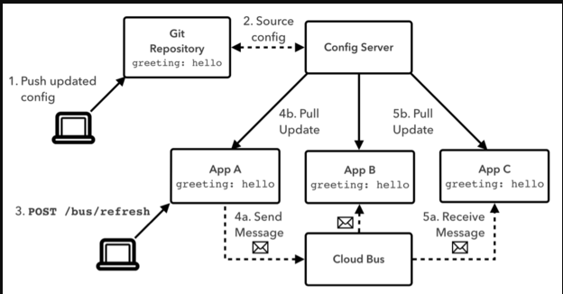

# Spring Cloud Bus 理论

>   官方文档：https://spring.io/projects/spring-cloud-bus

[toc]

## 是什么？能干嘛？

Spring Cloud Bus 可以理解成是分布式系统中的消息总线——通过轻量的 Message Broker （Rabbit MQ 或 Kafka）将分布式系统中的节点连接起来，然后可以用它来广播状态更新信息（例如配置信息）或其他管理指令。

>   计算机中的消息总线：https://baike.baidu.com/item/%E7%B3%BB%E7%BB%9F%E6%80%BB%E7%BA%BF/1190546
>
>   

## 基本原理？

假设使用的 Message Broker 是 RabbitMQ：所有节点订阅同一个 TOPIC → 将需要广播的信息放在 TOPIC