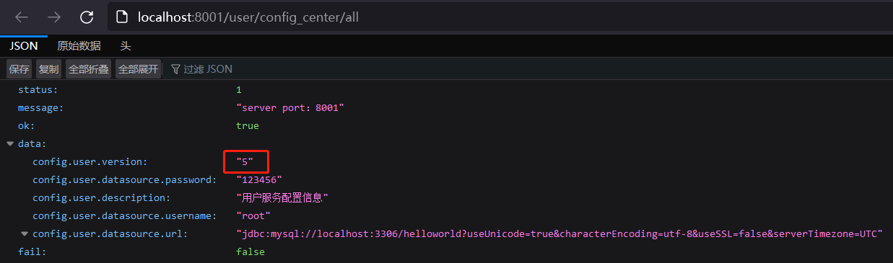
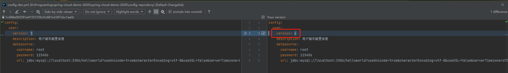
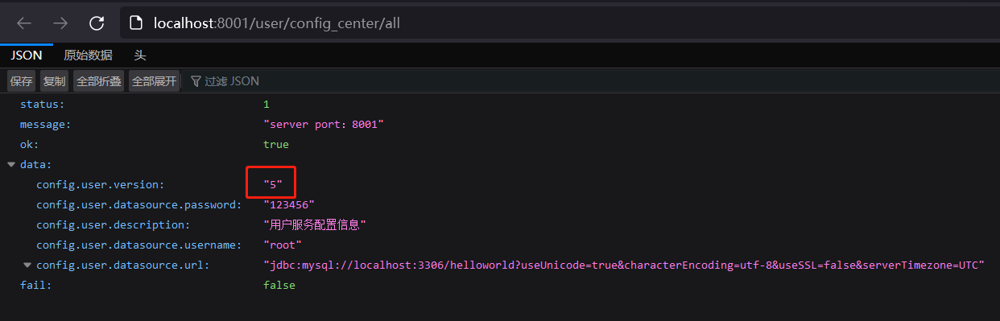
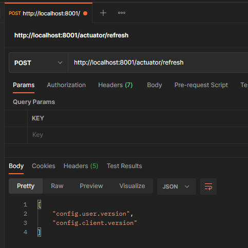
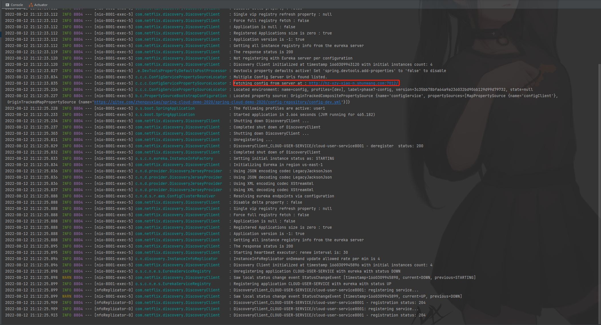
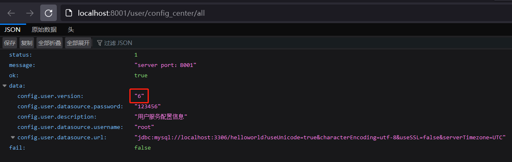

# 客户端手动刷新配置


[TOC]

[Config 实战 - 客户端重启刷新配置](./Config 实战 - 客户端重启刷新配置.md) 一文中记录了 Spring Cloud Config 的基本使用方式：客户端以重启的方式通过 Config Server 获取配置仓库最新的配置信息。本文记录的是一种不需要重启客户端就能让客户端获取最新配置的方案。


>   Note：本文基于 [《Config 实战 - 客户端重启刷新配置》](./Config 实战 - 客户端重启刷新配置.md)，部分重复的内容不再赘述。


## Config Client 优化


### 依赖文件

```xml
<?xml version="1.0" encoding="UTF-8"?>
<project xmlns = "http://maven.apache.org/POM/4.0.0"
         xmlns:xsi = "http://www.w3.org/2001/XMLSchema-instance"
         xsi:schemaLocation = "http://maven.apache.org/POM/4.0.0 http://maven.apache.org/xsd/maven-4.0.0.xsd">
    ...
    
    <dependencies>
        ...
        <dependency>
            <groupId>org.springframework.boot</groupId>
            <artifactId>spring-boot-starter-actuator</artifactId>
        </dependency>
        ...
    </dependencies>


</project>
```

在原来依赖的基础上添加：**spring-boot-starter-actuator**


### 配置文件

```yaml
server:
  port: 8001

eureka:
  instance:
    instance-id: cloud-user-service8001
    prefer-ip-address: true
  client:
    register-with-eureka: true # 是否向注册中心注册自己
    fetch-registry: true # 是否需要检索服务

# 暴露监控端点
management:
  endpoints:
    web:
      exposure:
        include: "*"
```

在原来 application.yaml 文件的基础上添加 actuator 相关的配置信息


### Controller

```java
@RefreshScope
...
public class UserController {
    ...
}
```

添加 @RefreshScope 注解


### 测试

1.   启动 Config Client，打印 Config Client 当前配置信息

     

     

2.   修改配置中心的配置文件

     

     

3.   再次打印配置信息

     

     发现配置信息并没有变化……

     

4.   手动刷新 Config Client 配置：

     **POST** http://localhost:8001/actuator/refresh

     

     

     Config Client 控制台信息：

     

     

     

5.   打印 Config Client 当前配置信息

     

     从结果可以看出，Config Client 当前已经成功获取到最新的配置信息，而且，Config Client 并没有重启服务。


## 总结

当前的方案实现了 Client Config 在不重启的条件下获取最新的配置信息，然而，还是存在很多不便——如果有100个服务，就需要调用100次接口……

好在，还有更好的方案可以继续优化，在学习`消息总线`的时候会介绍一种更好的方案！：[《Bus 实战 - 基于 Bus 优化 Config——实现动态刷新.md》](../Bus/Bus 实战 - 基于 Bus 优化 Config——实现动态刷新.md)
