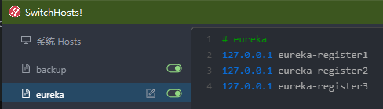
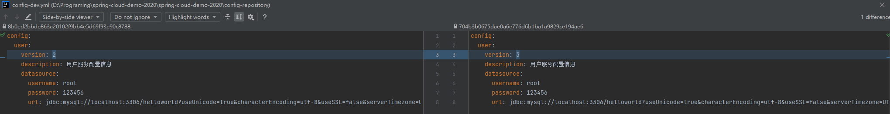
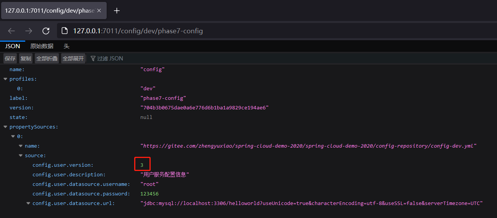

# 客户端重启属性配置


[TOC]


## 一、配置仓库


config-dev.yml

```yml
config:
  user:
    version: 2
    description: 用户服务配置信息
    datasource:
      username: root
      password: 123456
      url: jdbc:mysql://localhost:3306/helloworld?useUnicode=true&characterEncoding=utf-8&useSSL=false&serverTimezone=UTC
```


## 二、注册中心


## 三、Config Server


### 依赖文件

```xml
<?xml version="1.0" encoding="UTF-8"?>
<project xmlns = "http://maven.apache.org/POM/4.0.0"
         xmlns:xsi = "http://www.w3.org/2001/XMLSchema-instance"
         xsi:schemaLocation = "http://maven.apache.org/POM/4.0.0 http://maven.apache.org/xsd/maven-4.0.0.xsd">
    <parent>
        <artifactId>spring-cloud-demo-2020</artifactId>
        <groupId>org.xzy</groupId>
        <version>1.0-SNAPSHOT</version>
    </parent>
    
    <modelVersion>4.0.0</modelVersion>
    <artifactId>cloud-config-config</artifactId>
    <description>配置中心</description>
    
    <dependencies>
        <!--spring-->
        <dependency>
            <groupId>org.springframework.boot</groupId>
            <artifactId>spring-boot-starter-web</artifactId>
        </dependency>
        <!--spring-boot-configuration-processor-->
        <dependency>
            <groupId>org.springframework.boot</groupId>
            <artifactId>spring-boot-configuration-processor</artifactId>
        </dependency>
        <!--lombok-->
        <dependency>
            <groupId>org.projectlombok</groupId>
            <artifactId>lombok</artifactId>
        </dependency>
        <!--eureka-client-->
        <dependency>
            <groupId>org.springframework.cloud</groupId>
            <artifactId>spring-cloud-starter-netflix-eureka-client</artifactId>
        </dependency>
        <!--config-server-->
        <dependency>
            <groupId>org.springframework.cloud</groupId>
            <artifactId>spring-cloud-config-server</artifactId>
        </dependency>
    </dependencies>
</project
```

关键：spring-cloud-config-server


### 配置文件

```yaml
server:
  port: 7011

spring:
  application:
    name: cloud-config-center
  cloud:
    config:
      server:
        git:
          uri: https://gitee.com/zhengyuxiao/spring-cloud-demo-2020    # 存储配置文件的git仓库地址
          default-label: phase7-config    # 仓库分支
          username: ******  # git账号
          password: ******  # git密码
          search-paths: spring-cloud-demo-2020/config-repository    # git仓库存储配置文件的地址

eureka:
  client:
    service-url:
      defaultZone: http://eureka-register2:7002/eureka/,http://eureka-register3:7003/eureka/

logging:
  level:
    root: debug
```

>   Note：配置上述 defaultZone 时需要修改本地 host 文件，否则只能配置 IP 地址
>
>   


### 主启动类

```java
@SpringBootApplication
@EnableEurekaClient
@EnableConfigServer
public class ConfigApplication {
    public static void main(String[] args) {
        SpringApplication.run(ConfigApplication.class, args);
    }
}
```

关键：@EnableConfigServer


### 测试

1.   启动服务

     

2.   查看[ Eureka 控制面板](http://eureka-register1:7001/)：服务成功注册

     

     

3.   通过 Config Server 获取配置文件的信息

     >   Spring Cloud Config 对外提供了若干 REST 接口用于检索配置信息：
     >
     >   ```tex
     >   /{application}/{profile}[/{label}]
     >   /{application}-{profile}.yml
     >   /{label}/{application}-{profile}.yml
     >   /{application}-{profile}.properties
     >   /{label}/{application}-{profile}.properties
     >   ```

     

     1.   GET： http://127.0.0.1:7011/config/dev/phase7-config

          ```json
          {
            "name": "config",
            "profiles": [
              "dev"
            ],
            "label": "phase7-config",
            "version": "d4b4ce613ae3f87a6b31d4b3dc1987dde917e534",
            "state": null,
            "propertySources": [
              {
                "name": "https://gitee.com/zhengyuxiao/spring-cloud-demo-2020/spring-cloud-demo-2020/config-repository/config-dev.yml",
                "source": {
                  "config.user.version": 2,
                  "config.user.description": "用户服务配置信息",
                  "config.user.datasource.username": "root",
                  "config.user.datasource.password": 123456,
                  "config.user.datasource.url": "jdbc:mysql://localhost:3306/helloworld?useUnicode=true&characterEncoding=utf-8&useSSL=false&serverTimezone=UTC"
                }
              }
            ]
          }
          ```

          通过比较其他接口可以看出，这个接口返回的数据采用 JSON 格式

          

     2.   GET： http://127.0.0.1:7011/config-dev.yml

          ```yaml
          config:
            user:
              datasource:
                password: 123456
                url: jdbc:mysql://localhost:3306/helloworld?useUnicode=true&characterEncoding=utf-8&useSSL=false&serverTimezone=UTC
                username: root
              description: 用户服务配置信息
              version: 2
          
          ```

          

     3.   GET： http://127.0.0.1:7011/phase7-config/config-dev.yml

          ```yaml
          config:
            user:
              datasource:
                password: 123456
                url: jdbc:mysql://localhost:3306/helloworld?useUnicode=true&characterEncoding=utf-8&useSSL=false&serverTimezone=UTC
                username: root
              description: 用户服务配置信息
              version: 2
          ```

          这个接口返回的信息出现了中文乱码问题

          

## 四、Config Client


### 依赖文件

```xml
<?xml version="1.0" encoding="UTF-8"?>
<project xmlns = "http://maven.apache.org/POM/4.0.0"
         xmlns:xsi = "http://www.w3.org/2001/XMLSchema-instance"
         xsi:schemaLocation = "http://maven.apache.org/POM/4.0.0 http://maven.apache.org/xsd/maven-4.0.0.xsd">
    <parent>
        <artifactId>spring-cloud-demo-2020</artifactId>
        <groupId>org.xzy</groupId>
        <version>1.0-SNAPSHOT</version>
    </parent>
    
    <modelVersion>4.0.0</modelVersion>
    <artifactId>cloud-service-user</artifactId>
    <description>用户服务</description>
    
    <dependencies>
        <!--other module-->
        <dependency>
            <groupId>org.xzy</groupId>
            <artifactId>cloud-api-common</artifactId>
            <version>1.0-SNAPSHOT</version>
        </dependency>
        <!--spring-->
        <dependency>
            <groupId>org.springframework.boot</groupId>
            <artifactId>spring-boot-starter-web</artifactId>
        </dependency>
        <dependency>
            <groupId>org.springframework.boot</groupId>
            <artifactId>spring-boot-starter-actuator</artifactId>
        </dependency>
        <!--spring-boot-tools-->
        <dependency>
            <groupId>org.springframework.boot</groupId>
            <artifactId>spring-boot-devtools</artifactId>
            <scope>runtime</scope>
            <optional>true</optional>
        </dependency>
        <!--spring-boot-configuration-processor-->
        <dependency>
            <groupId>org.springframework.boot</groupId>
            <artifactId>spring-boot-configuration-processor</artifactId>
        </dependency>
        <!--lombok-->
        <dependency>
            <groupId>org.projectlombok</groupId>
            <artifactId>lombok</artifactId>
        </dependency>
        <!--eureka-client-->
        <dependency>
            <groupId>org.springframework.cloud</groupId>
            <artifactId>spring-cloud-starter-netflix-eureka-client</artifactId>
        </dependency>
        <!--config-->
        <dependency>
            <groupId>org.springframework.cloud</groupId>
            <artifactId>spring-cloud-starter-config</artifactId>
        </dependency>
    </dependencies>
</project>
```

关键：spring-cloud-starter-config


### 配置文件

bootstrap.yaml

```yaml
spring:
  application:
    name: cloud-user-service
  cloud:
    # Config客户端配置
    config: # 配置中心 -> phase7-config分支 -> config-dev.yml
      label: phase7-config
      name: config
      profile: dev
      # uri: http://127.0.0.1:7011    # 直接指定 Config-Server，不推荐
      discovery:                      # 指定服务名称，通过注册中心中转，推荐
        enabled: true
        service-id: cloud-config-center

eureka:
  client:
    service-url:
      defaultZone: http://eureka-register1:7001/eureka/,http://eureka-register2:7002/eureka/,http://eureka-register3:7003/eureka/
```

>   Note：如果直接使用 uri 属性指定具体的 config server，注册中心就没有意义了


application.yaml

```yaml
server:
  port: 8001

eureka:
  instance:
    instance-id: cloud-user-service8001
    prefer-ip-address: true
  client:
    register-with-eureka: true # 是否向注册中心注册自己
    fetch-registry: true # 是否需要检索服务
```

>   Note：bootstrap.yaml 的加载顺序先于 application.yaml


### 主启动类

```java
@SpringBootApplication
@EnableEurekaClient
@EnableDiscoveryClient
public class UserApplication {
    public static void main(String[] args) {
        SpringApplication.run(UserApplication.class, args);
    }
}
```


### 对外服务

```java
@RestController
@RequestMapping(path = "/user/config_center")
@RefreshScope  // 调用 xxx.xxx.xxx.xxx:xxx/actuator/refresh 接口，重新获取外部配置
public class ConfigCenterController {

    /**
     * 本地配置文件设置的配置信息
     */
    @Value("${server.port}")
    private String serverPort;

    /**
     * 配置中心设置的配置信息
     */
    @Value("${config.user.version}")
    private String version;
    @Value("${config.user.description}")
    private String description;
    @Value("${config.user.datasource.username}")
    private String dbUsername;
    @Value("${config.user.datasource.password}")
    private String dbPassword;
    @Value("${config.user.datasource.url}")
    private String dbUrl;

    @GetMapping("/all")
    public MessageBox<Map<String, String>> getAll() {
        Map<String, String> configFromCenter = new HashMap<>(5);
        configFromCenter.put("config.user.version", version);
        configFromCenter.put("config.user.description", description);
        configFromCenter.put("config.user.datasource.username", dbUsername);
        configFromCenter.put("config.user.datasource.password", dbPassword);
        configFromCenter.put("config.user.datasource.url", dbUrl);
        return MessageBox.ok("server port：" + serverPort, configFromCenter);
    }
}
```


### 测试

1.   启动服务

     

     

     

     

     其实服务能够成功启动，就已经说明服务成功从配置中心获取配置信息了，否则 ConfigCenterController 是服务实例化成功的…

     

2.   调用接口打印获取到的配置信息

     


## 五、Config Client 优化


### 问题引入

1.   到配置仓库修改配置文件

     

     

2.   调用 Config Server 的接口获取配置信息

     

     从结果可以看出，Config Server 已经成功获取到最新的数据。

     

3.   调用 Config Client 的接口，打印配置信息

     

     **从结果可以看出，Config Client 当前使用的依然是旧的配置信息！**


### 问题分析

每次调用 Config Server 的接口，Config Server 都会到配置仓库拉取最新的配置信息，所以打印出来的配置信息是最新的。一情况下，Config Client 只有启动的时候会通过 Config Server 获取一次配置信息，所以打印出来的配置信息是旧的。


### 问题解决

-   方案一：重启 Config Client

    

    重启 Config Client：

    

    再次调用接口：

    

    可以看到，现在 Config Client 已经成功获取到最新的配置。然而，这个方案存在很大的局限性——在实际应用中，很多服务不能随便重启

    

-   方案二：详见 [Config 实战 - 客户端手动刷新配置](./Config 实战 - 客户端手动刷新配置.md)