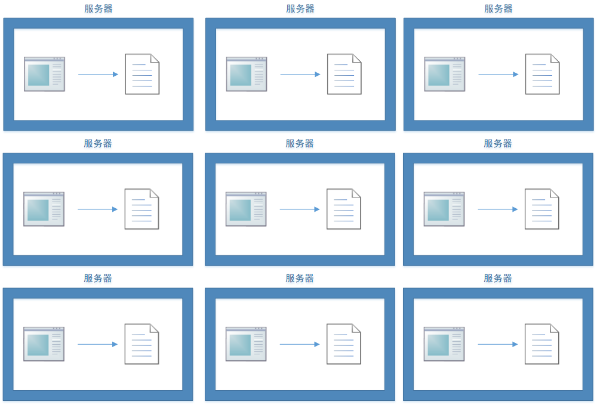
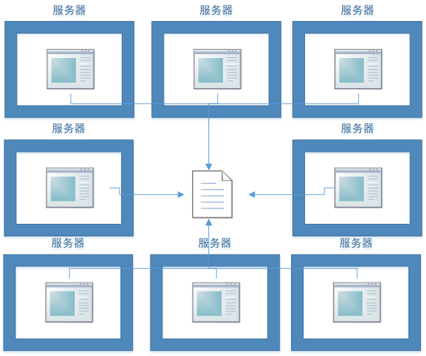
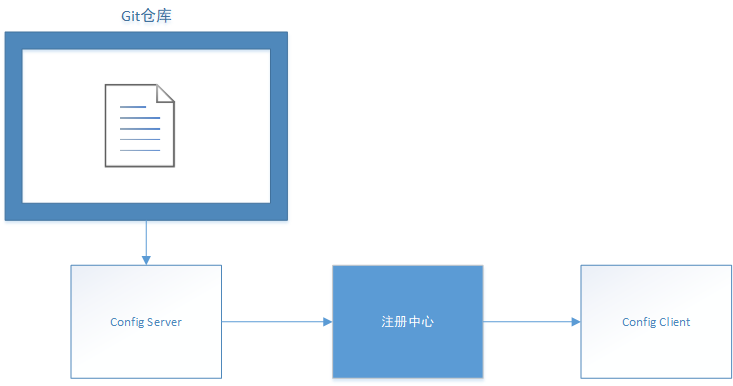

# Config 理论

>   Spring Cloud Config 官方文档：https://cloud.spring.io/spring-cloud-static/spring-cloud-config/2.2.1.RELEASE/reference/html/

[toc]

### 分布式系统面临的配置管理问题

#### 内部化配置 VS 外部化配置

以 Spring 应用为例，内部化配置就是将配置文件直接打进 Jar 包，启动服务的时候直接运行 Jar 包即可。外部化配置需要在启动 Jar 包的时候通过命令指定 Jar 包外的配置文件。内部化配置运行方便，但是每次修改配置都需要重新打包；外部化配置运行稍微麻烦一些，但是修改配置不需要重新打包。

#### 分散管理 VS 集中管理

分散管理

集中管理

在分布式系统中，服务的个数可能非常多，如果采用分散管理，一旦需要修改配置，工作量很大而且容易出错。相比之下，采用集中管理会好很多。

### Config 什么是？

“Spring Cloud Config provides server-side and client-side support for  externalized configuration in a distributed system. With the Config  Server, you have a central place to manage external properties for  applications across all environments.”

Spring Cloud Config 是 Spring 社区搞出来的一个用于集中管理配置信息的组件。

常见的Config应用架构

### Config 能干嘛？

-   集中管理配置：配置信息存储在仓库，其他服务统一通过 Config Server 间接获取
-   动态刷新配置：配置信息修改后，无需重启服务 Config Server 就能获取到最新的配置
-   对外提供 REST 接口用于查询配置信息
-   官方推荐采用 Git 作为仓库，但是也可以采用其他仓库，例如 SVN

