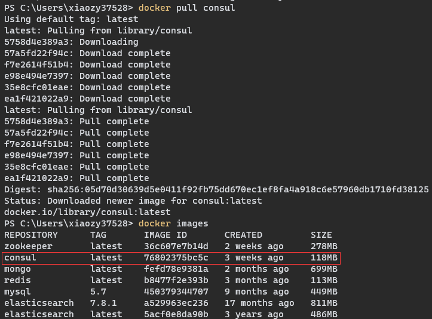

# Consul 安装

## 1、Linux环境

## 2、Windows环境

## 3、Win10 + Docker 环境

1.   拉取最新版本的 Consul 镜像

     ```
     docker pull consul
     ```

     

2.   创建并运行容器

     ```
     docker run -d -p 8500:8500 --name=myConsul consul:latest agent -server -bootstrap -ui -node=1 -client='0.0.0.0'
     ```

     -   agent: 表示启动 Agent 进程。
     -   server：表示启动 Consul Server 模式
     -   bootstrap：表示这个节点是 Server-Leader ，每个数据中心只能运行一台服务器。技术角度上讲 Leader 是通过 Raft 算法选举的，但是集群第一次启动时需要一个引导 Leader，在引导群集后，建议不要使用此标志。
     -   ui：表示启动 Web UI 管理器，默认开放端口 8500，所以上面使用 Docker 命令把 8500 端口对外开放。
     -   client：表示启动 Consul Cilent 模式。
     -   node：节点的名称，集群中必须是唯一的，默认是该节点的主机名。
     -   client：consul服务侦听地址，这个地址提供HTTP、DNS、RPC等服务，默认是127.0.0.1所以不对外提供服务，如果你要对外提供服务改成0.0.0.0
     -   join：表示加入到某一个集群中去。 如：-json=192.168.0.11。

3.   验证

     👉 [Web页面](http://127.0.0.1:8500)

     

