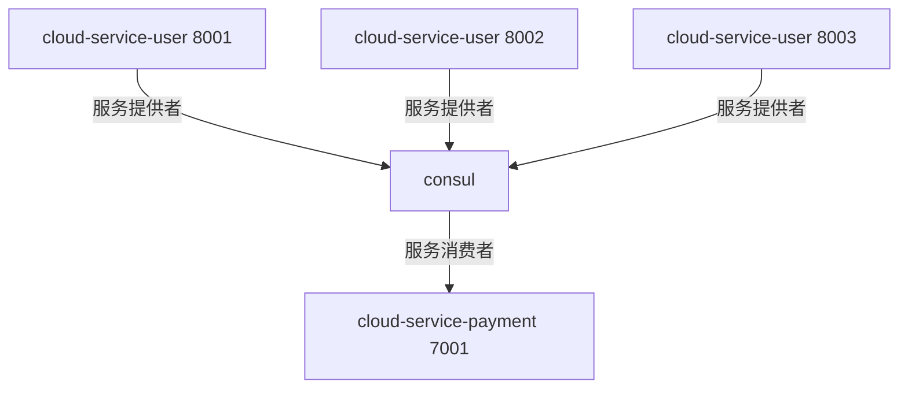
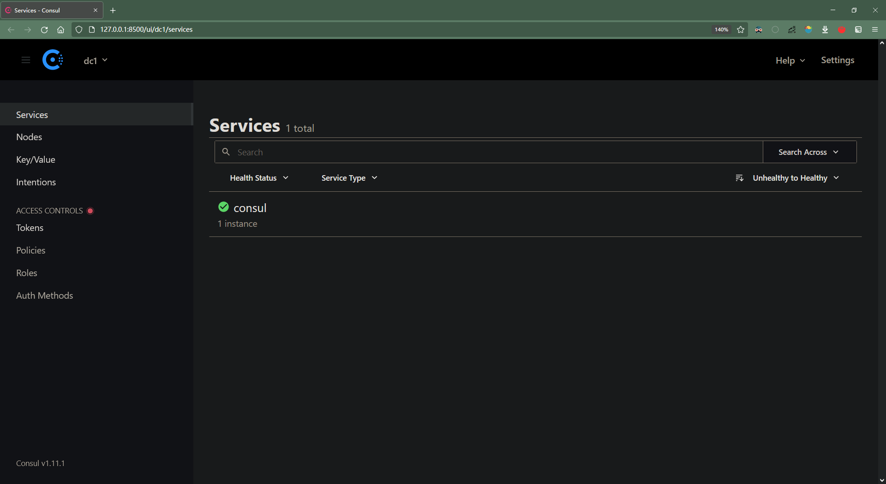
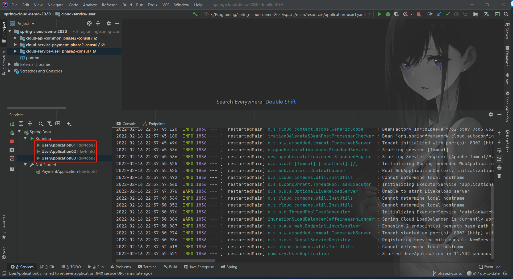
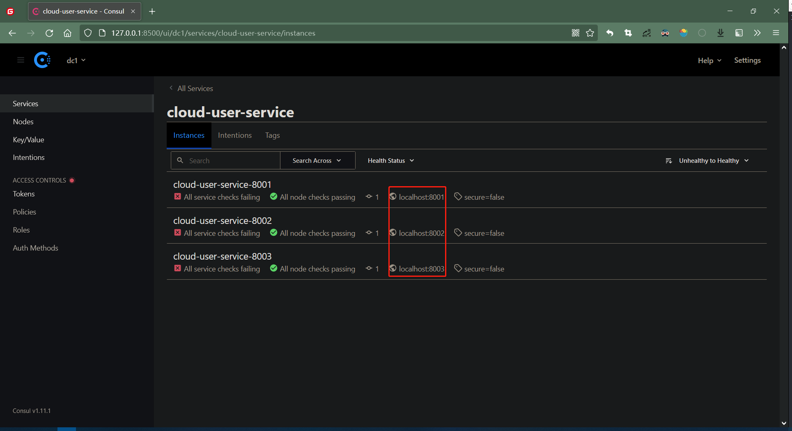
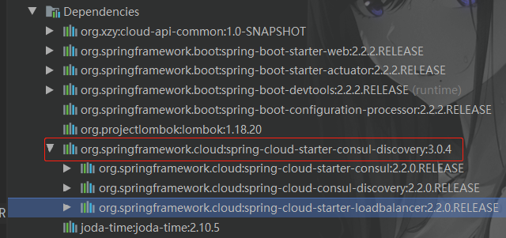
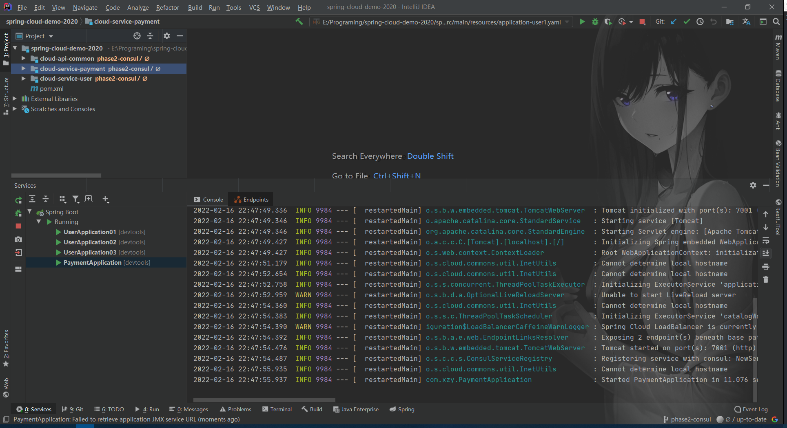
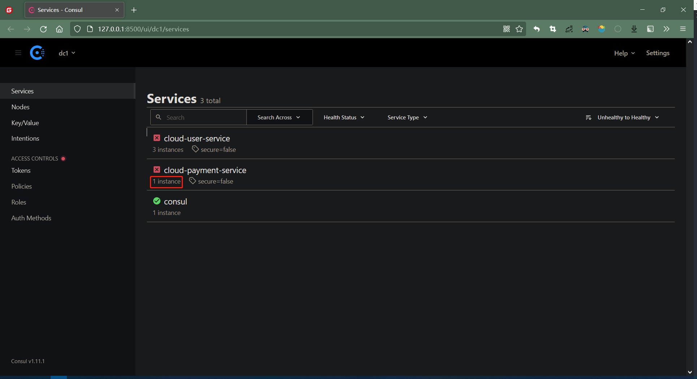
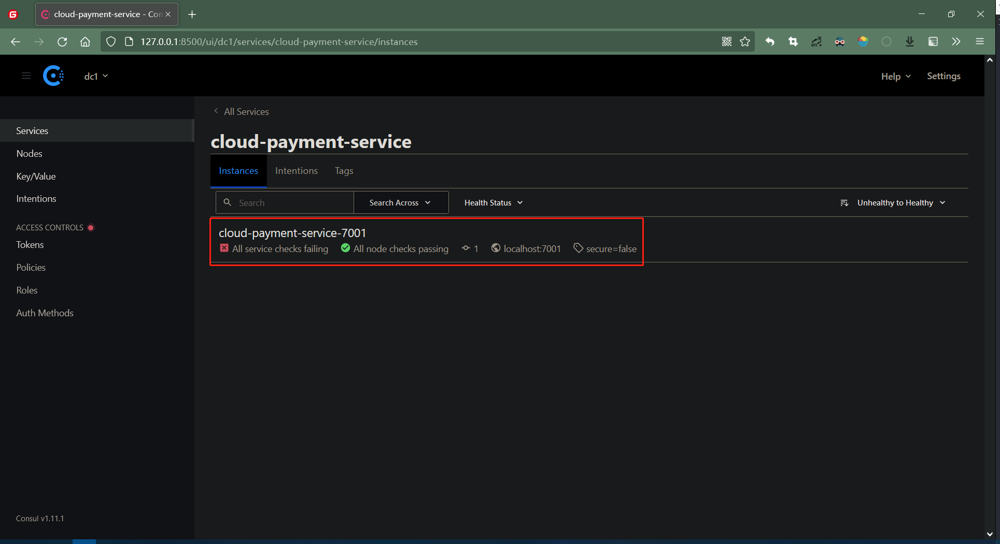

# 微服务注册中心

[toc]

系统结构：



## 1、注册中心

### 1.1 安装

<(￣︶￣)↗[Consul 实战 - 安装.md](./Consul 实战 - 安装.md)

### 1.2 测试

<(￣︶￣)↗[WEB 管理页面](http://127.0.0.1:8500)



## 2、服务提供者

### 2.1 依赖文件

```xml
<?xml version="1.0" encoding="UTF-8"?>
<project xmlns = "http://maven.apache.org/POM/4.0.0"
         xmlns:xsi = "http://www.w3.org/2001/XMLSchema-instance"
         xsi:schemaLocation = "http://maven.apache.org/POM/4.0.0 http://maven.apache.org/xsd/maven-4.0.0.xsd">
    <parent>
        <artifactId>spring-cloud-demo-2020</artifactId>
        <groupId>org.xzy</groupId>
        <version>1.0-SNAPSHOT</version>
    </parent>
    
    <modelVersion>4.0.0</modelVersion>
    <artifactId>cloud-service-user</artifactId>
    <description>用户服务</description>
    
    <dependencies>
        <!--other module-->
        <dependency>
            <groupId>org.xzy</groupId>
            <artifactId>cloud-api-common</artifactId>
            <version>1.0-SNAPSHOT</version>
        </dependency>
        <!--spring-->
        <dependency>
            <groupId>org.springframework.boot</groupId>
            <artifactId>spring-boot-starter-web</artifactId>
        </dependency>
        <dependency>
            <groupId>org.springframework.boot</groupId>
            <artifactId>spring-boot-starter-actuator</artifactId>
        </dependency>
        <!--spring-boot-tools-->
        <dependency>
            <groupId>org.springframework.boot</groupId>
            <artifactId>spring-boot-devtools</artifactId>
            <scope>runtime</scope>
            <optional>true</optional>
        </dependency>
        <!--spring-boot-configuration-processor-->
        <dependency>
            <groupId>org.springframework.boot</groupId>
            <artifactId>spring-boot-configuration-processor</artifactId>
        </dependency>
        <!--lombok-->
        <dependency>
            <groupId>org.projectlombok</groupId>
            <artifactId>lombok</artifactId>
        </dependency>
        <!--consul-->
        <dependency>
            <groupId>org.springframework.cloud</groupId>
            <artifactId>spring-cloud-starter-consul-discovery</artifactId>
        </dependency>
        <dependency>
            <groupId>joda-time</groupId>
            <artifactId>joda-time</artifactId>
        </dependency>
    </dependencies>


</project>
```

关键：spring-cloud-starter-consul-discovery

### 2.2 配置文件

```yaml
server:
  port: 8001

spring:
  application:
    name: cloud-user-service
  cloud:
    consul:
      host: 127.0.0.1
      port: 8500
      discovery:
        service-name: ${spring.application.name}

```

### 2.3 主启动类

```java
@SpringBootApplication
@EnableDiscoveryClient
public class UserApplication {
    public static void main(String[] args) {
        SpringApplication.run(UserApplication.class, args);
    }
}
```

注意：@EnableDiscoveryClient 开启服务注册与发现

### 2.4 对外服务

```java
@RestController
@RequestMapping("/user/user")
@Slf4j
public class UserController {
    @Value("${server.port}")
    private String serverPort;

    private final UserService userService;

    @Autowired
    public UserController(UserService userService) {
        this.userService = userService;
    }

    /**
     * 根据主键查询用户信息
     *
     * @param id 主键
     * @return 用户信息
     */
    @GetMapping("/{id}")
    public MessageBox<UserEntity> findByPrimaryKey(@PathVariable("id") Long id) {
        String msg = "Server port：" + serverPort + "  UUID：" + UUID.randomUUID().toString();
        return MessageBox.ok(msg, userService.findByPrimaryKey(id));
    }
}
```

说明：服务实例会将自己的端口号一并返回，方便我们了解服务调用的情况

### 2.5 测试

1.   修改端口号，启动 3 个服务实例

     

2.   打开 Consul 管理页面，查看实例注册结果

     <(￣︶￣)↗[WEB 管理页面](http://127.0.0.1:8500)

     

## 3、服务消费者

### 3.1 依赖文件

```xml
<?xml version="1.0" encoding="UTF-8"?>
<project xmlns="http://maven.apache.org/POM/4.0.0"
         xmlns:xsi="http://www.w3.org/2001/XMLSchema-instance"
         xsi:schemaLocation="http://maven.apache.org/POM/4.0.0 http://maven.apache.org/xsd/maven-4.0.0.xsd">
    <parent>
        <artifactId>spring-cloud-demo-2020</artifactId>
        <groupId>org.xzy</groupId>
        <version>1.0-SNAPSHOT</version>
    </parent>

    <modelVersion>4.0.0</modelVersion>
    <artifactId>cloud-service-payment</artifactId>
    <description>支付服务</description>

    <dependencies>
        <!--other module-->
        <dependency>
            <groupId>org.xzy</groupId>
            <artifactId>cloud-api-common</artifactId>
            <version>1.0-SNAPSHOT</version>
        </dependency>
        <!--spring-->
        <dependency>
            <groupId>org.springframework.boot</groupId>
            <artifactId>spring-boot-starter-web</artifactId>
        </dependency>
        <dependency>
            <groupId>org.springframework.boot</groupId>
            <artifactId>spring-boot-starter-actuator</artifactId>
        </dependency>
        <!--spring-boot-tools-->
        <dependency>
            <groupId>org.springframework.boot</groupId>
            <artifactId>spring-boot-devtools</artifactId>
            <scope>runtime</scope>
            <optional>true</optional>
        </dependency>
        <!--spring-boot-configuration-processor-->
        <dependency>
            <groupId>org.springframework.boot</groupId>
            <artifactId>spring-boot-configuration-processor</artifactId>
        </dependency>
        <!--lombok-->
        <dependency>
            <groupId>org.projectlombok</groupId>
            <artifactId>lombok</artifactId>
        </dependency>
        <!--consul-->
        <dependency>
            <groupId>org.springframework.cloud</groupId>
            <artifactId>spring-cloud-starter-consul-discovery</artifactId>
        </dependency>
        <dependency>
            <groupId>joda-time</groupId>
            <artifactId>joda-time</artifactId>
        </dependency>
    </dependencies>

</project>
```

关键：spring-cloud-starter-consul-discovery

### 3.2 配置文件

```yaml
server:
  port: 7001

spring:
  application:
    name: cloud-payment-service
  cloud:
    consul:
      host: 127.0.0.1
      port: 8500
      discovery:
        service-name: ${spring.application.name}
```

### 3.3 主启动类

```java
@SpringBootApplication
@EnableDiscoveryClient
public class PaymentApplication {
    public static void main(String[] args) {
        SpringApplication.run(PaymentApplication.class, args);
    }
    
    @Bean
    @LoadBalanced
    public RestTemplate restTemplate() {
        return new RestTemplate();
    }
}
```

注意：

1.   @EnableDiscoveryClient 开启服务注册与发现

2.   @LoadBalanced 给予 RestTemplate 负载均衡的能力（spring-cloud-starter-consul-discovery 集成了 spring-cloud-starter-loadbalancer）

     

### 3.4 调用远程服务

```java
@RestController
@RequestMapping(path = "/payment/payment")
public class PaymentController {
    public static final String INVOKE_URL = "http://cloud-user-service"; // 根据服务名称调用

    private final RestTemplate restTemplate;

    @Autowired
    public PaymentController(RestTemplate restTemplate) {
        this.restTemplate = restTemplate;
    }

    @GetMapping("/get_user_info")
    public MessageBox<Object> getUserInfo(@RequestParam("user_id") Long userId) {
        /*ParameterizedTypeReference<MessageBox<Object>> typeReference = new ParameterizedTypeReference<MessageBox<Object>>() {};
        ResponseEntity<MessageBox<Object>> responseEntity = restTemplate.exchange(INVOKE_URL + "/user/user/" + userId, HttpMethod.GET, null, typeReference);
        return responseEntity.getBody();*/
        
        return restTemplate.getForObject(INVOKE_URL + "/user/user/" + userId, MessageBox.class);
    }
}
```

注意：根据服务名称调用

### 3.5 测试

1.   启动服务实例

     

2.   打开 Consul 管理页面，查看实例注册结果

     <(￣︶￣)↗[WEB 管理页面](http://127.0.0.1:8500)

     

     

3.   调用接口（多次），查看远程服务调用情况

     返回值：

     ```
     {
       "status": 1,
       "message": "Server port：8001  UUID：a12fd0f1-ce0d-4108-a1c3-f36b4b2a0308",
       "ok": true,
       "data": null,
       "fail": false
     }
     ```

     ```
     {
       "status": 1,
       "message": "Server port：8002  UUID：87a1d8f2-61d0-475f-aa3a-26e691f34b21",
       "ok": true,
       "data": null,
       "fail": false
     }
     ```

     ```
     {
       "status": 1,
       "message": "Server port：8003  UUID：ff129f6d-e9a0-46c6-a0ee-5f3809b50e24",
       "ok": true,
       "data": null,
       "fail": false
     }
     ```

     ```
     {
       "status": 1,
       "message": "Server port：8001  UUID：d76d700d-f3e4-4b06-96c9-a4613105885d",
       "ok": true,
       "data": null,
       "fail": false
     }
     ```

     … （循环调用 8001、8002、8003）