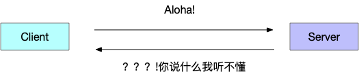
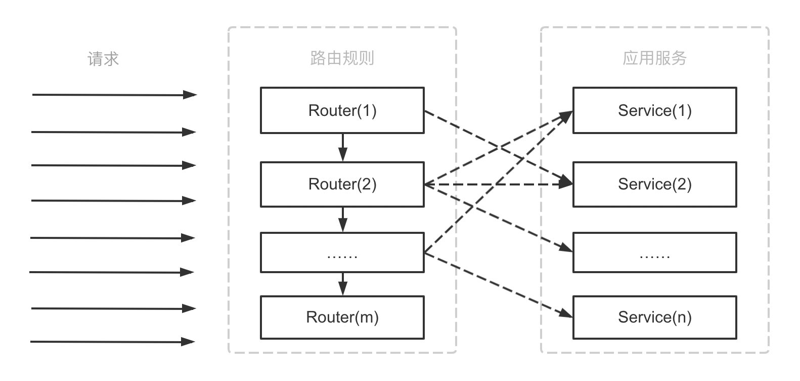

# Apache Dubbo 原理

## 概念

[→ 官方说明](https://dubbo.apache.org/zh/docs/concepts/)

### 服务发现

服务发现，即消费端自动发现服务地址列表的能力，是微服务框架需要具备的关键能力，借助于自动化的服务发现，微服务之间可以在无需感知对端部署位置与 IP 地址的情况下实现通信。

实现服务发现的方式有很多种，Dubbo 提供的是一种 ==Client-Based==  的服务发现机制，通常还需要部署额外的==第三方注册中心组件==来协调服务发现过程，如常用的 Nacos、Consul、Zookeeper 等，Dubbo 自身也提供了对多种注册中心组件的对接，用户可以灵活选择。

Dubbo 基于消费端的自动服务发现能力，其基本工作原理如下图：


服务发现的一个核心组件是注册中心，Provider 注册地址到注册中心，Consumer 从注册中心读取和订阅 Provider 地址列表。 因此，要启用服务发现，需要为 Dubbo 增加注册中心配置：

以 dubbo-spring-boot-starter 使用方式为例，增加 registry 配置

```yaml
# application.properties
dubbo
 registry
  address: zookeeper://127.0.0.1:2181
```


### 协议

协议是 RPC 的核心，它规范了数据在网络中的传输内容和格式。除必须的请求、响应数据外，通常还会包含额外控制数据，如单次请求的序列化方式、超时时间、压缩方式和鉴权信息等。

协议的内容包含三部分：

-   数据交换格式： 定义 RPC 的请求和响应对象在网络传输中的字节流内容，也叫作<u>序列化方式</u>
-   协议结构： 定义包含字段列表和各字段语义以及不同字段的排列方式
-   协议通过定义规则、格式和语义来约定数据如何在网络间传输。一次成功的 RPC 需要通信的两端都能够按照协议约定进行网络字节流的读写和对象转换。如果两端对使用的协议不能达成一致，就会出现“鸡同鸭讲”，无法满足远程通信的需求。




### 流量管理

<u>流量管理的本质是将请求根据制定好的路由规则分发到应用服务上</u>，如下图所示：



其中：

-   路由规则可以有多个，不同的路由规则之间存在优先级。如：Router(1) -> Router(2) -> …… -> Router(n)
-   一个路由规则可以路由到多个不同的应用服务。如：Router(2)既可以路由到Service(1)也可以路由到Service(2)
-   多个不同的路由规则可以路由到同一个应用服务。如：Router(1)和Router(2)都可以路由到Service(2)
-   路由规则也可以不路由到任何应用服务。如：Router(m)没有路由到任何一个Service上，所有命中Router(m)的请求都会因为没有对应的应用服务处理而导致报错
-   应用服务可以是单个的实例，也可以是一个应用集群。

