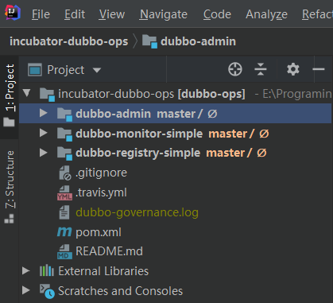
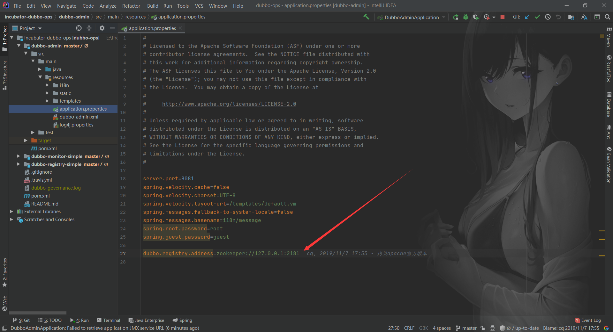
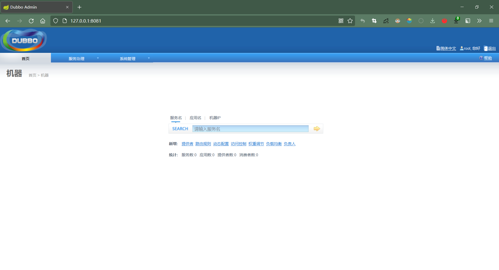
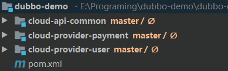
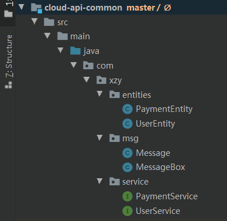
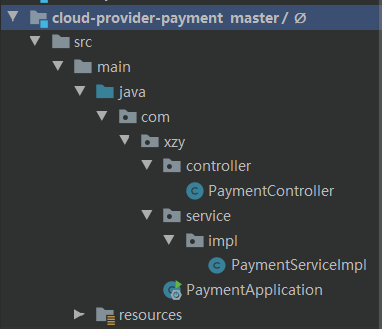
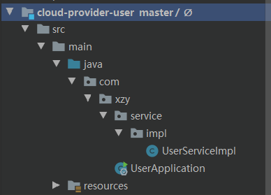
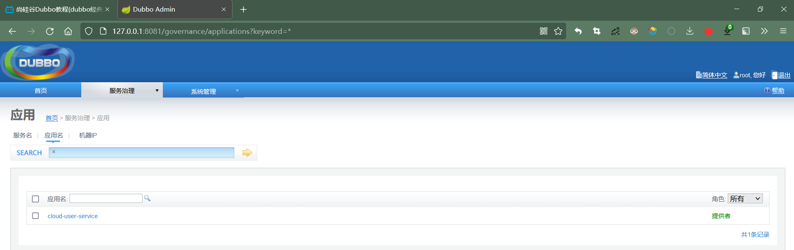

# Apache Dubbo 实战

## 一、环境搭建_注册中心

>   实现服务发现的方式有很多种，Dubbo 提供的是一种 ==Client-Based==  的服务发现机制，通常还需要部署额外的==第三方注册中心组件==来协调服务发现过程，如常用的 Nacos、Consul、Zookeeper 等，Dubbo 自身也提供了对多种注册中心组件的对接，用户可以灵活选择。（👉[更多内容](./Dubbo - 原理.md)）

👉[Zookeeper安装.md](../../中间件/Zookeeper/Zookeeper.md)

## 二、环境搭建_控制台

1.   拉取代码

     ```shell
     git clone https://github.com/xiaozhengyu/incubator-dubbo-ops.git
     ```

2.   打开项目

     

3.   修改配置

     

     主要检查注册中心的地址是否配置正确

4.   启动工程

     注意： 需要先启动 Zookeeper

5.   打开控制页面

     地址：http://127.0.0.1:8081/    账号密码：root/root

     

## 三、环境搭建_Maven工程



-   cloud-api-common：公共模块。包含公共实体类、工具类以及服务接口

    

-   cloud-provider-payment：支付服务

    

-   cloud-provider-user：用户服务

    

-   模块关系：

    ```mermaid
    graph LR
    common[cloud-api-common]
    payment[cloud-provider-payment]
    user[cloud-provider-user]
    payment-->common
    user-->common
    ```

## 四、服务注册

（以 cloud-provider-user 服务为例）

1.   添加依赖

     ```xml
     <!--dubbo-->
     <dependency>
         <groupId>com.alibaba.boot</groupId>
         <artifactId>dubbo-spring-boot-starter</artifactId>
         <version>${dubbo.spring.boot.starter.version}</version>
     </dependency>
     <!--公共模块-->
     <dependency>
         <groupId>org.xzy</groupId>
         <artifactId>cloud-api-common</artifactId>
         <version>1.0-SNAPSHOT</version>
     </dependency>
     ```

2.   添加配置

     ```yaml
     # application.yaml
     dubbo:
       application:
         name: cloud-user-service
       registry:
         address: 127.0.0.1:2181
         protocol: zookeeper
       protocol:
         name: dubbo
         port: 20880
     ```

3.   开启基于注解的 Dubbo 功能

     ```java
     @SpringBootApplication
     @EnableDubbo // 开启基于注解的 dubbo 功能
     public class UserApplication {
         public static void main(String[] args) {
             SpringApplication.run(UserApplication.class, args);
         }
     }
     ```

4.   对外暴露接口

     ```java
     @Service
     @com.alibaba.dubbo.config.annotation.Service // 对外暴露接口
     public class UserServiceImpl implements UserService {
         /**
          * 根据主键查询用户信息
          *
          * @param id 用户ID
          * @return 用户信息
          */
         @Override
         public UserEntity findByPrimaryKey(Long id) {
             return new UserEntity(1001L, "张三", 23, "m", "15268897788", "浙江省杭州市西湖区");
         }
     }
     ```

5.   启动服务，到控制台查看服务是否注册成功

     

## 五、服务调用

1.   参照上文“服务注册”的流程，对 cloud-provider-payment 服务进行配置

2.   服务调用

     ```java
     @RestController
     @RequestMapping(path = "/payment")
     public class PaymentController {
         @Reference //从注册中心获取服务
         private UserService userService;
     
         /**
          * 获取用户信息
          *
          * @param userId 用户ID
          * @return 用户信息
          */
         @GetMapping("/userInfo")
         public MessageBox<UserEntity> findUserInfo(@RequestParam Long userId) {
             return MessageBox.ok(userService.findByPrimaryKey(userId));
         }
     }
     ```

     注意：

     1.   UserService 接口定义在 cloud-api-common 公共模块
     2.   cloud-provider-user 服务实现了 UserService 接口，并对外暴露
     3.   cloud-provider-payment 服务并没有实现 UserService 接口

## 六、配置

👉[官方说明](https://dubbo.apache.org/zh/docs/references/configuration/overview/)

Dubbo 支持以下4种配置方式：

1.   API配置
2.   XML配置
3.   Annotation配置
4.   属性配置

Dubbo 的配置项非常多：👉[官方文档](https://dubbo.apache.org/zh/docs/references/xml/) 

## 七、高级用法

👉[官方文档](https://dubbo.apache.org/zh/docs/advanced/preflight-check/)

### 1、启动时检查

“启动时检查”指的是在启动服务的时候检查依赖的服务是否可用。