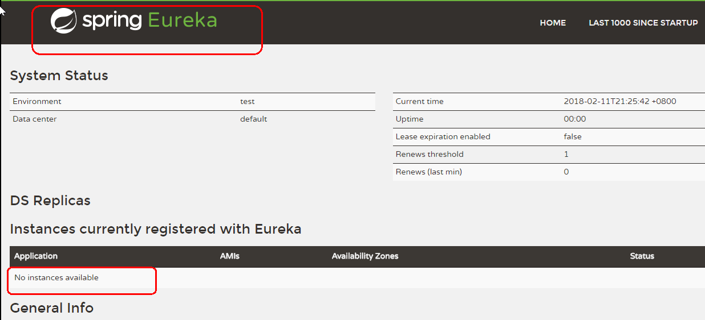
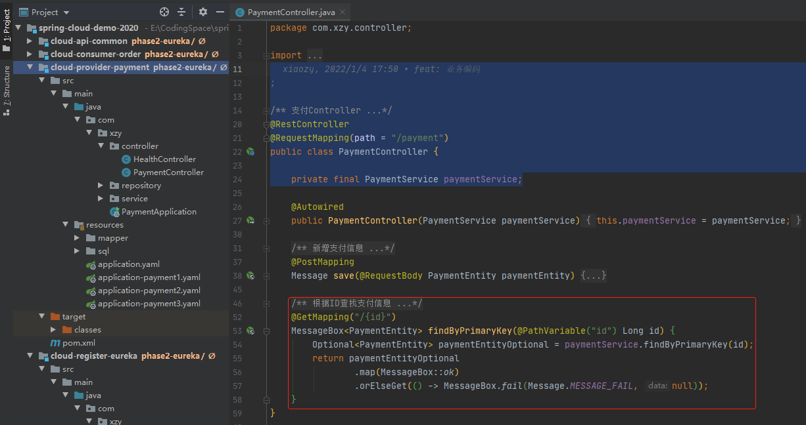
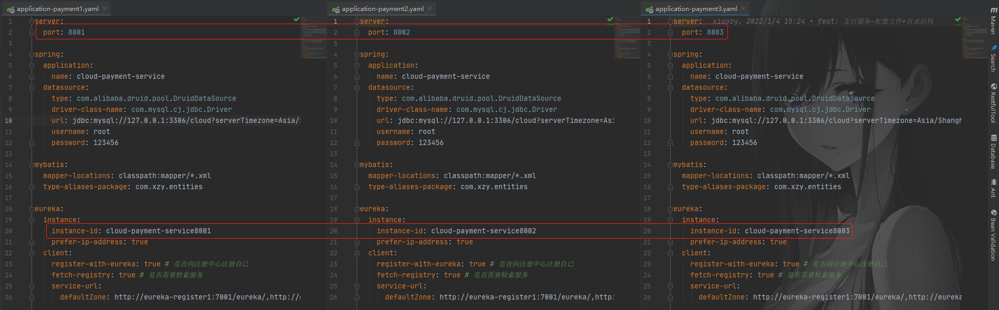
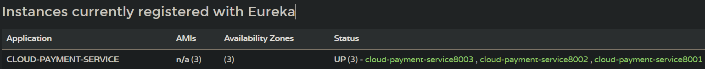
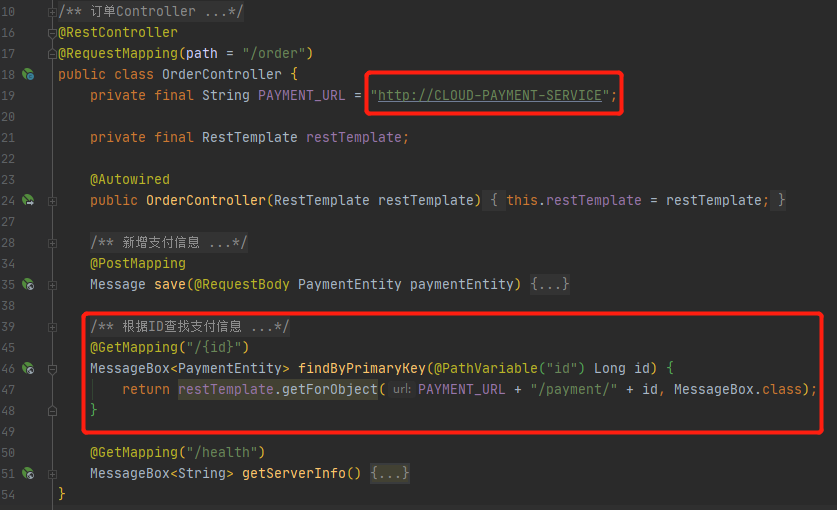

# 单机 Eureka

[toc]


修改 Windows 的 [hosts](C:\Windows\System32\drivers\etc) 文件，添加以下映射关系：

```
#Eureka
127.0.0.1 eureka-register1
```

## 1、构建注册中心（单体）

### 1.1 依赖文件

```xml
<?xml version="1.0" encoding="UTF-8"?>
<project xmlns = "http://maven.apache.org/POM/4.0.0"
         xmlns:xsi = "http://www.w3.org/2001/XMLSchema-instance"
         xsi:schemaLocation = "http://maven.apache.org/POM/4.0.0 http://maven.apache.org/xsd/maven-4.0.0.xsd">
    <parent>
        <artifactId>spring-cloud-demo-2020</artifactId>
        <groupId>org.xzy</groupId>
        <version>1.0-SNAPSHOT</version>
    </parent>
    
    <modelVersion>4.0.0</modelVersion>
    <artifactId>cloud-register-eureka</artifactId>
    <description>负责注册中心</description>
    
    <dependencies>
        <!--eureka-server-->
        <dependency>
            <groupId>org.springframework.cloud</groupId>
            <artifactId>spring-cloud-starter-netflix-eureka-server</artifactId>
        </dependency>
        <!--other module-->
        <dependency>
            <groupId>org.xzy</groupId>
            <artifactId>cloud-api-common</artifactId>
            <version>1.0-SNAPSHOT</version>
        </dependency>
        <!--spring-->
        <dependency>
            <groupId>org.springframework.boot</groupId>
            <artifactId>spring-boot-starter-web</artifactId>
        </dependency>
        <dependency>
            <groupId>org.springframework.boot</groupId>
            <artifactId>spring-boot-starter-actuator</artifactId>
        </dependency>
        <!--spring-boot-tools-->
        <dependency>
            <groupId>org.springframework.boot</groupId>
            <artifactId>spring-boot-devtools</artifactId>
            <scope>runtime</scope>
            <optional>true</optional>
        </dependency>
        <!--spring-boot-configuration-processor-->
        <dependency>
            <groupId>org.springframework.boot</groupId>
            <artifactId>spring-boot-configuration-processor</artifactId>
        </dependency>
        <!--lombok-->
        <dependency>
            <groupId>org.projectlombok</groupId>
            <artifactId>lombok</artifactId>
        </dependency>
    </dependencies>

</project>
```

注意：<font color = red>spring-cloud-starter-netflix-eureka-server</font>

### 1.2 配置文件

```yaml
server:
  port: 7001

eureka:
  instance:
    hostname: eureka-register1 # Eureka 服务端的实例名称
  client:
    register-with-eureka: false # 是否向注册中心注册自己
    fetch-registry: false # 是否需要检索服务：注册中心的职责就是维护服务实例，它并不需要去检索服务
    service-url: # 服务注册中心的地址
      defaultZone: http://eureka-register1:7001/eureka/
```

注意：需要修改 hosts 文件，添加对 eureka-reaigste1 的 ip 映射（或者在配置文件这里直接配置IP）

### 1.3 主启动类

```java
@SpringBootApplication
@EnableEurekaServer
public class EurekaApplication {
    public static void main(String[] args) {
        SpringApplication.run(EurekaApplication.class, args);
    }
}
```

注意：<font color = red>@EnableEurekaServer</font>

### 1.4 测试

1.   启动服务

2.   浏览器访问 http://127.0.0.1:7001/

     

     目前还没有服务向注册中心注册，所以 Instance 列表是空的

## 2、构建服务提供方

### 2.1 依赖文件

```xml
<?xml version="1.0" encoding="UTF-8"?>
<project xmlns="http://maven.apache.org/POM/4.0.0"
         xmlns:xsi="http://www.w3.org/2001/XMLSchema-instance"
         xsi:schemaLocation="http://maven.apache.org/POM/4.0.0 http://maven.apache.org/xsd/maven-4.0.0.xsd">
    <parent>
        <artifactId>spring-cloud-demo-2020</artifactId>
        <groupId>org.xzy</groupId>
        <version>1.0-SNAPSHOT</version>
    </parent>

    <modelVersion>4.0.0</modelVersion>
    <artifactId>cloud-provider-payment</artifactId>
    <description>支付服务</description>

    <dependencies>
        <!--eureka-client-->
        <dependency>
            <groupId>org.springframework.cloud</groupId>
            <artifactId>spring-cloud-starter-netflix-eureka-client</artifactId>
        </dependency>
        <!--other module-->
        <dependency>
            <groupId>org.xzy</groupId>
            <artifactId>cloud-api-common</artifactId>
            <version>1.0-SNAPSHOT</version>
        </dependency>
        <!--spring-->
        <dependency>
            <groupId>org.springframework.boot</groupId>
            <artifactId>spring-boot-starter-web</artifactId>
        </dependency>
        <dependency>
            <groupId>org.springframework.boot</groupId>
            <artifactId>spring-boot-starter-actuator</artifactId>
        </dependency>
        <!--mybatis-->
        <dependency>
            <groupId>org.mybatis.spring.boot</groupId>
            <artifactId>mybatis-spring-boot-starter</artifactId>
        </dependency>
        <!--druid-->
        <dependency>
            <groupId>com.alibaba</groupId>
            <artifactId>druid-spring-boot-starter</artifactId>
        </dependency>
        <!--mysql-connector-java-->
        <dependency>
            <groupId>mysql</groupId>
            <artifactId>mysql-connector-java</artifactId>
        </dependency>
        <!--jdbc-->
        <dependency>
            <groupId>org.springframework.boot</groupId>
            <artifactId>spring-boot-starter-jdbc</artifactId>
        </dependency>
        <!--spring-boot-tools-->
        <dependency>
            <groupId>org.springframework.boot</groupId>
            <artifactId>spring-boot-devtools</artifactId>
            <scope>runtime</scope>
            <optional>true</optional>
        </dependency>
        <!--spring-boot-configuration-processor-->
        <dependency>
            <groupId>org.springframework.boot</groupId>
            <artifactId>spring-boot-configuration-processor</artifactId>
        </dependency>
        <!--lombok-->
        <dependency>
            <groupId>org.projectlombok</groupId>
            <artifactId>lombok</artifactId>
        </dependency>
    </dependencies>

</project>
```

注意：<font color = red>spring-cloud-starter-netflix-eureka-client</font>

### 2.2 配置文件

```yaml
server:
  port: 8001

spring:
  application:
    name: cloud-payment-service
  datasource:
    type: com.alibaba.druid.pool.DruidDataSource
    driver-class-name: com.mysql.cj.jdbc.Driver
    url: jdbc:mysql://127.0.0.1:3306/cloud?serverTimezone=Asia/Shanghai&useUnicode=true&characterEncoding=UTF-8&useSSL=false
    username: root
    password: 123456

mybatis:
  mapper-locations: classpath:mapper/*.xml
  type-aliases-package: com.xzy.entities

eureka:
  instance:
    instance-id: cloud-payment-service8001 #实例在配置中心显示的名称
    prefer-ip-address: true
  client:
    register-with-eureka: true # 是否向注册中心注册自己
    fetch-registry: true # 是否需要检索服务
    service-url:
      defaultZone: http://eureka-register1:7001/eureka/
```

注意：需要修改 hosts 文件，添加对 eureka-reaigste1 的 ip 映射（或者在配置文件这里直接配置IP）

### 2.3 主启动类

```java
@SpringBootApplication
@EnableEurekaClient
public class PaymentApplication {
    public static void main(String[] args) {
        SpringApplication.run(PaymentApplication.class, args);
    }
}
```

注意：@EnableEurekaClient

### 2.4 对外服务



### 2.5 测试

1.   以不同的端口、实例名称启动多个实例

     

2.   浏览器访问 http://127.0.0.1:7001/

     

     实例已经被注册到注册中心

## 3、构建服务消费方

### 3.1 依赖文件

```xml
<?xml version="1.0" encoding="UTF-8"?>
<project xmlns = "http://maven.apache.org/POM/4.0.0"
         xmlns:xsi = "http://www.w3.org/2001/XMLSchema-instance"
         xsi:schemaLocation = "http://maven.apache.org/POM/4.0.0 http://maven.apache.org/xsd/maven-4.0.0.xsd">
    <parent>
        <artifactId>spring-cloud-demo-2020</artifactId>
        <groupId>org.xzy</groupId>
        <version>1.0-SNAPSHOT</version>
    </parent>
    
    <modelVersion>4.0.0</modelVersion>
    <artifactId>cloud-consumer-order</artifactId>
    <description>订单服务</description>
    
    <dependencies>
        <!--eureka-client-->
        <dependency>
            <groupId>org.springframework.cloud</groupId>
            <artifactId>spring-cloud-starter-netflix-eureka-client</artifactId>
        </dependency>
        <!--other module-->
        <dependency>
            <groupId>org.xzy</groupId>
            <artifactId>cloud-api-common</artifactId>
            <version>1.0-SNAPSHOT</version>
        </dependency>
        <!--spring-->
        <dependency>
            <groupId>org.springframework.boot</groupId>
            <artifactId>spring-boot-starter-web</artifactId>
        </dependency>
        <dependency>
            <groupId>org.springframework.boot</groupId>
            <artifactId>spring-boot-starter-actuator</artifactId>
        </dependency>
        <!--mybatis-->
        <dependency>
            <groupId>org.mybatis.spring.boot</groupId>
            <artifactId>mybatis-spring-boot-starter</artifactId>
        </dependency>
        <!--druid-->
        <dependency>
            <groupId>com.alibaba</groupId>
            <artifactId>druid-spring-boot-starter</artifactId>
        </dependency>
        <!--mysql-connector-java-->
        <dependency>
            <groupId>mysql</groupId>
            <artifactId>mysql-connector-java</artifactId>
        </dependency>
        <!--jdbc-->
        <dependency>
            <groupId>org.springframework.boot</groupId>
            <artifactId>spring-boot-starter-jdbc</artifactId>
        </dependency>
        <!--spring-boot-tools-->
        <dependency>
            <groupId>org.springframework.boot</groupId>
            <artifactId>spring-boot-devtools</artifactId>
            <scope>runtime</scope>
            <optional>true</optional>
        </dependency>
        <!--spring-boot-configuration-processor-->
        <dependency>
            <groupId>org.springframework.boot</groupId>
            <artifactId>spring-boot-configuration-processor</artifactId>
        </dependency>
        <!--lombok-->
        <dependency>
            <groupId>org.projectlombok</groupId>
            <artifactId>lombok</artifactId>
        </dependency>
    </dependencies>

</project>
```

### 3.2 配置文件

```yaml
server:
  port: 9002

spring:
  application:
    name: cloud-order-service
  datasource:
    type: com.alibaba.druid.pool.DruidDataSource
    driver-class-name: com.mysql.cj.jdbc.Driver
    url: jdbc:mysql://127.0.0.1:3306/cloud?serverTimezone=Asia/Shanghai&useUnicode=true&characterEncoding=UTF-8&useSSL=false
    username: root
    password: 123456

mybatis:
  mapper-locations: classpath:mapper/*.xml
  type-aliases-package: com.xzy.entities

eureka:
  instance:
    instance-id: cloud-order-service9002
    prefer-ip-address: true
  client:
    register-with-eureka: true # 是否向注册中心注册自己
    fetch-registry: true # 是否需要检索服务
    service-url:
      defaultZone: http://eureka-register1:7001/eureka/
```

注意：需要修改 hosts 文件，添加对 eureka-reaigste1 的 ip 映射（或者在配置文件这里直接配置IP）

### 3.3 主启动类

```java
@SpringBootApplication
@EnableEurekaClient
public class OrderApplication {
    public static void main(String[] args) {
        SpringApplication.run(OrderApplication.class, args);
    }
}
```

### 3.4 RestTemplate

```java
@Configuration
public class ApplicationContextConfig {

    @Bean
    @LoadBalanced
    public RestTemplate restTemplate() {
        return new RestTemplate();
    }
}
```

### 3.5 服务调用



注意：这里是根据服务名称进行调用

### 3.6 测试

1.   启动应用
2.   打开注册中心，能够看到服务实例已经注册
3.   调用接口，判断 RPC 调用是否成功
4.   多调用几次接口，到服务提供方各个实例的控制台查看打印的消息，看看哪些实例接收到了 RPC 请求

