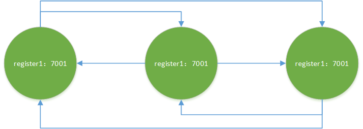
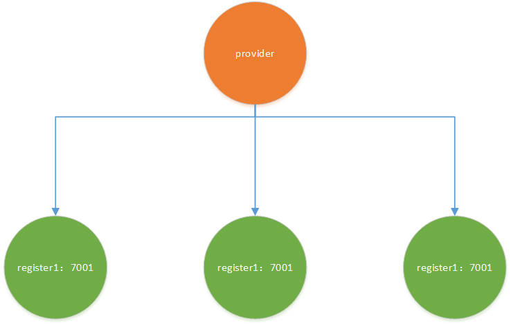

# 集群 Eureka

[toc]

修改 Windows 的 [hosts](C:\Windows\System32\drivers\etc) 文件，添加以下映射关系：

```
#Eureka
127.0.0.1 eureka-register1
127.0.0.1 eureka-register2
127.0.0.1 eureka-register3
```


## 1、构建注册中心（集群）


### 1.1 依赖文件

```xml
<?xml version="1.0" encoding="UTF-8"?>
<project xmlns = "http://maven.apache.org/POM/4.0.0"
         xmlns:xsi = "http://www.w3.org/2001/XMLSchema-instance"
         xsi:schemaLocation = "http://maven.apache.org/POM/4.0.0 http://maven.apache.org/xsd/maven-4.0.0.xsd">
    <parent>
        <artifactId>spring-cloud-demo-2020</artifactId>
        <groupId>org.xzy</groupId>
        <version>1.0-SNAPSHOT</version>
    </parent>
    
    <modelVersion>4.0.0</modelVersion>
    <artifactId>cloud-register-eureka</artifactId>
    <description>负责注册中心</description>
    
    <dependencies>
        <!--eureka-server-->
        <dependency>
            <groupId>org.springframework.cloud</groupId>
            <artifactId>spring-cloud-starter-netflix-eureka-server</artifactId>
        </dependency>
        <!--other module-->
        <dependency>
            <groupId>org.xzy</groupId>
            <artifactId>cloud-api-common</artifactId>
            <version>1.0-SNAPSHOT</version>
        </dependency>
        <!--spring-->
        <dependency>
            <groupId>org.springframework.boot</groupId>
            <artifactId>spring-boot-starter-web</artifactId>
        </dependency>
        <dependency>
            <groupId>org.springframework.boot</groupId>
            <artifactId>spring-boot-starter-actuator</artifactId>
        </dependency>
        <!--spring-boot-tools-->
        <dependency>
            <groupId>org.springframework.boot</groupId>
            <artifactId>spring-boot-devtools</artifactId>
            <scope>runtime</scope>
            <optional>true</optional>
        </dependency>
        <!--spring-boot-configuration-processor-->
        <dependency>
            <groupId>org.springframework.boot</groupId>
            <artifactId>spring-boot-configuration-processor</artifactId>
        </dependency>
        <!--lombok-->
        <dependency>
            <groupId>org.projectlombok</groupId>
            <artifactId>lombok</artifactId>
        </dependency>
    </dependencies>

</project>
```

注意：<font color = red>spring-cloud-starter-netflix-eureka-server</font>

### 1.2 配置文件

3 个实例的配置文件：

```yaml
server:
  port: 7001

eureka:
  instance:
    hostname: eureka-register1 # Eureka 服务端的实例名称
  client:
    register-with-eureka: false # 是否向注册中心注册自己
    fetch-registry: false # 是否需要检索服务：注册中心的职责就是维护服务实例，它并不需要去检索服务
    service-url: # 服务注册中心的地址
      defaultZone: http://eureka-register2:7002/eureka/,http://eureka-register3:7003/eureka/
```

```yaml
server:
  port: 7002

eureka:
  instance:
    hostname: eureka-register2 # Eureka 服务端的实例名称
  client:
    register-with-eureka: false # 是否向注册中心注册自己
    fetch-registry: false # 是否需要检索服务：注册中心的职责就是维护服务实例，它并不需要去检索服务
    service-url: # 服务注册中心的地址
      defaultZone: http://eureka-register1:7001/eureka/,http://eureka-register3:7003/eureka/
```

```yaml
server:
  port: 7003

eureka:
  instance:
    hostname: eureka-register3 # Eureka 服务端的实例名称
  client:
    register-with-eureka: false # 是否向注册中心注册自己
    fetch-registry: false # 是否需要检索服务：注册中心的职责就是维护服务实例，它并不需要去检索服务
    service-url: # 服务注册中心的地址
      defaultZone: http://eureka-register1:7001/eureka/,http://eureka-register2:7002/eureka/
```

注意：

-   eureke.instance.hostname：不同实例不能相同
-   eureke.client.service-url.defaultZone：其他实例的地址
-   需要修改 hosts 文件，添加 IP 映射才能配置 http://eureka-register1:7001/eureka/ 这样的地址，否则需要配置真实 IP



### 1.3 主启动类

```java
@SpringBootApplication
@EnableEurekaServer
public class EurekaApplication {
    public static void main(String[] args) {
        SpringApplication.run(EurekaApplication.class, args);
    }
}
```

注意：<font color = red>@EnableEurekaServer</font>

### 1.4 测试

1.   启动所有实例

     

2.   打开各个实例的控制面板

     

     -   DS Replicas 显示了集群中的其他节点
     -   Instance currently registered with Eureka 限制了注册到当前节点的服务实例

## 2、构建服务提供方

### 2.1 依赖文件

```xml
<?xml version="1.0" encoding="UTF-8"?>
<project xmlns="http://maven.apache.org/POM/4.0.0"
         xmlns:xsi="http://www.w3.org/2001/XMLSchema-instance"
         xsi:schemaLocation="http://maven.apache.org/POM/4.0.0 http://maven.apache.org/xsd/maven-4.0.0.xsd">
    <parent>
        <artifactId>spring-cloud-demo-2020</artifactId>
        <groupId>org.xzy</groupId>
        <version>1.0-SNAPSHOT</version>
    </parent>

    <modelVersion>4.0.0</modelVersion>
    <artifactId>cloud-provider-payment</artifactId>
    <description>支付服务</description>

    <dependencies>
        <!--eureka-client-->
        <dependency>
            <groupId>org.springframework.cloud</groupId>
            <artifactId>spring-cloud-starter-netflix-eureka-client</artifactId>
        </dependency>
        <!--other module-->
        <dependency>
            <groupId>org.xzy</groupId>
            <artifactId>cloud-api-common</artifactId>
            <version>1.0-SNAPSHOT</version>
        </dependency>
        <!--spring-->
        <dependency>
            <groupId>org.springframework.boot</groupId>
            <artifactId>spring-boot-starter-web</artifactId>
        </dependency>
        <dependency>
            <groupId>org.springframework.boot</groupId>
            <artifactId>spring-boot-starter-actuator</artifactId>
        </dependency>
        <!--mybatis-->
        <dependency>
            <groupId>org.mybatis.spring.boot</groupId>
            <artifactId>mybatis-spring-boot-starter</artifactId>
        </dependency>
        <!--druid-->
        <dependency>
            <groupId>com.alibaba</groupId>
            <artifactId>druid-spring-boot-starter</artifactId>
        </dependency>
        <!--mysql-connector-java-->
        <dependency>
            <groupId>mysql</groupId>
            <artifactId>mysql-connector-java</artifactId>
        </dependency>
        <!--jdbc-->
        <dependency>
            <groupId>org.springframework.boot</groupId>
            <artifactId>spring-boot-starter-jdbc</artifactId>
        </dependency>
        <!--spring-boot-tools-->
        <dependency>
            <groupId>org.springframework.boot</groupId>
            <artifactId>spring-boot-devtools</artifactId>
            <scope>runtime</scope>
            <optional>true</optional>
        </dependency>
        <!--spring-boot-configuration-processor-->
        <dependency>
            <groupId>org.springframework.boot</groupId>
            <artifactId>spring-boot-configuration-processor</artifactId>
        </dependency>
        <!--lombok-->
        <dependency>
            <groupId>org.projectlombok</groupId>
            <artifactId>lombok</artifactId>
        </dependency>
    </dependencies>

</project>
```

注意：<font color = red>spring-cloud-starter-netflix-eureka-client</font>

### 2.2 配置文件

```
server:
  port: 8001

spring:
  application:
    name: cloud-payment-service
  datasource:
    type: com.alibaba.druid.pool.DruidDataSource
    driver-class-name: com.mysql.cj.jdbc.Driver
    url: jdbc:mysql://127.0.0.1:3306/cloud?serverTimezone=Asia/Shanghai&useUnicode=true&characterEncoding=UTF-8&useSSL=false
    username: root
    password: 123456

mybatis:
  mapper-locations: classpath:mapper/*.xml
  type-aliases-package: com.xzy.entities

eureka:
  instance:
    instance-id: cloud-payment-service8001
    prefer-ip-address: true
  client:
    register-with-eureka: true # 是否向注册中心注册自己
    fetch-registry: true # 是否需要检索服务
    service-url:
      defaultZone: http://eureka-register1:7001/eureka/,http://eureka-register2:7002/eureka/,http://eureka-register3:7003/eureka/
```

注意：需要在 <font color = red>eureka.client.service-url.defaultZone</font> 配置所有注册中心实例的地址！实例启动后会向到配置的所有注册中心实例注册，并向所有注册中心实例发送心跳



### 2.3 主启动类

```java
@SpringBootApplication
@EnableEurekaClient
public class PaymentApplication {
    public static void main(String[] args) {
        SpringApplication.run(PaymentApplication.class, args);
    }
}
```

注意：@EnableEurekaClient

### 2.4 对外提供服务

```java
@RestController
@RequestMapping(path = "/payment")
public class PaymentController {

    private final PaymentService paymentService;

    @Autowired
    public PaymentController(PaymentService paymentService) {
        this.paymentService = paymentService;
    }

    /**
     * 新增支付信息
     *
     * @param paymentEntity 支付信息
     * @return 1：新增成功 0：新增失败
     */
    @PostMapping
    Message save(@RequestBody PaymentEntity paymentEntity) {
        if (1 == paymentService.save(paymentEntity)) {
            return Message.ok();
        } else {
            return Message.fail();
        }
    }

    /**
     * 根据ID查找支付信息
     *
     * @param id ID
     * @return 支付信息
     */
    @GetMapping("/{id}")
    MessageBox<PaymentEntity> findByPrimaryKey(@PathVariable("id") Long id) {
        Optional<PaymentEntity> paymentEntityOptional = paymentService.findByPrimaryKey(id);
        return paymentEntityOptional
                .map(MessageBox::ok)
                .orElseGet(() -> MessageBox.fail(Message.MESSAGE_FAIL, null));
    }
}
```

### 2.5 测试

1.   启动应用

2.   查看实例是否成功注册到注册中心集群

     

## 3、构建服务消费方

### 3.1 依赖文件

```xml
<?xml version="1.0" encoding="UTF-8"?>
<project xmlns = "http://maven.apache.org/POM/4.0.0"
         xmlns:xsi = "http://www.w3.org/2001/XMLSchema-instance"
         xsi:schemaLocation = "http://maven.apache.org/POM/4.0.0 http://maven.apache.org/xsd/maven-4.0.0.xsd">
    <parent>
        <artifactId>spring-cloud-demo-2020</artifactId>
        <groupId>org.xzy</groupId>
        <version>1.0-SNAPSHOT</version>
    </parent>
    
    <modelVersion>4.0.0</modelVersion>
    <artifactId>cloud-consumer-order</artifactId>
    <description>订单服务</description>
    
    <dependencies>
        <!--eureka-client-->
        <dependency>
            <groupId>org.springframework.cloud</groupId>
            <artifactId>spring-cloud-starter-netflix-eureka-client</artifactId>
        </dependency>
        <!--other module-->
        <dependency>
            <groupId>org.xzy</groupId>
            <artifactId>cloud-api-common</artifactId>
            <version>1.0-SNAPSHOT</version>
        </dependency>
        <!--spring-->
        <dependency>
            <groupId>org.springframework.boot</groupId>
            <artifactId>spring-boot-starter-web</artifactId>
        </dependency>
        <dependency>
            <groupId>org.springframework.boot</groupId>
            <artifactId>spring-boot-starter-actuator</artifactId>
        </dependency>
        <!--mybatis-->
        <dependency>
            <groupId>org.mybatis.spring.boot</groupId>
            <artifactId>mybatis-spring-boot-starter</artifactId>
        </dependency>
        <!--druid-->
        <dependency>
            <groupId>com.alibaba</groupId>
            <artifactId>druid-spring-boot-starter</artifactId>
        </dependency>
        <!--mysql-connector-java-->
        <dependency>
            <groupId>mysql</groupId>
            <artifactId>mysql-connector-java</artifactId>
        </dependency>
        <!--jdbc-->
        <dependency>
            <groupId>org.springframework.boot</groupId>
            <artifactId>spring-boot-starter-jdbc</artifactId>
        </dependency>
        <!--spring-boot-tools-->
        <dependency>
            <groupId>org.springframework.boot</groupId>
            <artifactId>spring-boot-devtools</artifactId>
            <scope>runtime</scope>
            <optional>true</optional>
        </dependency>
        <!--spring-boot-configuration-processor-->
        <dependency>
            <groupId>org.springframework.boot</groupId>
            <artifactId>spring-boot-configuration-processor</artifactId>
        </dependency>
        <!--lombok-->
        <dependency>
            <groupId>org.projectlombok</groupId>
            <artifactId>lombok</artifactId>
        </dependency>
    </dependencies>

</project>
```

注意：spring-cloud-starter-netflix-eureka-client

### 3.2 配置文件

```yaml
server:
  port: 9002

spring:
  application:
    name: cloud-order-service
  datasource:
    type: com.alibaba.druid.pool.DruidDataSource
    driver-class-name: com.mysql.cj.jdbc.Driver
    url: jdbc:mysql://127.0.0.1:3306/cloud?serverTimezone=Asia/Shanghai&useUnicode=true&characterEncoding=UTF-8&useSSL=false
    username: root
    password: 123456

mybatis:
  mapper-locations: classpath:mapper/*.xml
  type-aliases-package: com.xzy.entities

eureka:
  instance:
    instance-id: cloud-order-service9002
    prefer-ip-address: true
  client:
    register-with-eureka: true # 是否向注册中心注册自己
    fetch-registry: true # 是否需要检索服务
    service-url:
      defaultZone: http://eureka-register1:7001/eureka/,http://eureka-register2:7002/eureka/,http://eureka-register3:7003/eureka/
```

注意：与服务提供方一样，服务消费方也需要在 <font color = red>eureka.client.service-url.defaultZone</font> 配置所有注册中心实例的地址！


### 3.3 主启动类

```java
@SpringBootApplication
@EnableEurekaClient
public class OrderApplication {
    public static void main(String[] args) {
        SpringApplication.run(OrderApplication.class, args);
    }
    
    @Bean
    @LoadBalanced // 开启负载均衡
    public RestTemplate restTemplate() {
        return new RestTemplate();
    }
}
```

注意：@LoadBalance 注解赋予了 RestTemplate 负载均衡的能力。

### 3.4 调用远程服务

```java
@RestController
@RequestMapping(path = "/order")
public class OrderController {
    private final String PAYMENT_URL = "http://CLOUD-PAYMENT-SERVICE";

    private final RestTemplate restTemplate;

    @Autowired
    public OrderController(RestTemplate restTemplate) {
        this.restTemplate = restTemplate;
    }

    /**
     * 新增支付信息
     *
     * @param paymentEntity 支付信息
     * @return 1：新增成功 0：新增失败
     */
    @PostMapping
    Message save(@RequestBody PaymentEntity paymentEntity) {
        return restTemplate.postForObject(PAYMENT_URL + "/payment", paymentEntity, Message.class);
    }

    /**
     * 根据ID查找支付信息
     *
     * @param id ID
     * @return 支付信息
     */
    @GetMapping("/{id}")
    MessageBox<PaymentEntity> findByPrimaryKey(@PathVariable("id") Long id) {
        return restTemplate.getForObject(PAYMENT_URL + "/payment/" + id, MessageBox.class);
    }
}
```

注意：通过服务名称调用接口。Eureka Client 会先到注册中心根据服务名称查找服务实例信息（例如 IP 地址），然后根据 IP 地址进行接口调用。如果存在多个服务实例，并且没有通过 @LoadBalance 开启负载均衡，系统就会抛出异常，因为不知道该调用那个实例；如果已经开启了负载均衡，那么系统会按照负载均衡策略选择一个实例进行调用。

如果不通过服务名称调用接口（http://CLOUD-PAYMENT-SERVICE -> http:xxx.xxx.xxx.xxx:xxx），即使配置了 @LoadBalance 系统也无法进行负载均衡。

Eureka 通过整合 Ribbon 以提供负载均衡的能力：


### 3.4 测试

1.   启用应用
2.   查看实例是否成功注册到注册中心集群
3.   调用接口，测试 RPC 能否成功；重复调用接口，判断负载均衡是否生效
4.   查看各个 Eureka Service 实例的控制台，关闭刚才处理了 RPC 的实例
5.   重复 3、4 步骤，测试在部分实例宕机的情况下，集群能否继续对完提供服务
