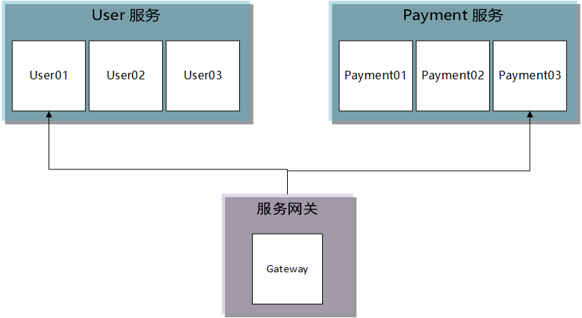
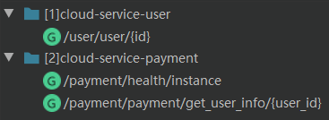
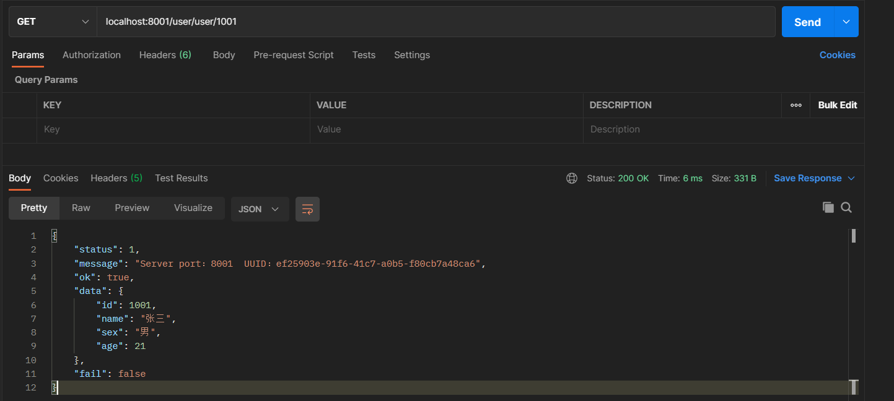
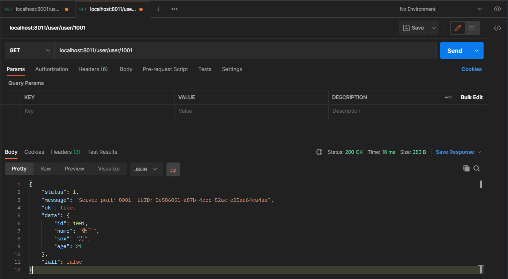

# Gateway 入门级使用

[toc]


系统架构：



服务接口：




## 搭建服务网关

### 1. 依赖文件

```xml
<dependencies>
        <!--gateway-->
        <dependency>
            <groupId>org.springframework.cloud</groupId>
            <artifactId>spring-cloud-starter-gateway</artifactId>
        </dependency>
</dependencies>
```

### 2. 配置文件

```yaml
server:
  port: 8011

spring:
  application:
    name: cloud-gateway
  cloud:
    # 网关路由
    gateway:
      routes:
        - id: payment_route              # 路由ID（唯一）
          uri: http://localhost:9001     # http://localhost:8011/payment/**  ->  http://localhost:9001/payment/**
          predicates:
            - Path=/payment/**

        - id: user_route
          uri: http://localhost:8001    # http://localhost:8011/user/**  ->  http://localhost:8001/user/**
          predicates:
            - Path=/user/**
```

上述配置设置了下列路由规则：

-   /payment/**  ->  http://localhost:9001/payment/**
-   /user/**  ->  http://localhost:8001/user/**

## 测试服务网关

1.   启动 Payment 服务实例，启动 User 服务实例，启动 Gateway 网关实例

2.   直接访问相关接口

     

3.   通过网关访问相关接口

     

## 附加说明

Gateway 提供了两种网关配置方式：通过配置文件或 Java 代码。上文采用的是配置文件的方式，下面展示的是 Java 代码的配置方式。

```java
@SpringBootConfiguration
public class GatewayConfig {

    @Bean
    public RouteLocator routes(RouteLocatorBuilder builder) {
        RouteLocatorBuilder.Builder routes = builder.routes();
        routes.route("payment_route", r -> r.path("/payment/**").uri("http://localhost:9001"));
        routes.route("user_route", r -> r.path("/user/**").uri("http://localhost:8001"));
        return routes.build();
    }
}
```