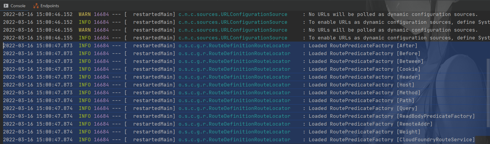
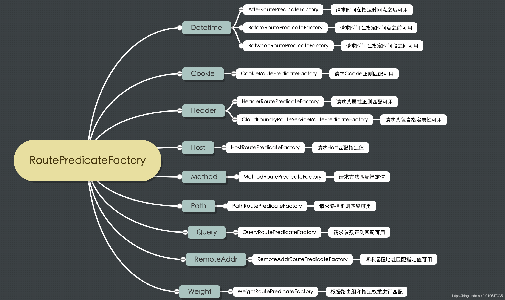

# Predicate 的使用

[toc]


<(￣︶￣)↗[Spring 官方文档](https://cloud.spring.io/spring-cloud-static/spring-cloud-gateway/2.2.1.RELEASE/reference/html/#gateway-request-predicates-factories)


## 是什么？

当启动 Gateway 实例的时候，控制台输出了下列信息：



那么，这个 RoutePredicateFactory 是什么？Spring Cloud Gateway 创建 Route 对象时， 使用 RoutePredicateFactory 创建 Predicate 对象，然后将 Predicate 对象赋值给 Route。 Spring Cloud Gateway 包含许多内置的 Route Predicate Factories，用于匹配 HTTP 请求的不同属性。




## 怎么用？

### After Route Predicate

The after route predicate factory takes one parameter, a datetime. This predicate matches requests that happen after the specified datetime. The following example configures an after route predicate:

Example 1. application.yml

```yaml
spring:
  cloud:
    gateway:
      routes:
      - id: after_route
        uri: https://example.org
        predicates:
        - After=2017-01-20T17:42:47.789-07:00[America/Denver]
```

This route matches any request made after Jan 20, 2017 17:42 Mountain Time (Denver).

### Before Route Predicate

The before route predicate factory takes one parameter, a `datetime`. This predicate matches requests that happen before the specified `datetime`. The following example configures a before route predicate:

Example 2. application.yml

```yaml
spring:
  cloud:
    gateway:
      routes:
      - id: before_route
        uri: https://example.org
        predicates:
        - Before=2017-01-20T17:42:47.789-07:00[America/Denver]
```

This route matches any request made before Jan 20, 2017 17:42 Mountain Time (Denver).

### Between Route Predicate

The between route predicate factory takes two parameters, `datetime1` and `datetime2`. This predicate matches requests that happen after `datetime1` and before `datetime2`. The `datetime2` parameter must be after `datetime1`. The following example configures a between route predicate:

Example 3. application.yml

```yaml
spring:
  cloud:
    gateway:
      routes:
      - id: between_route
        uri: https://example.org
        predicates:
        - Between=2017-01-20T17:42:47.789-07:00[America/Denver], 2017-01-21T17:42:47.789-07:00[America/Denver]
```

This route matches any request made after Jan 20, 2017 17:42 Mountain Time (Denver) and before Jan 21, 2017 17:42 Mountain Time (Denver). This could be useful for maintenance windows.

### Cookie Route Predicate

The cookie route predicate factory takes two parameters, the cookie name and a regular expression. This predicate matches cookies that have the given name and whose values match the regular expression. The following example configures a cookie route predicate factory:

Example 4. application.yml

```yaml
spring:
  cloud:
    gateway:
      routes:
      - id: cookie_route
        uri: https://example.org
        predicates:
        - Cookie=chocolate, ch.p
```

This route matches requests that have a cookie named `chocolate` whose value matches the `ch.p` regular expression.

### Header Route Predicate

The header route predicate factory takes two parameters, the header name and a regular expression. This predicate matches with a header that has the given name whose value matches the regular expression. The following example configures a header route predicate:

Example 5. application.yml

```yaml
spring:
  cloud:
    gateway:
      routes:
      - id: header_route
        uri: https://example.org
        predicates:
        - Header=X-Request-Id, \d+
```

This route matches if the request has a header named `X-Request-Id` whose value matches the `\d+` regular expression (that is, it has a value of one or more digits).

### Host Route Predicate

The host route predicate factory takes one parameter: a list of host name patterns. The pattern is an Ant-style pattern with `.` as the separator. This predicates matches the `Host` header that matches the pattern. The following example configures a host route predicate:

Example 6. application.yml

```yaml
spring:
  cloud:
    gateway:
      routes:
      - id: host_route
        uri: https://example.org
        predicates:
        - Host=**.somehost.org,**.anotherhost.org
```

URI template variables (such as `{sub}.myhost.org`) are supported as well.

This route matches if the request has a `Host` header with a value of `www.somehost.org` or `beta.somehost.org` or `www.anotherhost.org`.

This predicate extracts the URI template variables (such as `sub`, defined in the preceding example) as a map of names and values and places it in the `ServerWebExchange.getAttributes()` with a key defined in `ServerWebExchangeUtils.URI_TEMPLATE_VARIABLES_ATTRIBUTE`. Those values are then available for use by [`GatewayFilter` factories](https://cloud.spring.io/spring-cloud-static/spring-cloud-gateway/2.2.1.RELEASE/reference/html/#gateway-route-filters)

### Method Route Predicate

The Method Route Predicate Factory takes one or more parameters: the HTTP methods to match. The following example configures a method route predicate:

Example 7. application.yml

```yaml
spring:
  cloud:
    gateway:
      routes:
      - id: method_route
        uri: https://example.org
        predicates:
        - Method=GET,POST
```

This route matches if the request method was a `GET` or a `POST`.

### Path Route Predicate

The Path Route Predicate Factory takes two parameters: a list of Spring `PathMatcher` patterns and an optional flag called `matchOptionalTrailingSeparator`. The following example configures a path route predicate:

Example 8. application.yml

```yaml
spring:
  cloud:
    gateway:
      routes:
      - id: host_route
        uri: https://example.org
        predicates:
        - Path=/red/{segment},/blue/{segment}
```

This route matches if the request path was, for example: `/red/1` or `/red/blue` or `/blue/green`.

This predicate extracts the URI template variables (such as `segment`, defined in the preceding example) as a map of names and values and places it in the `ServerWebExchange.getAttributes()` with a key defined in `ServerWebExchangeUtils.URI_TEMPLATE_VARIABLES_ATTRIBUTE`. Those values are then available for use by [`GatewayFilter` factories](https://cloud.spring.io/spring-cloud-static/spring-cloud-gateway/2.2.1.RELEASE/reference/html/#gateway-route-filters)

A utility method (called `get`) is available to make access to these variables easier. The following example shows how to use the `get` method:

```java
Map<String, String> uriVariables = ServerWebExchangeUtils.getPathPredicateVariables(exchange);

String segment = uriVariables.get("segment");
```

### Query Route Predicate

The query route predicate factory takes two parameters: a required `param` and an optional `regexp`. The following example configures a query route predicate:

Example 9. application.yml

```yaml
spring:
  cloud:
    gateway:
      routes:
      - id: query_route
        uri: https://example.org
        predicates:
        - Query=green
```

The preceding route matches if the request contained a `green` query parameter.

application.yml

```yaml
spring:
  cloud:
    gateway:
      routes:
      - id: query_route
        uri: https://example.org
        predicates:
        - Query=red, gree.
```

The preceding route matches if the request contained a `red` query parameter whose value matched the `gree.` regexp, so `green` and `greet` would match.
