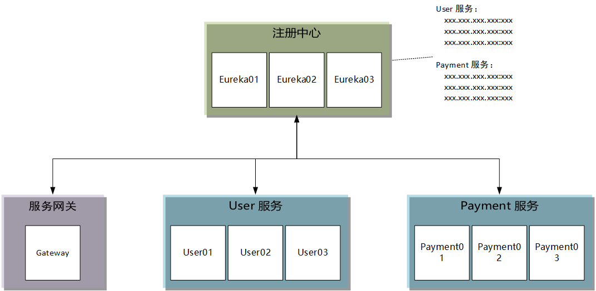
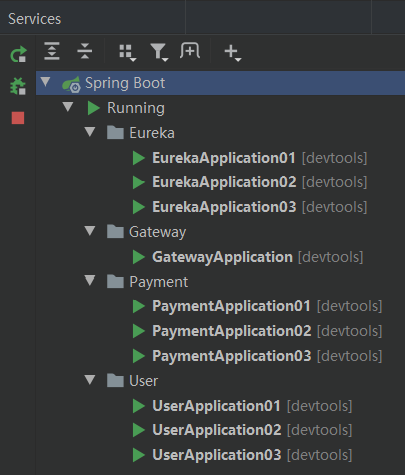
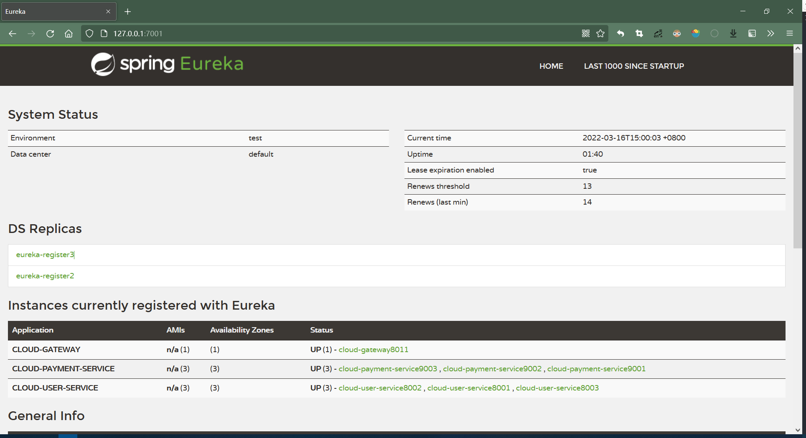
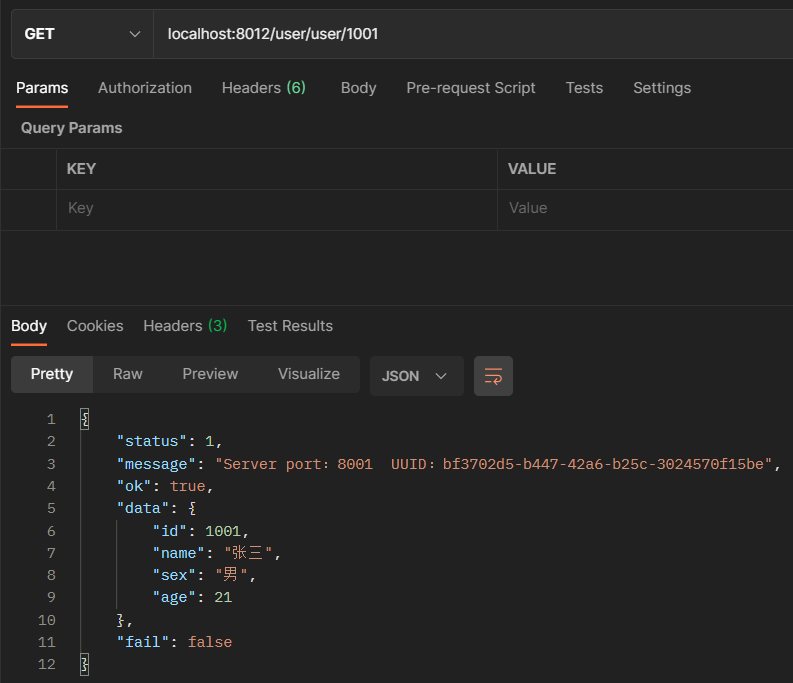
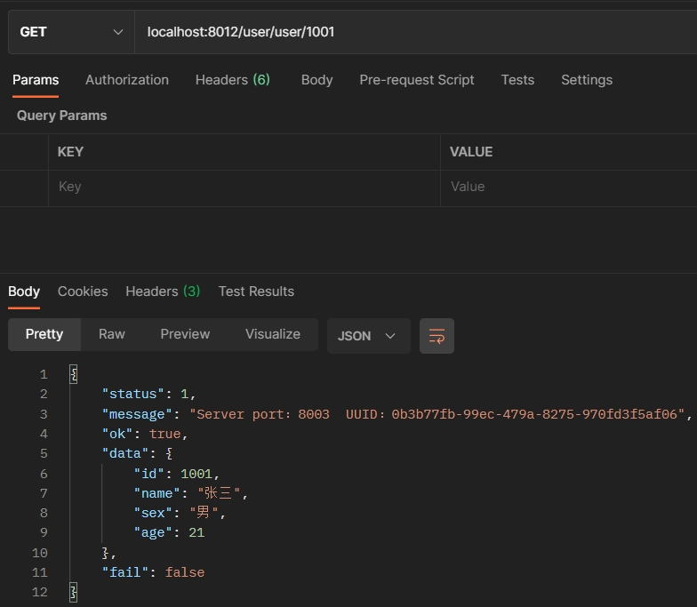
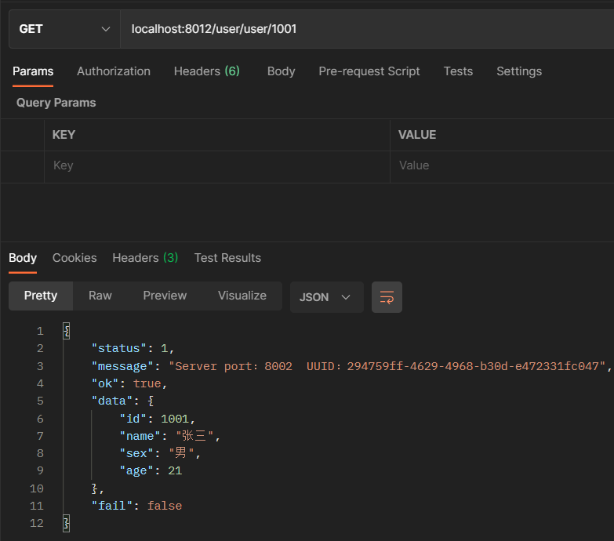

# Gateway + 注册中心：通过服务名实现动态路由

[toc]


在 [Gateway 实战 - Gateway 入门级使用.md](./Gateway 实战 - Gateway 入门级使用.md) 的基础上对系统进行调整。


系统架构：




## 搭建 Gateway 服务网关

### 1. 依赖文件

```xml
<dependencies>
    <!--eureka-client-->
    <dependency>
        <groupId>org.springframework.cloud</groupId>
        <artifactId>spring-cloud-starter-netflix-eureka-client</artifactId>
    </dependency>
    <!--gateway-->
    <dependency>
        <groupId>org.springframework.cloud</groupId>
        <artifactId>spring-cloud-starter-gateway</artifactId>
    </dependency>
</dependencies>
```

### 2. 配置文件

```yaml
server:
  port: 8012

spring:
  application:
    name: cloud-gateway
  cloud:
    # 网关路由
    gateway:
      discovery:
        locator:
          enabled: true                    # 从注册中心获取服务实例地址，动态路由
      routes:
        - id: payment_route                # 路由ID（唯一）
          uri: lb://cloud-payment-service  # 通过配置服务名实现动态路由
          predicates:                      # 1.先从注册中心查询cloud-payment-service的实例列表，然后根据负载均衡策略选择一个实例
            - Path=/payment/**             # 2.http://localhost:8012/payment/**  -->  http://{实例地址}/payment/**

        - id: user_route
          uri: lb://cloud-user-service
          predicates:
            - Path=/user/**


eureka:
  instance:
    instance-id: cloud-gateway8012
    prefer-ip-address: true
  client:
    register-with-eureka: true # 是否向注册中心注册自己
    fetch-registry: true # 是否需要检索服务
    service-url:
      defaultZone: http://eureka-register1:7001/eureka/,http://eureka-register2:7002/eureka/,http://eureka-register3:7003/eureka/
```

对比 [Gateway 实战 - Gateway 入门级使用.md](./Gateway 实战 - Gateway 入门级使用.md) 中使用的配置文件：

```yaml
server:
  port: 8011

spring:
  application:
    name: cloud-gateway
  cloud:
    # 网关路由
    gateway:
      routes:
        - id: payment_route              # 路由ID（唯一）
          uri: http://localhost:9001     # http://localhost:8011/payment/**  ->  http://localhost:9001/payment/**
          predicates:
            - Path=/payment/**

        - id: user_route
          uri: http://localhost:8001    # http://localhost:8011/user/**  ->  http://localhost:8001/user/**
          predicates:
            - Path=/user/**
```

差异：

-   路由规则中不再直接指明服务实例的地址，改为指明服务名称。Gateway 将从注册中心获取服务实例清单，然后进行动态路由
-   路由规则中使用`lb协议`开启 Gateway 的负载均衡功能

## 测试 Gateway 服务网关

1.   启动 Eureka 注册中心，启动服务实例，启动 Gateway

     

     

2.   通过网关调用服务接口

     调用1：

     

     调用2：

     

     调用3：

     

