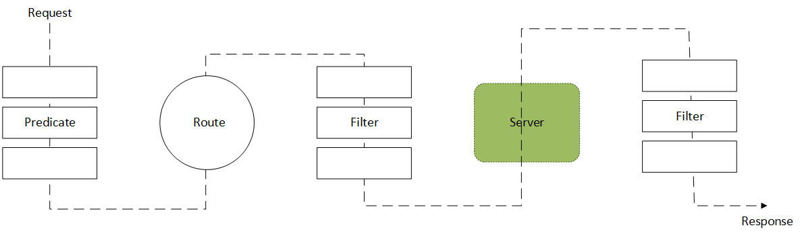

# Gateway 理论

[toc]

官网：https://cloud.spring.io/spring-cloud-static/spring-cloud-gateway/2.2.1.RELEASE/reference/html/

## Gateway 与 Zuul

网关是微服务系统中十分重要的组件，在 Spring Cloud 1.x 版本中通常采用 Netflix 公司的 Zuul 1.x 作为网关，但是由于各种原因 Zuul 2.0 迟迟没有推出，等不及的 Spring Cloud 社区决定自己开发网关组件，于是就有了 Spring Cloud Gateway。

Spring Cloud Gateway 基于 Spring 5.0、Spring Boot 2.0 以及 Project Reactor 等技术开发，旨在为微服务系统提供简单、有效、统一的 API 路由管理。

图1 网关在微服务系统中的位置

## Gateway 能干嘛？

-   反向代理
-   鉴权
-   流量控制
-   熔断
-   日志监控
-   …

## Gateway 三大核心概念

-   **路由（Route）**：路由是 Gateway 的基本模块，它由 ID、目标 URI、一系列断言、一系列过滤器组成
    -   **断言（Predicate）**：使用断言可以对 HTTP 请求进行筛选（请求头、请求参数等）
    -   **过滤器（Filter）**：使用过滤器可以在路由前后对 HTTP 请求进行修改

图2 Gateway 核心概念

图3 Gateway 核心概念

