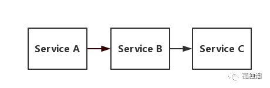
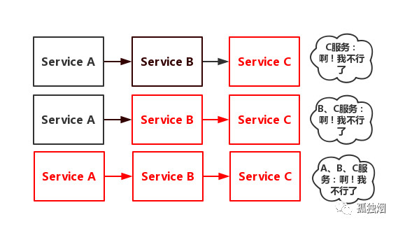
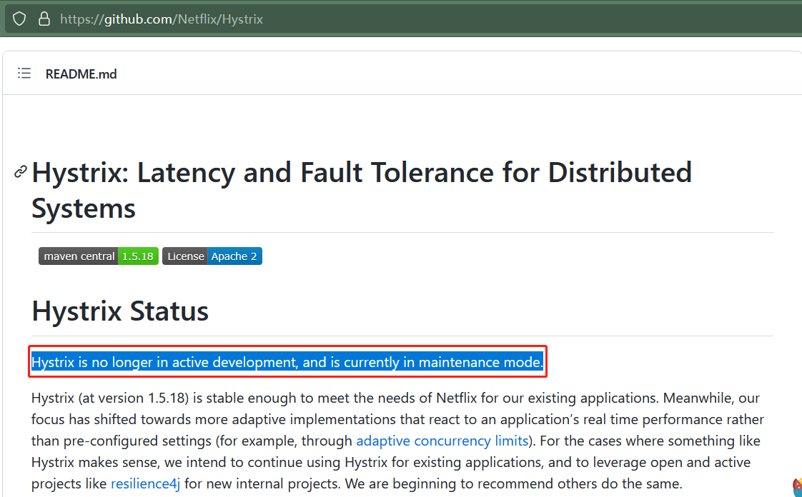

# Hystrix 理论

[toc]

## 服务雪崩|故障蔓延

假设存在如下调用链：

当 Service C 变得不可用，Service B  对 Sercice C 的请求就会阻塞，Service B 的线程资源就会逐渐被耗尽，Service B 也变得不可用。紧接着，Service A 对Service B的请求也会被阻塞，Service A 的线程资源也会逐渐被耗尽，Service A 也变得不可用。这一过程如下图所示：

## 服务降级、熔断、限流

在上述问题中，最初出现故障的只有 Service C，但最终却导致了整条链路上所有的服务都出现故障，通常我们称之为`故障蔓延`或`服务雪崩`。服务降级、服务熔断、服务限流是解决服务雪崩问题的常用手段：

-   **服务降级**：站在全局的角度，当系统资源出现紧张，牺牲部分非核心功能，优先保障核心功能 ~(弃卒保帅)~ 

    >   “牺牲部分非核心功能”的意思是，降低功能的质量，或者停止该功能，例如，将强一致性改为最终一致性。

    

-   **服务熔断**：在外部接口可能出现问题的情况下，暂时停止对外部接口的调用，给外部接口一个喘息的机会，避免外部接口被直接打死

    >   “外部接口可能出现问题”的依据通常是响应速度、请求成功率等

    

-   **服务限流**：当请求总量或者一段时间内的请求数量超过设定的阈值，直接拒绝新的请求

## Hystrix 简介

Hystrix 是一个用于处理分布式系统的延迟和容错的开源库。<(￣︶￣)↗[官方使用指导手册](https://github.com/Netflix/Hystrix/wiki/How-To-Use)

虽然 Hystrix 很强大，但是非常遗憾，目前 Hystrix 项目已经进入停更状态：

