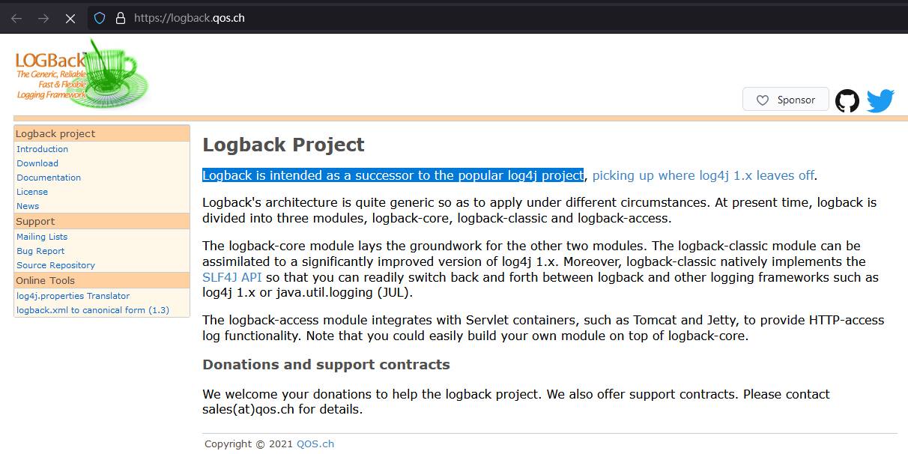
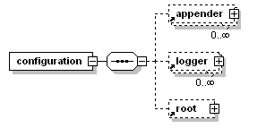

# Logback 理论

官网：https://logback.qos.ch/

-   Logback 是什么？

-   为什么选择 Logback？

-   如何使用 Logback？


## 一、Logback 简介

Logback 是由 Log4j 创始人设计的另一个开源项目，它的设计目标是替代 Log4j。



Logback 包含 3 个核心模块：

-   logback-core：其它两个模块的基础模块
-   logback-classic：它是 Log4j 的一个改良版本，同时它完整实现了 slf4j API 使你可以很方便地更换成其它日志系统如 log4j 或 JDK14 Logging
-   logback-access：访问模块与 Servlet 容器集成提供通过 Http 来访问日志的功能


## 二、Logback 替代 Log4j 的理由

官方说明：[Reasons to prefer logback over log4j 1.x](https://logback.qos.ch/reasonsToSwitch.html)

Logback 在 Log4j 1.x 的基础上进行了大量的改进：

-   速度更快的实现方式：在 Log4j 1.x 的基础上，对部分代码进行了重写和优化，最终使得某些关键功能的执行速度获得较大的提升，同时占用的内存也更小

-   充分的测试

-   支持配置文件的热修改

    ……

## 三、Logback 常用配置介绍

### 1、常用节点结构



```xml
<configutation>
    <appender></appender>
    <logger></logger>
    <root></root>
</configutation>
```


### 2、常用节点说明

#### configutation 节点

configuration 是根节点，包含 3 个属性：

| 属性       | 说明                                                         |
| ---------- | ------------------------------------------------------------ |
| scan       | 设置为 true 时，配置文件如果发生改变，将会被重新加载。默认值为 true |
| scanPeriod | 监测配置文件是否有修改的时间间隔，如果没有给出时间单位，默认单位是毫秒。当 scan 为 true 时，此属性生效。默认的时间间隔为1分钟 |
| debug      | 设置为 true 时，将打印出 logback 内部日志信息，实时查看 logback 运行状态。默认值为 false |

示例：

```xml
<configuration scan="true" scanPeriod="60 seconds" debug="false"> 
　　  <!--其他配置省略-->
</configuration>
```

#### appender 节点

<u>appender 是负责记录日志的组件</u>，它有 2 个必要的属性：

| 属性  | 说明                      |
| ----- | ------------------------- |
| name  | appender 的名称           |
| class | appender 实现类的全限定名 |

appender 常见实现类：

| 实现类              | 说明                                                         |
| ------------------- | ------------------------------------------------------------ |
| ConsoleAppender     | 将日志输出到控制台                                           |
| FileAppender        | 将日志输出到文件                                             |
| RollingFileAppender | 滚动记录日志，先将日志输出到指定文件，当符合某个条件时，将日志输出到其他文件 |


下面仅对 appender 的常见实现类进行说明，更多实现类请查阅官方文档。

##### 1. ConsoleAppender

包含以下子节点：

-   <encoder>：对日志进行格式化
-   <target>：字符串以 System.out（默认）或 System.err 输出

**示例：**将 >= BEBUG 级别的日志输出到控制台

```xml
<configuration>
　　　<appender name="STDOUT" class="ch.qos.logback.core.ConsoleAppender"> 
　　　　　 <encoder> 
　　　　　　　　　<pattern>%-4relative [%thread] %-5level %logger{35} - %msg %n</pattern> 
　　　　　 </encoder> 
　　　</appender> 

　　　<root level="DEBUG"> 
　　　　　　<appender-ref ref="STDOUT" /> 
　　　</root> 
</configuration>
```


##### 2. FileAppender

包含以下子节点：

-   <file>：被写入的文件名，可以是相对目录，也可以是绝对目录，如果上级目录不存在会自动创建。没有默认值
-   <append>：如果是 true，日志被追加到文件结尾，如果是 false，清空现存文件。默认是true
-   <encoder>：对日志进行格式化
-   <prudent>：如果是 true，日志会被安全的写入文件，即使其他的 FileAppender 也在向此文件做写入操作。效率低，默认是 false

**示例：**将 >= BEBUG 级别的日志输出到 testFile.log

```xml
<configuration> 
    <appender name="FILE" class="ch.qos.logback.core.FileAppender"> 
        <file>testFile.log</file>
        <append>true</append>
        <encoder> 
            <pattern>%-4relative [%thread] %-5level %logger{35} - %msg%n</pattern> 
        </encoder> 
    </appender> 

    <root level="DEBUG"> 
        <appender-ref ref="FILE" /> 
    </root> 
</configuration>
```


##### 3. RollingFileAppender

包含以下子节点：

-   <file>：被写入的文件名，可以是相对目录，也可以是绝对目录，如果上级目录不存在会自动创建。没有默认值

-   <append>：如果是 true，日志被追加到文件结尾，如果是 false，清空现存文件。默认是 true

-   <rollingPolicy>：当发生滚动时，决定 RollingFileAppender 的行为，涉及文件移动和重命名。

    通过 class 属性定义具体的滚动策略类：

    1.  **class = "ch.qos.logback.core.rolling.TimeBasedRollingPolicy"**

        （最常用的滚动策略）根据时间来制定滚动策略，即负责滚动也负责触发滚动。包含以下子节点：

        -   <fileNamePattern>：

            （必要节点）包含文件名和 “%d” 转换符，“%d” 可以包含一个java.text.SimpleDateFormat 指定的时间格式，如：%d{yyyy-MM}。如果直接使用 %d，默认的时间格式是 yyyy-MM-dd。RollingFileAppender 的 <file> 子节点可有可无，通过设置 <file>，可以为活动文件和归档文件指定不同位置，当前日志总是记录到 <file> 指定的文件（活动文件），活动文件的名字不会改变；
            如果没设置 <file>，活动文件的名字会根据 <fileNamePattern> 的值，每隔一段时间改变一次。“/”或者“\”会被当做目录分隔符。

        -   <maxHistory>:
            （可选节点）控制保留的归档文件的最大数量，超出数量就删除旧文件。假设设置每个月滚动，且<maxHistory> 是 6，则只保存最近6个月的文件，删除之前的旧文件。注意，删除旧文件时，那些为了归档而创建的目录也会被删除。

    2.  **class = ch.qos.logback.core.rolling.SizeBasedTriggeringPolicy**

        查看当前活动文件的大小，如果超过指定大小会告知RollingFileAppender 触发当前活动文件滚动。

    3.  **class = "ch.qos.logback.core.rolling.FixedWindowRollingPolicy"**

        根据固定窗口算法重命名文件的滚动策略

**示例：**每天生成一个日志文件，保存30天的日志文件

```xml
<configuration> 
    <appender name="FILE" class="ch.qos.logback.core.rolling.RollingFileAppender"> 
        <rollingPolicy class="ch.qos.logback.core.rolling.TimeBasedRollingPolicy"> 
　　　　　    <fileNamePattern>logFile.%d{yyyy-MM-dd}.log</fileNamePattern> 
　　　　　    <maxHistory>30</maxHistory> 
　　　　　</rollingPolicy> 
　　　　　<encoder> 
　　　　　    <pattern>%-4relative [%thread] %-5level %logger{35} - %msg%n</pattern> 
　　　　　</encoder> 
    </appender> 

    <root level="DEBUG"> 
　　    <appender-ref ref="FILE" /> 
    </root> 
</configuration>
```


#### logger 节点

<logger> 用来设置某一个包或者某一个类的日志打印级别，以及指定 <appender>

三个属性：

-   name：用来指定受此 logger 约束的某一个包或类
-   level：（可选）用来设置打印级别，大小写不敏感：TRACE, DEBUG, INFO, WARN, ERROR, ALL和OFF，还有一个特殊值 INHERITED 或者同义词 NULL，代表强制执行上级的级别。如果未设置此属性，那么当前 loger 将会继承上级的级别。
-   addtivity：（可选）是否向上级 logger 传递打印信息（默认是 true）

可以包含零个或多个 <appender-ref> 子节点，用于标识哪些 appender 将会添加到这个 logger。


#### root 节点

<root> 也是 <logger> 元素，但它是所有 logger 的上级，即“根 logger”

与 <logger> 相比只有一个level属性，因为 name 固定为 “root”，且没有上级

和 <logger> 一样，可以包含零个或多个 <appender-ref> 子节点，用于标识哪些 appender 将会添加到这个 logger。


**示例：**常用logger配置

```xml
<!-- show parameters for hibernate sql 专为 Hibernate 定制 -->
<logger name="org.hibernate.type.descriptor.sql.BasicBinder" level="TRACE" />
<logger name="org.hibernate.type.descriptor.sql.BasicExtractor" level="DEBUG" />
<logger name="org.hibernate.SQL" level="DEBUG" />
<logger name="org.hibernate.engine.QueryParameters" level="DEBUG" />
<logger name="org.hibernate.engine.query.HQLQueryPlan" level="DEBUG" />

<!--myibatis log configure-->
<logger name="com.apache.ibatis" level="TRACE"/>
<logger name="java.sql.Connection" level="DEBUG"/>
<logger name="java.sql.Statement" level="DEBUG"/>
<logger name="java.sql.PreparedStatement" level="DEBUG"/>
```


## 四、logback.xml 配置示例

```xml
<?xml version="1.0" encoding="UTF-8"?>
<configuration debug="false">

    <!--定义日志文件的存储地址 勿在 LogBack 的配置中使用相对路径-->
    <property name="LOG_HOME" value="/home" />

    <!--控制台日志， 控制台输出 -->
    <appender name="STDOUT" class="ch.qos.logback.core.ConsoleAppender">
        <encoder class="ch.qos.logback.classic.encoder.PatternLayoutEncoder">
            <!--格式化输出：%d表示日期，%thread表示线程名，%-5level：级别从左显示5个字符宽度,%msg：日志消息，%n是换行符-->
            <pattern>%d{yyyy-MM-dd HH:mm:ss.SSS} [%thread] %-5level %logger{50} - %msg%n</pattern>
        </encoder>
    </appender>

    <!--文件日志， 按照每天生成日志文件 -->
    <appender name="FILE" class="ch.qos.logback.core.rolling.RollingFileAppender">
        <rollingPolicy class="ch.qos.logback.core.rolling.TimeBasedRollingPolicy">
            <!--日志文件输出的文件名-->
            <FileNamePattern>${LOG_HOME}/TestWeb.log.%d{yyyy-MM-dd}.log</FileNamePattern>
            <!--日志文件保留天数-->
            <MaxHistory>30</MaxHistory>
        </rollingPolicy>
        <encoder class="ch.qos.logback.classic.encoder.PatternLayoutEncoder">
            <!--格式化输出：%d表示日期，%thread表示线程名，%-5level：级别从左显示5个字符宽度%msg：日志消息，%n是换行符-->
            <pattern>%d{yyyy-MM-dd HH:mm:ss.SSS} [%thread] %-5level %logger{50} - %msg%n</pattern>
        </encoder>
        <!--日志文件最大的大小-->
        <triggeringPolicy class="ch.qos.logback.core.rolling.SizeBasedTriggeringPolicy">
            <MaxFileSize>10MB</MaxFileSize>
        </triggeringPolicy>
    </appender>

    <!-- show parameters for hibernate sql 专为 Hibernate 定制 -->
    <logger name="org.hibernate.type.descriptor.sql.BasicBinder" level="TRACE" />
    <logger name="org.hibernate.type.descriptor.sql.BasicExtractor" level="DEBUG" />
    <logger name="org.hibernate.SQL" level="DEBUG" />
    <logger name="org.hibernate.engine.QueryParameters" level="DEBUG" />
    <logger name="org.hibernate.engine.query.HQLQueryPlan" level="DEBUG" />

    <!--myibatis log configure-->
    <logger name="com.apache.ibatis" level="TRACE"/>
    <logger name="java.sql.Connection" level="DEBUG"/>
    <logger name="java.sql.Statement" level="DEBUG"/>
    <logger name="java.sql.PreparedStatement" level="DEBUG"/>

    <!-- 日志输出级别 -->
    <root level="DEBUG">
        <appender-ref ref="STDOUT" />
        <appender-ref ref="FILE"/>
    </root>
</configuration>
```


## 五、总结

### 1、输出源选择

logback 的配置，需要配置输出源 appender，打日志的 logger（子节点）和 root（根节点），<u>实际上，它输出日志是从子节点开始，子节点如果有输出源直接输入，如果无，判断配置的 addtivity，是否向上级传递，即是否向 root 传递，传递则采用root 的输出源，否则不输出日志。</u>


### 2、日志级别

日志记录器（Logger）的行为是分等级的： 分为 OFF、FATAL、ERROR、WARN、INFO、DEBUG、ALL或者您定义的级别

建议只使用四个级别：ERROR > WARN > INFO > DEBUG

**项目上生产环境的时候一定得把debug的日志级别重新调为warn或者更高，避免产生大量日志。**