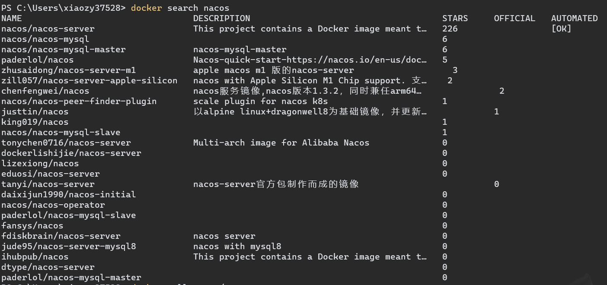
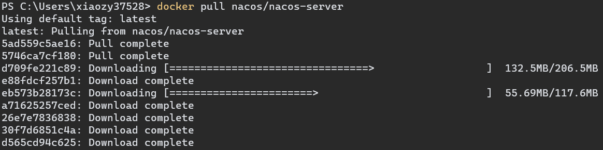
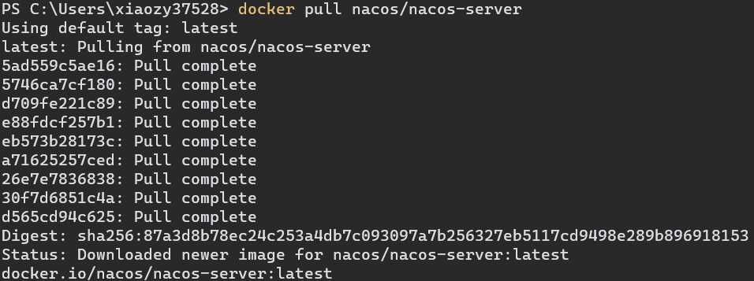
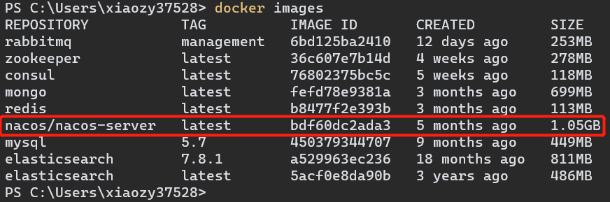
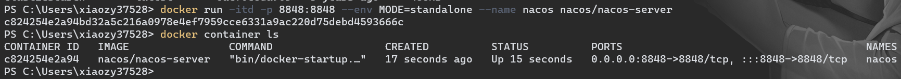
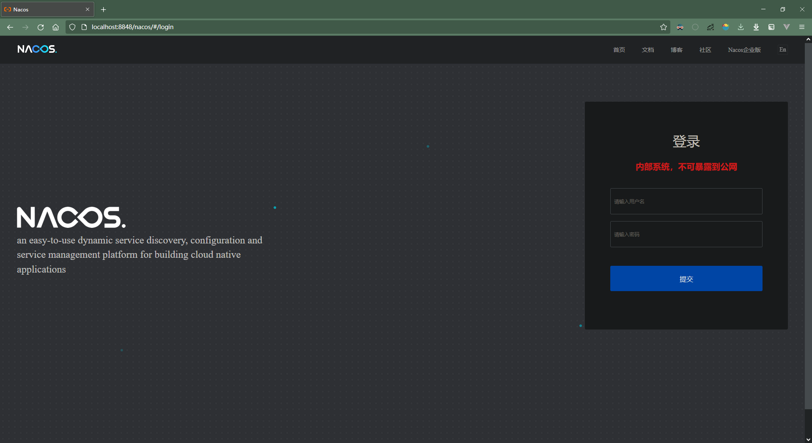
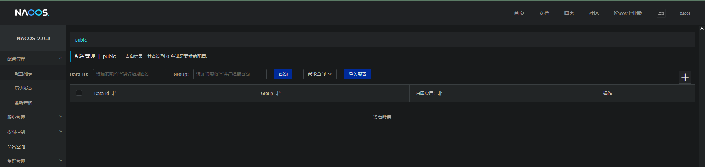

# Nacos 安装与使用

<(￣︶￣)↗[GO!] [官方指导文档](https://nacos.io/zh-cn/docs/quick-start.html)

<(￣︶￣)↗[GO!] [《使用Docker部署Nacos-Server》](https://www.cnblogs.com/serendipity-fzx/articles/15400618.html)


### Win10 + Docker 环境

1.   检索镜像

     ```shell
     docker search nacos
     ```

     

2.   拉取镜像

     ```shell
     docker pull nacos/nacos-server
     ```

     

     

3.   检查拉取结果

     ```shell
     docker images
     ```

     

4.   创建并运行实例（单节点模式）

     ```shell
     docker run -itd -p 8848:8848 --env MODE=standalone --name nacos nacos/nacos-server
     ```

     

5.   检查启动结果

     <(￣︶￣)↗[GO!] [Nacos控制台](localhost:8848/nacos)    账号密码：nacos/nacos

     

     

