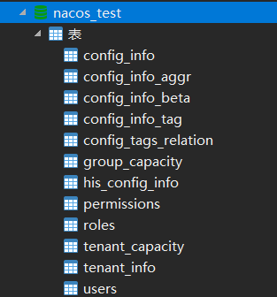
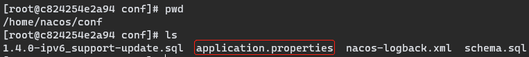
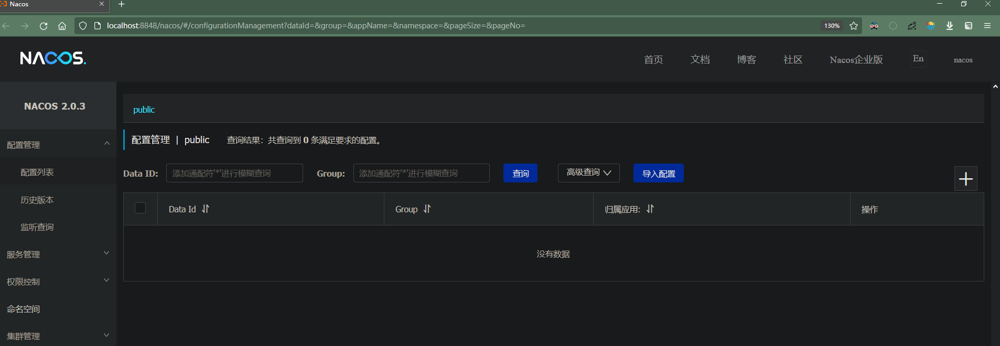
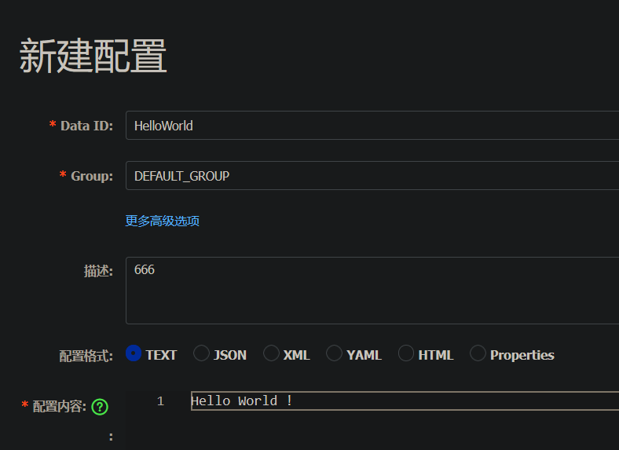
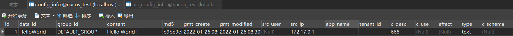

# Nacos 持久化

（环境：Win10 + Docker）

---

## 1、搭建 Docker 局域网

<(￣︶￣)↗[Docker 实战 - 局域网络搭建.md](../../服务器相关/Docker/Docker 实战 - 局域网络搭建.md)

1.   创建局域网：

     ```
     PS C:\Users\xiaozy37528> docker network create myNetwork
     f26e19d32597aec0a762c2e7081f86de930aa885b90c983a78730af2a6a018e6
     ```

2.   将 Nacos 和 MySQL 容器接入局域网：

     ```
     docker network connect myNetwork MyNacos
     docker network connect myNetwork mysql
     ```

3.   查看局域网接入情况：

     ```
     PS C:\Users\xiaozy37528> docker network inspect myNetwork
     [
         {
             "Name": "myNetwork",
             "Id": "f26e19d32597aec0a762c2e7081f86de930aa885b90c983a78730af2a6a018e6",
             "Created": "2022-01-26T03:11:03.8063259Z",
             "Scope": "local",
             "Driver": "bridge",
             "EnableIPv6": false,
             "IPAM": {
                 "Driver": "default",
                 "Options": {},
                 "Config": [
                     {
                         "Subnet": "172.19.0.0/16",
                         "Gateway": "172.19.0.1"
                     }
                 ]
             },
             "Internal": false,
             "Attachable": false,
             "Ingress": false,
             "ConfigFrom": {
                 "Network": ""
             },
             "ConfigOnly": false,
             "Containers": {
                 "3cdb8945aa49aee996e12417a22260b8a5d7ed28d609a93dcd73bd82f0efe23c": {
                     "Name": "mysql",
                     "EndpointID": "1ece17d728f830bfd4420b6b5c9d34c1b12c0e2ccac6d263c88dfdb6934aa5e7",
                     "MacAddress": "02:42:ac:13:00:04",
                     "IPv4Address": "172.19.0.4/16",
                     "IPv6Address": ""
                 },
                 "c824254e2a94bd32a5c216a0978e4ef7959cce6331a9ac220d75debd4593666c": {
                     "Name": "nacos",
                     "EndpointID": "a2119d6c6742bd886ec19e910c207c20011e532d25f9f8afb0b2f59533fda13d",
                     "MacAddress": "02:42:ac:13:00:03",
                     "IPv4Address": "172.19.0.3/16",
                     "IPv6Address": ""
                 }
             },
             "Options": {},
             "Labels": {}
         }
     ]
     ```

4.   验证 Nacos 容器与 MySQL 容器能否互相 ping 通：

     （nacos ping mysql）

     ```
     # ping 172.19.0.4
     PING 172.19.0.4 (172.19.0.4) 56(84) bytes of data.
     64 bytes from 172.19.0.4: icmp_seq=1 ttl=64 time=0.123 ms
     64 bytes from 172.19.0.4: icmp_seq=2 ttl=64 time=0.048 ms
     64 bytes from 172.19.0.4: icmp_seq=3 ttl=64 time=0.041 ms
     64 bytes from 172.19.0.4: icmp_seq=4 ttl=64 time=0.058 ms
     --- 172.19.0.4 ping statistics ---
     4 packets transmitted, 4 received, 0% packet loss, time 3153ms
     rtt min/avg/max/mdev = 0.041/0.067/0.123/0.033 ms
     
     
     # ping mysql
     PING mysql (172.19.0.4) 56(84) bytes of data.
     64 bytes from mysql.myNetwork (172.19.0.4): icmp_seq=1 ttl=64 time=0.040 ms
     64 bytes from mysql.myNetwork (172.19.0.4): icmp_seq=2 ttl=64 time=0.045 ms
     64 bytes from mysql.myNetwork (172.19.0.4): icmp_seq=3 ttl=64 time=0.096 ms
     64 bytes from mysql.myNetwork (172.19.0.4): icmp_seq=4 ttl=64 time=0.066 ms
     --- mysql ping statistics ---
     4 packets transmitted, 4 received, 0% packet loss, time 3117ms
     rtt min/avg/max/mdev = 0.040/0.061/0.096/0.024 ms
     ```

     （mysql ping nacos）

     ```
     # ping 172.19.0.2
     PING 172.19.0.2 (172.19.0.2) 56(84) bytes of data.
     64 bytes from 172.19.0.2: icmp_seq=1 ttl=64 time=0.076 ms
     64 bytes from 172.19.0.2: icmp_seq=2 ttl=64 time=0.051 ms
     64 bytes from 172.19.0.2: icmp_seq=3 ttl=64 time=0.036 ms
     64 bytes from 172.19.0.2: icmp_seq=4 ttl=64 time=0.039 ms
     --- 172.19.0.2 ping statistics ---
     4 packets transmitted, 4 received, 0% packet loss, time 100ms
     rtt min/avg/max/mdev = 0.036/0.050/0.076/0.017 ms
     
     
     # ping MyNginx
     PING MyNginx (172.19.0.2) 56(84) bytes of data.
     64 bytes from MyNginx.myNetwork (172.19.0.2): icmp_seq=1 ttl=64 time=0.037 ms
     64 bytes from MyNginx.myNetwork (172.19.0.2): icmp_seq=2 ttl=64 time=0.044 ms
     64 bytes from MyNginx.myNetwork (172.19.0.2): icmp_seq=3 ttl=64 time=0.066 ms
     64 bytes from MyNginx.myNetwork (172.19.0.2): icmp_seq=4 ttl=64 time=0.056 ms
     64 bytes from MyNginx.myNetwork (172.19.0.2): icmp_seq=5 ttl=64 time=0.068 ms
     --- MyNginx ping statistics ---
     5 packets transmitted, 5 received, 0% packet loss, time 133ms
     rtt min/avg/max/mdev = 0.037/0.054/0.068/0.013 ms
     ```

     

## 2、创建 Nacos 数据库

1.   获取 Nacos 数据库创建脚本

     https://github.com/alibaba/nacos/blob/develop/config/src/main/resources/META-INF/nacos-db.sql

2.   MySQL 执行脚本创建数据库

     

## 3、配置 Nacos 持久化

1.   修改 Nacos 配置文件

     

     ```
     spring.datasource.platform=mysql
     
     db.num=1
     db.url.0=jdbc:mysql://172.19.0.4:3306/nacos_test?characterEncoding=utf8&connectTimeout=1000&socketTimeout=3000&autoReconnect=true
     db.user=root
     db.password=123456
     ```

2.   重启 Nacos

## 4、验证配置效果

1.   打开[控制面板](http://localhost:8848/nacos)

     

     正常打开说明 Nacos 正常启动，如果之前有在 Nacos 上添加配置信息，可以发现配置信息现在看不到了，因为 Nacos 现在使用的是我们配置的 MySQL 数据库。

     

2.   随便添加一些数据

     

     

     

3.   检查数据是否被保存到 MySQL

     

     数据成功保存到MySQL，说明 Nacos 持久化配置已经

