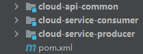
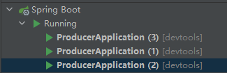
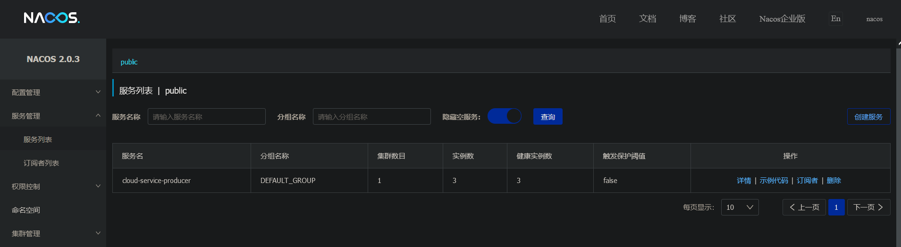
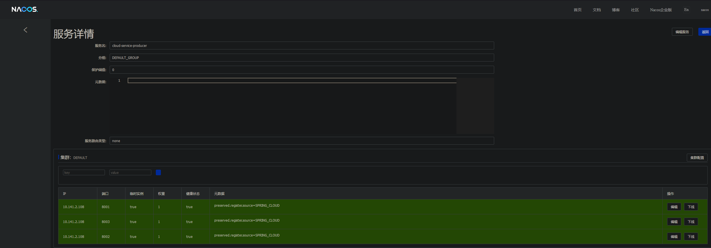
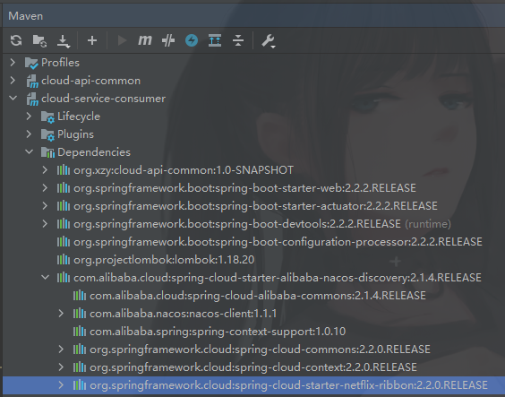
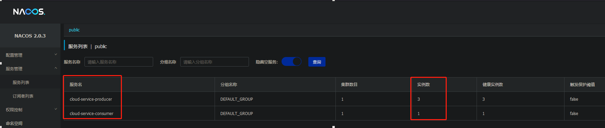
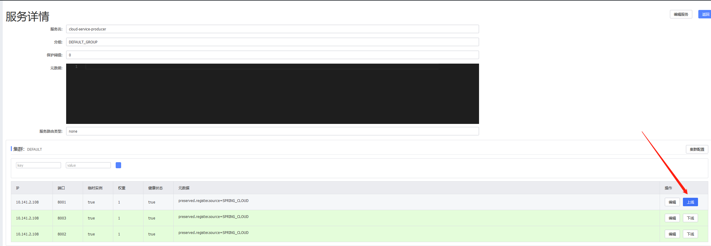

# 注册中心（单点）

---

[toc]


工程结构：




## 一、注册中心

参照 [Nacos实战 - 安装与使用](./Nacos实战 - 安装与使用.md) 安装并运营单个 Nacos 节点。


## 二、服务提供者

### 2.1 依赖文件

```xml
<?xml version="1.0" encoding="UTF-8"?>
<project xmlns = "http://maven.apache.org/POM/4.0.0"
         xmlns:xsi = "http://www.w3.org/2001/XMLSchema-instance"
         xsi:schemaLocation = "http://maven.apache.org/POM/4.0.0 http://maven.apache.org/xsd/maven-4.0.0.xsd">
    <parent>
        <artifactId>spring-cloud-demo-2020</artifactId>
        <groupId>org.xzy</groupId>
        <version>1.0-SNAPSHOT</version>
    </parent>
    
    <modelVersion>4.0.0</modelVersion>
    <artifactId>cloud-service-producer</artifactId>
    <description>生产者</description>
    
    <dependencies>
        <!--other module-->
        <dependency>
            <groupId>org.xzy</groupId>
            <artifactId>cloud-api-common</artifactId>
            <version>1.0-SNAPSHOT</version>
        </dependency>
        <!--spring-->
        <dependency>
            <groupId>org.springframework.boot</groupId>
            <artifactId>spring-boot-starter-web</artifactId>
        </dependency>
        <dependency>
            <groupId>org.springframework.boot</groupId>
            <artifactId>spring-boot-starter-actuator</artifactId>
        </dependency>
        <!--spring-boot-tools-->
        <dependency>
            <groupId>org.springframework.boot</groupId>
            <artifactId>spring-boot-devtools</artifactId>
            <scope>runtime</scope>
            <optional>true</optional>
        </dependency>
        <!--spring-boot-configuration-processor-->
        <dependency>
            <groupId>org.springframework.boot</groupId>
            <artifactId>spring-boot-configuration-processor</artifactId>
        </dependency>
        <!--lombok-->
        <dependency>
            <groupId>org.projectlombok</groupId>
            <artifactId>lombok</artifactId>
        </dependency>
        <!--nacos-discovery-->
        <dependency>
            <groupId>com.alibaba.cloud</groupId>
            <artifactId>spring-cloud-starter-alibaba-nacos-discovery</artifactId>
        </dependency>
    </dependencies>
</project>
```

注意：spring-cloud-starter-alibaba-nacos-discovery


### 2.2 配置文件

```yaml
server:
  port: 8001

spring:
  application:
    name: cloud-service-producer

  cloud:
    nacos:
      discovery:
        server-addr: 127.0.0.1:8848 # Nacos-Server 地址
```


### 2.3 主启动类

```java
package com.xzy;

import org.springframework.boot.SpringApplication;
import org.springframework.boot.autoconfigure.SpringBootApplication;
import org.springframework.cloud.client.discovery.EnableDiscoveryClient;

/**
 * @author xzy
 * @date 2022/1/19 13:19
 */
@SpringBootApplication
@EnableDiscoveryClient
public class ProducerApplication {
    public static void main(String[] args) {
        SpringApplication.run(ProducerApplication.class, args);
    }
}
```

注意：@EnableDiscoveryClient


### 2.4 对外服务

```java
package com.xzy.controller;

import org.springframework.beans.factory.annotation.Value;
import org.springframework.web.bind.annotation.GetMapping;
import org.springframework.web.bind.annotation.PathVariable;
import org.springframework.web.bind.annotation.RequestMapping;
import org.springframework.web.bind.annotation.RestController;

/**
 * @author xzy
 * @date 2022/1/20 10:43
 */
@RestController
@RequestMapping(path = "/producer")
public class ProducerController {

    @Value("${server.port}")
    private String serverPort;

    @Value("${spring.application.name}")
    private String serviceName;

    @GetMapping("/echo/{str}")
    public String echo(@PathVariable("str") String str) {
        return serviceName + serverPort + "--->" + str;
    }
}
```


### 2.5 测试

1.   启动多个实例




2.   查看Nacos控制面板，检查实例注册情况

     

     
     
3.   查看实例详细信息
     


## 三、服务消费者

### 3.1 依赖文件

```xml
<?xml version="1.0" encoding="UTF-8"?>
<project xmlns = "http://maven.apache.org/POM/4.0.0"
         xmlns:xsi = "http://www.w3.org/2001/XMLSchema-instance"
         xsi:schemaLocation = "http://maven.apache.org/POM/4.0.0 http://maven.apache.org/xsd/maven-4.0.0.xsd">
    <parent>
        <artifactId>spring-cloud-demo-2020</artifactId>
        <groupId>org.xzy</groupId>
        <version>1.0-SNAPSHOT</version>
    </parent>
    
    <modelVersion>4.0.0</modelVersion>
    <artifactId>cloud-service-consumer</artifactId>
    <description>消费者</description>
    
    <dependencies>
        <!--other module-->
        <dependency>
            <groupId>org.xzy</groupId>
            <artifactId>cloud-api-common</artifactId>
            <version>1.0-SNAPSHOT</version>
        </dependency>
        <!--spring-->
        <dependency>
            <groupId>org.springframework.boot</groupId>
            <artifactId>spring-boot-starter-web</artifactId>
        </dependency>
        <dependency>
            <groupId>org.springframework.boot</groupId>
            <artifactId>spring-boot-starter-actuator</artifactId>
        </dependency>
        <!--spring-boot-tools-->
        <dependency>
            <groupId>org.springframework.boot</groupId>
            <artifactId>spring-boot-devtools</artifactId>
            <scope>runtime</scope>
            <optional>true</optional>
        </dependency>
        <!--spring-boot-configuration-processor-->
        <dependency>
            <groupId>org.springframework.boot</groupId>
            <artifactId>spring-boot-configuration-processor</artifactId>
        </dependency>
        <!--lombok-->
        <dependency>
            <groupId>org.projectlombok</groupId>
            <artifactId>lombok</artifactId>
        </dependency>
        <!--nacos-discovery-->
        <dependency>
            <groupId>com.alibaba.cloud</groupId>
            <artifactId>spring-cloud-starter-alibaba-nacos-discovery</artifactId>
        </dependency>
    </dependencies>
    
</project>
```

主要：spring-cloud-starter-alibaba-nacos-discovery


### 3.2 配置文件

```yaml
server:
  port: 8011

spring:
  application:
    name: cloud-service-consumer

  cloud:
    nacos:
      discovery:
        server-addr: 127.0.0.1:8848 # Nacos-Server 地址
```


### 3.3 主启动类

```java
package com.xzy;

import org.springframework.boot.SpringApplication;
import org.springframework.boot.autoconfigure.SpringBootApplication;
import org.springframework.cloud.client.discovery.EnableDiscoveryClient;
import org.springframework.cloud.client.loadbalancer.LoadBalanced;
import org.springframework.context.annotation.Bean;
import org.springframework.web.client.RestTemplate;

/**
 * @author xzy
 * @date 2022/1/19 13:19
 */
@SpringBootApplication
@EnableDiscoveryClient
public class ConsumerApplication {
    public static void main(String[] args) {
        SpringApplication.run(ConsumerApplication.class, args);
    }

    @Bean
    @LoadBalanced // 开启与Ribbon的集成，实现负载均衡
    public RestTemplate restTemplate() {
        return new RestTemplate();
    }
}
```

主要：

1.   @EnableDiscoveryClient

2.   @LoadBalanced 给予 RestTemplate 负载均衡的能力。Nacos 集成了 Ribbon 从而实现负载均衡：

     


### 3.4 服务调用

```java
package com.xzy.controller;

import org.springframework.beans.factory.annotation.Autowired;
import org.springframework.beans.factory.annotation.Value;
import org.springframework.web.bind.annotation.GetMapping;
import org.springframework.web.bind.annotation.PathVariable;
import org.springframework.web.bind.annotation.RequestMapping;
import org.springframework.web.bind.annotation.RestController;
import org.springframework.web.client.RestTemplate;

import java.util.UUID;

/**
 * @author xzy
 * @date 2022/1/20 10:54
 */
@RestController
@RequestMapping(path = "/consumer")
public class ConsumerController {

    @Value("${server.port}")
    private String serverPort;

    @Value("${spring.application.name}")
    private String serviceName;

    private final RestTemplate restTemplate;

    @Autowired
    public ConsumerController(RestTemplate restTemplate) {
        this.restTemplate = restTemplate;
    }

    @GetMapping("/echo/{str}")
    public String echo(@PathVariable("str") String str) {
        String responseMsg = restTemplate.getForObject("http://cloud-service-producer/producer/echo/" + str, String.class);
        return responseMsg + serviceName + serverPort + "    (UUID:" + UUID.randomUUID().toString() + ")";
    }
}
```

主要：通过服务名称调用接口


### 4.5 测试


#### 4.5.1 服务调用，轮训分发

1.   启动消费者实例，打开 Nacos 面板查看实例是否成功注册

     

     

2.   连续调用消费者接口，返回值如下：

     ```
     cloud-service-producer8001--->hicloud-service-consumer8011    (UUID:d0566031-b3c1-44a2-ac39-2303a3a55a02)
     
     cloud-service-producer8003--->hicloud-service-consumer8011    (UUID:489a1b55-75c8-45bb-98d7-9050e39a03d1)
     
     cloud-service-producer8002--->hicloud-service-consumer8011    (UUID:7538adbf-cddd-4e31-9e8b-b0581292454f)
     
     cloud-service-producer8001--->hicloud-service-consumer8011    (UUID:300080d2-e0a3-4f3d-8703-4d91f623c443)
     
     cloud-service-producer8003--->hicloud-service-consumer8011    (UUID:a32bf208-e069-40e8-b5fb-3e1bea427848)
     
     cloud-service-producer8002--->hicloud-service-consumer8011    (UUID:390ff7a7-43dd-48f8-87d6-1f978d1413be)
     
     cloud-service-producer8001--->hicloud-service-consumer8011    (UUID:c48e5f73-b1c6-4fae-8b26-99cb75199285)
     
     cloud-service-producer8003--->hicloud-service-consumer8011    (UUID:30a787a4-a88a-47e5-a2e5-5398a31be2f8)
     
     cloud-service-producer8002--->hicloud-service-consumer8011    (UUID:319a7bdd-11a4-463f-8501-bd5808c706f2)
     
     cloud-service-producer8001--->hicloud-service-consumer8011    (UUID:ccf8b6df-d68f-44aa-b288-21eece1e94db)
     ```

     结合上文，可以发现消费者发送的请求被轮训分发到所有服务提供者节点


#### 4.5.2 实例下线

1.   通过 Nacos 面板下线一个服务提供者的实例：

     

     

2.   连续调用消费者接口，返回值如下：

     ```
     cloud-service-producer8002--->hicloud-service-consumer8011    (UUID:9e450e98-b8db-4021-9d73-032cfbc67503)
     
     cloud-service-producer8003--->hicloud-service-consumer8011    (UUID:32a55a4f-9650-4fb6-837a-cfa6b485dd26)
     
     cloud-service-producer8002--->hicloud-service-consumer8011    (UUID:a103ca29-35d0-4180-84ab-38a679f85c4c)
     
     cloud-service-producer8003--->hicloud-service-consumer8011    (UUID:c88c1f0a-9e77-4269-a372-99d64aa80834)
     
     cloud-service-producer8002--->hicloud-service-consumer8011    (UUID:0c40d74b-ec03-4f84-8bf6-21e061bdeffd)
     
     cloud-service-producer8003--->hicloud-service-consumer8011    (UUID:10d6f3c0-ed13-4682-9ba9-9775a1093901)
     ```

     观察返回信息，可以看到请求已经没有再分发到被下线的节点。